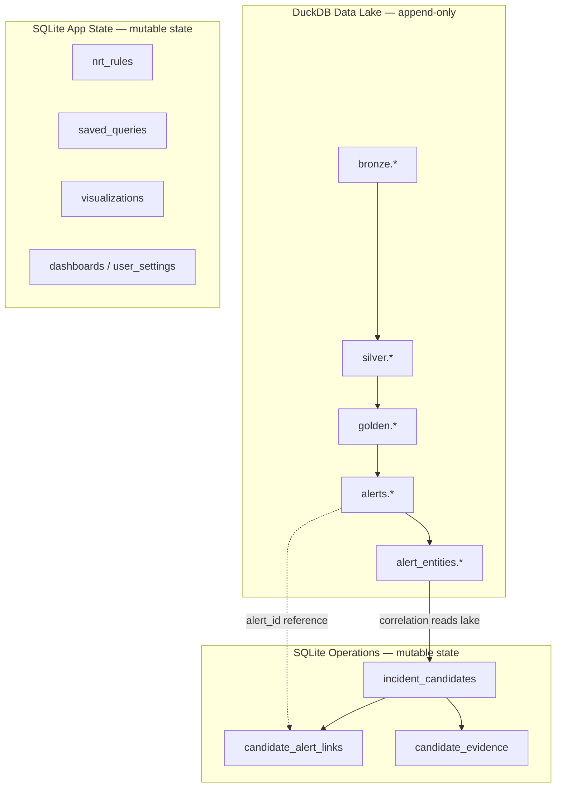
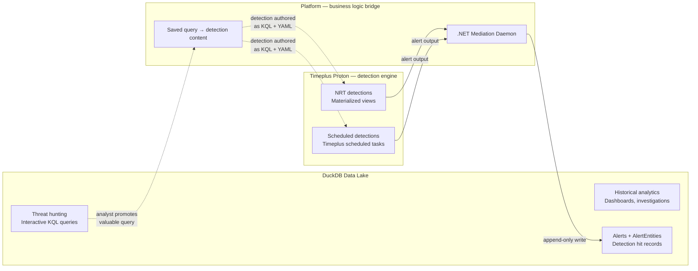
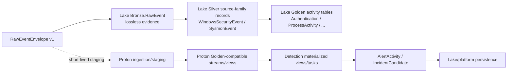
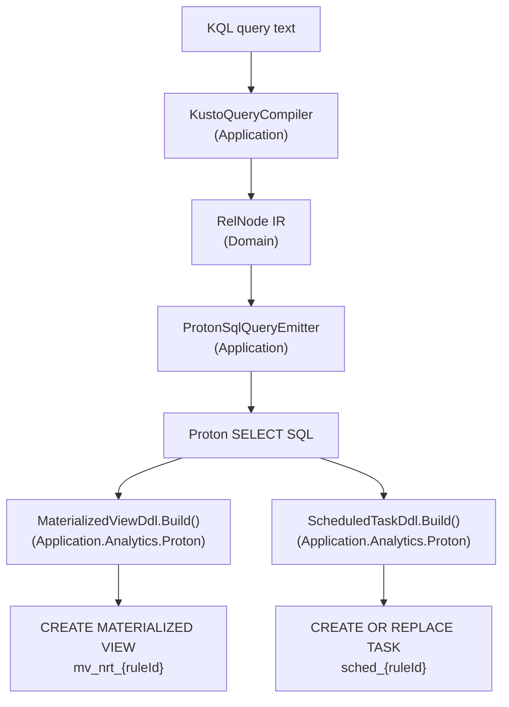
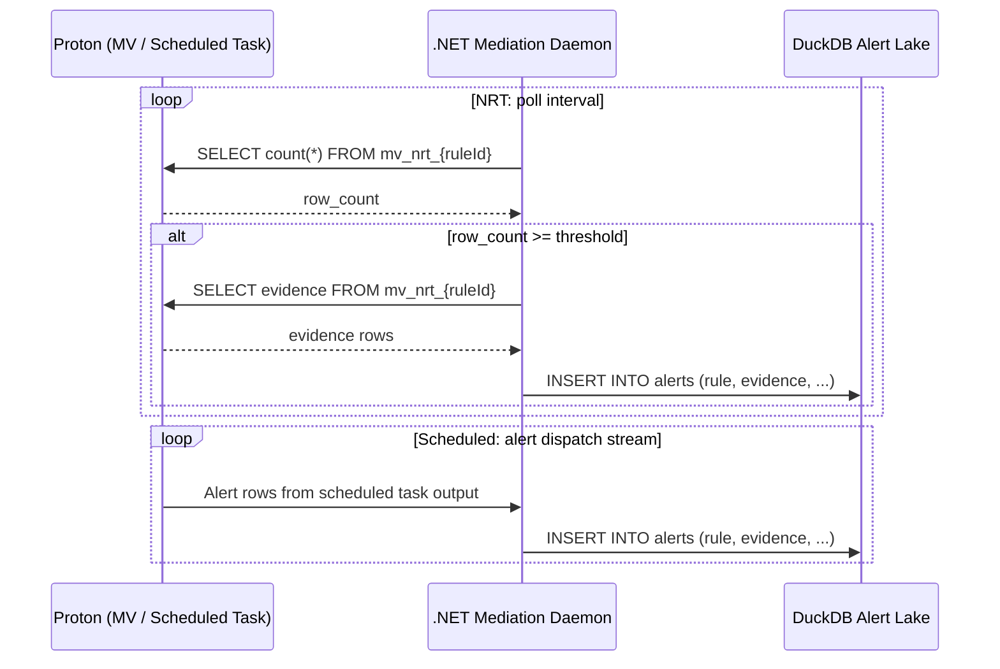
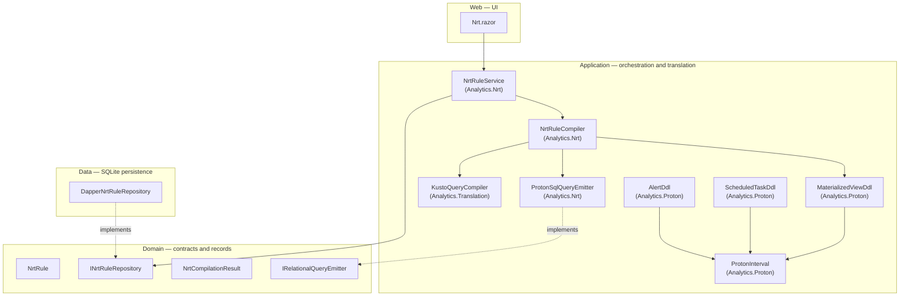

# DeltaZulu Platform architecture

DeltaZulu Platform is a local, schema-governed, full-cycle security analytics platform. It connects
interactive analytics, detection content governance, scheduled detection execution, alerting,
enrichment, incident-candidate correlation, triage, and feedback into detection improvement. The
repository has completed its host merge and Clean Architecture consolidation: one Blazor web app,
ten source projects, and one consolidated test project.

## Product model

The platform exposes three user-facing modules inside one platform shell:

| Module | Route prefix | Primary purpose | Current code home |
|---|---:|---|---|
| Analytics | `/analytics` | KQL-based querying, schema exploration, query history, curated analytics, visualizations, dashboards, evidence capture, and threat-hunting workflows. | `src/DeltaZulu.Platform.Web/Analytics`, `src/DeltaZulu.Platform.Application/Analytics`, `src/DeltaZulu.Platform.Domain/Analytics`, `src/DeltaZulu.Platform.Data` |
| Detection Content Governance | `/governance` | Detection packages, governed proposals, semantic detection content, validation checks, review, acceptance, restore, and version history. | `src/DeltaZulu.Platform.Web/Governance`, `src/DeltaZulu.Platform.Application/Governance`, `src/DeltaZulu.Platform.Domain/Governance`, `src/DeltaZulu.Platform.Data` |
| Operations | `/operations` | Executable detections, scheduled detection runs, alerts, alert entities, enrichment, suppression, incident candidates, triage state, and recovery. | Target module; code home will follow the same Domain/Application/Data/Web pattern. |

The modules remain separate by responsibility:

- **Analytics** asks questions and preserves analytical artifacts.
- **Governance** controls detection-content proposals and acceptance.
- **Operations** executes accepted detections and manages produced operational state.

The target modules integrate through explicit handoff boundaries: curated analytics can be promoted
into detection drafts; accepted detection versions project executable definitions; detection runs create
alerts; alerts correlate into incident candidates; triage outcomes create detection-tuning work. Today,
Analytics and Governance are registered and usable; Operations is still a target module with scaffolded
domain/persistence primitives rather than a registered module and execution-to-alert pipeline.

Threat hunting is a workflow under Analytics, not the parent product category. The parent category
is Analytics. Hunting is one analytics workflow. Scheduled detection execution, dashboards,
validation, alert investigation, and candidate triage all consume the same analytics substrate
under different policies.

The route names are product navigation boundaries inside `DeltaZulu.Platform.Web`, not separate
deployables. All modules run inside the same host and share the same design system, service
container, configuration pipeline, and host lifecycle. The current design-system adoption is not yet
fully enforced: tokens and components are present, but product identity, radius rules, typography scope,
legacy CSS aliases, table/state primitives, and Operations validation surfaces remain active gaps.

## Solution structure

```text
src/
  DeltaZulu.Platform.Domain/       # Core model and contracts
  DeltaZulu.Platform.Application/  # Use cases and application services
  DeltaZulu.Platform.Ingestion/    # Raw-log pub-sub boundary and NDJSON codec
  DeltaZulu.Platform.Data.DuckDb/  # DuckDB SQL emission, schema, and runtime
  DeltaZulu.Platform.Data/         # Shared data abstractions
  DeltaZulu.Platform.Data.SQLite/  # SQLite repositories and seed data
  DeltaZulu.Platform.Data.Git/     # Git accepted-content store
  DeltaZulu.Platform.Data.Proton/  # Proton SQL/DDL backend
  DeltaZulu.Blazor.Interop/        # Typed Blazor JS interop wrappers
  DeltaZulu.Platform.Web/          # Blazor host, platform shell, UI, components

tests/
  DeltaZulu.Platform.Tests/        # Consolidated test suite
```

### Dependency direction

```text
DeltaZulu.Platform.Web
  -> DeltaZulu.Blazor.Interop
  -> DeltaZulu.Platform.Application
  -> DeltaZulu.Platform.Data
  -> DeltaZulu.Platform.Data.DuckDb
  -> DeltaZulu.Platform.Data.Git
  -> DeltaZulu.Platform.Data.Proton
  -> DeltaZulu.Platform.Data.SQLite
  -> DeltaZulu.Platform.Domain
  -> DeltaZulu.Platform.Ingestion

DeltaZulu.Platform.Application
  -> DeltaZulu.Platform.Domain

DeltaZulu.Platform.Data
  -> DeltaZulu.Platform.Application
  -> DeltaZulu.Platform.Domain

DeltaZulu.Platform.Data.SQLite
  -> DeltaZulu.Platform.Application
  -> DeltaZulu.Platform.Data
  -> DeltaZulu.Platform.Data.DuckDb
  -> DeltaZulu.Platform.Domain
  -> DeltaZulu.Platform.Ingestion

DeltaZulu.Platform.Data.Git
  -> DeltaZulu.Platform.Domain

DeltaZulu.Platform.Data.Proton
  -> DeltaZulu.Platform.Domain

DeltaZulu.Platform.Data.DuckDb
  -> DeltaZulu.Platform.Application
  -> DeltaZulu.Platform.Domain
  -> DeltaZulu.Platform.Ingestion

DeltaZulu.Platform.Ingestion
  -> no project references

DeltaZulu.Blazor.Interop
  -> no project references

DeltaZulu.Platform.Domain
  -> no project references
```

The intended architectural rule is dependency inversion around domain/application contracts: domain
models and contracts define the core language; application services coordinate use cases; data
implements persistence/runtime adapters; web composes and renders the platform.

## Layer responsibilities

### Domain

`DeltaZulu.Platform.Domain` owns pure platform language and invariants:

- Detection content identity, path, file, and accepted-reference contracts under `Detection/`.
- Analytics records, query model, schema definitions, mappings, diagnostics, saved-query records,
  target curated-analytic records, rendering records, and settings records under `Analytics/`.
- Governance aggregates, changes, detections, issues, reviews, triage, workflow state, identifiers,
  content-library artifacts, and repository contracts under `Governance/`.
- Initial operations records for executable detection definitions, detection runs, alerts, alert
  entities, incident candidates, and candidate evidence are scaffolded, currently still under the
  Analytics namespace. Target work should create explicit `Operations/` domain boundaries before the
  operations model grows further.

The domain layer does not know about Blazor, DuckDB connections, SQLite connections, Git repositories,
MudBlazor, Elsa workflow internals, or platform hosting.

### Application

`DeltaZulu.Platform.Application` owns use-case orchestration:

- Analytics translation, validation, relational planning, rendering, catalog/sample-query services,
  and query/runtime coordination that can report structured diagnostics.
- Target shared analytics execution contract used by interactive queries, dashboards, validation
  checks, scheduled detection execution, and recovery with purpose-specific policies. The current
  implementation still needs this application-layer contract extracted from the Web-shaped query path.
- Governance change services, merge/readiness services, validation checks, workflow orchestration
  abstractions, and canonical content pipeline services.
- Target Operations services including executable detection projection, scheduled execution
  coordination, alert materialization, entity extraction, enrichment, suppression, candidate
  correlation, and triage coordination.

Application code may depend on domain contracts and external libraries needed for application behavior,
but it should not contain UI state or direct host composition. Elsa workflows orchestrate order,
timing, branching, retries, timers, and human-in-the-loop steps at this layer, but they do not own
detection logic, alert semantics, evidence integrity, entity meaning, suppression rules, or
incident-candidate validity.

### Ingestion

`DeltaZulu.Platform.Ingestion` owns the raw-log pub-sub boundary:

- `IRawLogPubSub`, `InMemoryRawLogBus`, and `RawLogBatch`/`RawLogEnvelope` types define the pub-sub
  contract for raw-log delivery between producers and consumers.
- `RawLogNdjsonCodec` serializes/deserializes the NDJSON wire format (one envelope per line).
- Exchange format is NDJSON with channel, ingest metadata, host/provider/source metadata, and the
  source-shaped `rawLog` JSON payload.
- Producers today are development seeders; future producers include collectors and broker adapters.
- Consumers today are the DuckDB Bronze table loaders; future consumers include Golden data-lake
  writers and near-real-time Proton loaders.
- Has no project references — it is a standalone boundary that Data, Data.DuckDb, and Web can all
  depend on without creating circular references.

### Data.DuckDb

`DeltaZulu.Platform.Data.DuckDb` owns DuckDB-specific infrastructure for threat hunting and
historical analytics:

- DuckDB SQL emission, query runtime, schema application, schema provenance tracking, and drift
  detection.
- DuckDB is the execution engine for interactive KQL queries, dashboards, and investigations. It
  is not used for detection execution — all detections (NRT and scheduled) target Timeplus Proton.
- Separated from `DeltaZulu.Platform.Data` to keep the DuckDB runtime isolated from SQLite
  repositories and Git storage.
- `IRelationalQueryEmitter` and `IRelationalQueryEmitterFactory` in the Domain layer define the
  backend-neutral compilation contract; `DeltaZulu.Platform.Data.DuckDb` provides the DuckDB
  implementation for analytics, and `DeltaZulu.Platform.Data.Proton` provides the Proton
  implementation for detection DDL generation (see [Detection execution architecture](#detection-execution-architecture)).

### Data projects

The storage/runtime layer is split by backend:

- `DeltaZulu.Platform.Data` contains shared data abstractions. It should stay small and avoid becoming a catch-all infrastructure project.
- `DeltaZulu.Platform.Data.SQLite` owns SQLite repositories, schema initialization, application persistence, and development/demo seed data.
- `DeltaZulu.Platform.Data.Git` owns the Git accepted-content store for accepted governance content history.
- `DeltaZulu.Platform.Data.Proton` owns Proton/ClickHouse SQL emission and detection DDL builders for streaming detection targets.
- Target Operations persistence should move conceptually under a clean operations namespace/database boundary and publish approved DuckDB-facing read models for KQL.

Data code implements storage and runtime adapters. It should not leak storage details into user-facing routes or UI components.

### Blazor.Interop

`DeltaZulu.Blazor.Interop` is a standalone Razor class library providing typed wrappers for Blazor
JS interop:

- `ClipboardService`, `FileOperationsService`, `JsLifecycleGuard`, `ElementReferenceExtensions`, and
  `BoundingClientRect` replace raw `IJSRuntime` calls in Razor components with typed, mockable
  services.
- A consolidated `interop.js` module bundles all platform interop functions.
- Has no project references — it is a pure Blazor/JS boundary library.
- Registered via `AddBlazorInterop()` in `Program.cs`.

### Web

`DeltaZulu.Platform.Web` is the only runnable web application. It owns:

- The Blazor host, layout, route table, static assets, component library, design tokens, and platform
  navigation.
- The product UI design-system boundary, currently housed inside Web. As components grow, shared
  `Dz*` primitives should remain visibly separated from feature pages so they do not become thin,
  page-specific wrappers.
- Platform module descriptors and navigation entries for Analytics and Governance today, with
  Operations as the next target module. The first Operations navigation slice should expose placeholders
  for executable detections, detection runs, alerts, incident candidates, operations health, and settings
  before deeper alerting implementation so the design system can be validated against operational flows.
- Analytics pages, dashboards, UI services, and visualization adapters.
- Governance pages, UI services, and markdown/component adapters.
- Target Operations pages including executable detection views, detection run views, alert queue,
  alert detail, incident candidate views, triage workflows, and operations health.
- Dependency-injection composition in `Program.cs`.

No standalone `Program.cs`, `App.razor`, appsettings, launch settings, or host layouts should be
reintroduced under separate module projects.

## Platform host composition

`DeltaZulu.Platform.Web/Program.cs` is the single host composition root. Current module registration
includes Analytics and Governance; Operations is the target next module to add:

- `AnalyticsModule` and `GovernanceModule` implement the platform module contract today.
- The target `OperationsModule` should implement the same platform module contract when the first
  Operations slice lands, with placeholder routes early enough to exercise alert queues, detection runs,
  incident candidates, operations health, and investigation/triage flows in the shell.
- MudBlazor services and shared UI assets are registered once.
- Governance persistence, validation, workflow orchestration, and Git accepted-content storage are
  configured in the host composition root.
- Analytics web services are registered through `AddAnalyticsWebModule` and bootstrapped once during
  app startup.
- Operations services will register executable detection, run, alert, candidate, and triage
  repositories plus workflow definitions after the shared execution and projection contracts exist.
- Razor components are mapped through the single `DeltaZulu.Platform.Web.App` root.

## Product identity and design-system rules

The architecture intentionally uses one coherent product UI rather than separate visual systems per module. The current product name is `DeltaZulu Platform`; visible naming, home/hero copy, CTA labels, and dark featured treatment must follow the product identity rules in `docs/design/PRODUCT_IDENTITY.md` before broad Operations UI expansion.

Design-system enforcement rules:

- Product UI uses IBM Plex Sans. Newsreader is marketing/display typography only and must not leak into
  product pages through global heading selectors.
- Orange is action-only. Primary action buttons may use it; decorative hovers, close buttons, splitters,
  passive badges, and ambient chrome should not use orange simply because they are `Primary` or accent.
- Radius is binary: structural surfaces are sharp, action controls are pill-shaped, and only explicitly
  allowed inputs receive tiny softening. Medium panel/table/drawer radii are a design-system gap.
- DeltaZulu tokens are authoritative. Hunting-era compatibility aliases such as `--hunt-*`, broad
  `--bg-*`, and broad `--text-*` should be removed or isolated during migration instead of becoming a
  permanent abstraction layer over the design system.
- Dashboard UI must use canonical primitives for tables, filters, toolbars, drawers, status badges,
  evidence panels, and state blocks. Components must cover empty, loading, degraded, error, disabled,
  selected, hover, focus, overflow, freshness, truncation, row-limit, source, and partial-result states.
- Evidence/result tables must expose operational context as first-class UI: source, freshness, query
  purpose, row limit, truncation, degraded/partial status, column overflow, and copy/export affordances.
- A design-system audit should check for forbidden radius values, orange misuse, Newsreader leakage,
  unsupported color literals, legacy aliases/classes, and raw Mud component usage that bypasses approved
  `Dz*` wrappers.

## Analytics architecture

Analytics owns query, dashboard, library, curated-analytic, and investigation workflows. Its core rules are:

- Analysts query governed Golden contracts, not internal Bronze/Silver/runtime tables.
- KQL is parsed with Microsoft Kusto tooling and translated through a controlled relational
  intermediate model before target SQL is emitted. DuckDB SQL is emitted for threat hunting and
  historical analytics; Proton SQL is emitted for detection execution (both NRT and scheduled).
- Unsupported KQL constructs are rejected with structured diagnostics rather than silently
  approximated.
- Runtime SQL is transient execution detail, not source-controlled detection content.
- Dashboard rendering and visualization metadata sit above the query runtime; they do not create a
  second query language or storage model.
- Threat hunting is a workflow under Analytics, not the parent module.
- Curated analytics are target reusable analytical objects with query text, purpose, expected result
  shape, required schemas, entity mappings, known false positives, severity/confidence/risk hints, and
  notes. Current saved-query history is not a substitute for this semantic model.
- The DuckDB-backed shared analytics execution contract supports interactive queries, dashboards,
  and validation dry runs. Detection execution is a separate path through Proton and is not part of
  this contract. The only link between hunting and detection is the business-logic pivot where an
  analyst promotes a saved query to a detection content proposal.

The detailed KQL semantics and support matrix remain in the domain-specific analytics documents linked
from `docs/README.md`.

## Governance architecture

Governance owns detection-content proposal, validation, review, acceptance, restore, and version-history workflows. Its core product rule is:

> Edit a detection, prove it is safe, accept it into history.

Governance rules:

- The database owns operational state: changes, drafts, checks, reviews, workflow state, read models,
  and version projections.
- Git owns accepted canonical detection content and accepted version history.
- A Proposal is a database-owned object, not a Git branch.
- Checks and reviews are part of the Proposal workspace; users should not need to reason about workflow
  engine internals.
- Users see product concepts such as detections, proposals, checks, reviews, versions, compare, restore,
  and history. They should not see Git implementation terms such as branch, staging, rebase, reset,
  tree, index, or HEAD.
- Restore creates a new proposal and must not rewrite accepted history.
- Acceptance can project or update an executable detection definition when required metadata exists.

## Operations architecture

Operations is the target module for detection execution and security operations state. The current
codebase has scaffolded records/repositories, but it has not crossed the operational threshold: there
is no registered Operations module, no alert materialization service, no approved operations KQL
views, no Operations UI, and no enrichment/suppression/correlation/triage feedback loop yet.

All detection execution — both near-real-time and scheduled — runs on Timeplus Proton. DuckDB is the
threat-hunting and historical-analytics engine only; it is not part of the detection execution path.
The two engines share KQL as the analyst-facing language and the RelNode IR as the internal
representation, but they target different SQL dialects and serve different purposes.

### Data model: lake vs operational state

The two storage tiers are separated by mutability, not by topic area.

**DuckDB data lake — append-only forever.**
Every record written to the lake is immutable. Writers are the ingestion layer (Bronze/Silver/Gold
events) and the .NET mediation daemon (Alerts, AlertEntities). Nothing in the lake is ever updated
or deleted. Analysts query the lake via KQL through the `ApprovedViewCatalog` canonical views.

**SQLite operational state — mutable lifecycle records.**
Incident candidates and their associated links and evidence have explicit status lifecycles and are
managed by the Operations module. These records are never in the lake; the lake is their evidence
source, not their home.



**Where `detection_runs` lands** depends on whether the daemon writes a final record at completion
or updates a row mid-run. If each run is a single atomic write at the end, it belongs in the lake
as an append-only audit record. If the daemon updates status mid-run, it is operational state in
SQLite. This decision should be made when the daemon is implemented.

### Existing code debt

The current `DapperAlertRepository` has `UpdateStatusAsync` and an upsert `ON CONFLICT DO UPDATE
SET status = ...`. This contradicts the append-only model and must be removed when alerts migrate
to the lake. The repository will be replaced by a direct DuckDB lake writer with no status column.

`alerts`, `alert_entities`, `incident_candidates`, `candidate_alert_links`, and
`candidate_evidence` are currently listed in `AppStateTables` (the SQLite app state attachment).
This is wrong: `alerts` and `alert_entities` belong in the lake; the incident tables belong in a
separate operations SQLite database, not the app state database.

The `ApprovedViewCatalog` needs `AlertEvent` and `AlertEntity` canonical views so analysts can
write KQL against lake alerts the same way they query `ProcessEvent`, `Dns`, and `NetworkSession`.

### Engine responsibilities



- Executable detection definitions are projections from accepted detection content. They include
  detection identity, accepted version, rule hash, query text, severity, confidence, risk score,
  MITRE metadata, entity mapping, schedule cron, lookback policy, alert materialization mode,
  suppression policy, enabled flag, and timestamps.
- Detection runs are traceable execution records (see note above on append-only vs mutable).
- Alerts are immutable lake records created from detection matches. No status column. No updates.
- Alert entities are normalized entities extracted from alert evidence at write time. Immutable.
- Incident candidates are operational records built by correlating alerts from the lake. They have
  an explicit status lifecycle (Pending → Active → Closed/Dismissed) and live in operations SQLite.
- Candidate alert links are the join between an incident candidate and the lake alert IDs it
  incorporates. Owned by the incident candidate; stored in operations SQLite.
- Triage decisions are analyst decisions recorded against incident candidates. Operations SQLite.

### Analytics → detection pivot

The pivot from saved query to detection content is a user-initiated action, not an automated
pipeline. The analyst:

1. Writes and refines a KQL query during an analytics or threat-hunting workflow (executed against DuckDB).
2. Saves the query for reuse.
3. Decides the query has detection value and initiates a detection content proposal.
4. Authors detection metadata (severity, confidence, MITRE mappings, threshold, schedule).
5. The platform compiles the KQL to Proton SQL and wraps it in materialized view or scheduled task DDL.
6. The detection enters the governance review pipeline before deployment.

## Detection execution architecture

All detection execution targets Timeplus Proton. The platform compiles KQL detection content into
Proton-compatible SQL and generates deployment artifacts (materialized view DDL or scheduled task
definitions). Proton handles stateful stream processing, windowed aggregation, and scheduled
execution natively. A .NET mediation daemon bridges Proton alert output back to the platform's
operational state store.

### Two detection modes

| | NRT detections | Scheduled detections |
|---|---|---|
| Execution model | Continuous materialized view | Timeplus scheduled task |
| Latency | Sub-second to seconds | Cron-driven (minutes to hours) |
| State management | Proton MV internal state | Lookback window per execution |
| Proton artifact | `CREATE MATERIALIZED VIEW` | Scheduled task definition |
| Threshold evaluation | Row count in MV ≥ t | Result count per run ≥ t |
| Use case | High-urgency, low-latency alerts | Periodic pattern detection, compliance |

Both modes share the same compilation pipeline (KQL → RelNode → ProtonSQL), the same detection
metadata model (YAML), and the same alert materialization path into the DuckDB data lake.

### Schema medallion and Proton alignment

DeltaZulu uses one logical schema model across two physical execution environments. DuckDB/DuckLake is the durable lake for replay, hunting, scheduled analytics, and evidence reconstruction. Timeplus Proton is the near-real-time detection engine and should run against Golden-compatible streams or materialized views, not a long-retention duplicate of the full lake. ADR 0007 is authoritative for this boundary.



**Bronze.** Bronze is the replayable raw-evidence layer. The target table is `RawEvent`, backed by `RawEventEnvelope v1`, with payload, source, timing, sequence, integrity, transport, parser-status, and envelope-version metadata. Existing source-family Bronze tables are compatibility/pre-target structures.

**Silver.** Silver is parsed, source-native, and grouped by source family and payload shape. Windows Security and Sysmon should use grouped records with common promoted fields plus `EventDataJson`; event-ID-specific views are transitional implementation details, not the default schema rule.

**Golden.** Golden is the default analyst and detection schema. Tables use DeltaZulu-owned PascalCase activity names such as `Authentication`, `ProcessActivity`, `NetworkActivity`, `DnsActivity`, `FileActivity`, `RegistryActivity`, and `AlertActivity`, and carry lineage back to Bronze/Silver evidence.

**Proton.** Proton implements the streaming projection of Golden. It may keep short-lived ingestion/staging streams, but detection content should operate on Golden-compatible streams/materialized views and emit alert or incident-candidate records that link back to lake-retained evidence. Proton retention is driven by detection windows, not evidence-retention policy.

### KQL compilation pipeline

The detection compiler reuses the same KQL parsing and RelNode IR that powers interactive DuckDB
queries, but emits Proton/ClickHouse-dialect SQL instead of DuckDB SQL. Typed DDL builders then
wrap that SQL in the appropriate Proton artifact without any raw string interpolation.



### Proton DDL builders

All Proton deployment artifacts are produced through typed C# builders in the
`DeltaZulu.Platform.Application.Analytics.Proton` namespace. Raw Proton SQL strings are never
assembled by hand; the builders validate required fields and emit correct DDL.

| Builder | Proton artifact | Key clauses |
|---|---|---|
| `MaterializedViewDdl` | `CREATE MATERIALIZED VIEW` | `INTO`, `SETTINGS` (checkpoint, DLQ, recovery, memory weight) |
| `ScheduledTaskDdl` | `CREATE OR REPLACE TASK` | `SCHEDULE`, `TIMEOUT`, `INTO` |
| `AlertDdl` | `CREATE ALERT` | `BATCH N EVENTS WITH TIMEOUT`, `LIMIT M ALERTS PER`, `CALL` |
| `ProtonInterval` | Inline time literals | `5s`, `2m`, `1h`, `1d` for SCHEDULE/TIMEOUT/BATCH clauses |

Each builder exposes `Build()` for the creation DDL and complementary methods for lifecycle
operations (`BuildDrop()`, `BuildPause()`, `BuildResume()`, `BuildAlterSetting()`, etc.). This
ensures every Proton DDL string is generated through a single, testable path regardless of which
module or service needs the artifact.

`NrtRuleCompiler` uses `MaterializedViewDdl` to produce NRT detection MV DDL. Future scheduled
detection and alert pipeline code will use `ScheduledTaskDdl` and `AlertDdl` respectively.

Key dialect differences from DuckDB emission:

| Concern | DuckDB | Proton / ClickHouse |
|---|---|---|
| Current time | `current_timestamp` | `now()` |
| Interval literal | `INTERVAL '7 days'` | `INTERVAL 7 DAY` |
| Case-insensitive match | `ILIKE` | `position(lower(x), lower(y))` |
| Distinct count | `count(DISTINCT x)` | `uniq(x)` |
| List aggregation | `list(x)` | `groupArray(x)` |
| Table reference | `golden."ViewName"` | plain name or backtick-quoted |
| Default LIMIT | Applied | Not applied (MVs run continuously) |
| String functions | DuckDB builtins | ClickHouse builtins (`splitByString`, `replaceRegexpAll`, etc.) |

### Threshold evaluation and alert materialization

The .NET mediation daemon is a background service that bridges the streaming and analytical worlds.
For NRT rules, it polls detection materialized views and compares row counts against each rule's
threshold. For scheduled detections, Proton's scheduled task framework handles execution timing and
the daemon consumes the alert dispatch stream.



Neither the mediation daemon nor the scheduled detection path is implemented yet. Current code
covers NRT rule authoring, KQL-to-Proton compilation, and rule persistence. The mediation daemon,
Proton connectivity, scheduled task generation, and alert materialization are target work.

### Clean architecture placement

Detection execution code follows the same layer boundaries as the rest of the platform:



**Why `ProtonSqlQueryEmitter` lives in Application, not Data.** The DuckDB emitter lives in
`Data.DuckDb` because it is co-located with the DuckDB connection factory, schema applier, and
query runtime — it is part of an infrastructure adapter that executes queries. The Proton emitter
is a stateless code generator: it transforms a RelNode tree into a SQL string with no I/O, no
Proton connection, and no runtime dependencies. It is a translation concern analogous to
`KustoQueryCompiler`, which also lives in Application. If a Proton runtime adapter is added later
(connection management, DDL deployment, stream tailing), that adapter belongs in a `Data.Proton`
infrastructure project and should consume `IRelationalQueryEmitter` from Domain via DI — the
emitter can move at that point without affecting the compilation pipeline.

**No diamond dependencies.** The detection execution dependency graph is strictly layered:

```text
Web (Nrt.razor)
  → Application (NrtRuleService, NrtRuleCompiler, ProtonSqlQueryEmitter,
                 MaterializedViewDdl, ScheduledTaskDdl, AlertDdl, ProtonInterval)
    → Domain (NrtRule, INrtRuleRepository, NrtCompilationResult, IRelationalQueryEmitter)

Data (DapperNrtRuleRepository)
  → Domain (INrtRuleRepository)
```

Web reaches Domain only through Application. Data reaches Domain directly for repository
implementation. There is no path where two layers depend on the same concrete type through
different intermediaries.

## Workflow orchestration

Elsa is used as the long-running orchestration substrate for security analytics workflows. It
coordinates steps, waits, timers, retries, branching, and human decisions. It does not own
security semantics.

| Workflow | Elsa responsibility | Domain/application responsibility |
|---|---|---|
| Validation | Run ordered checks, pause/retry/cancel, record workflow step identity. | Decide check meaning, blocking status, schema validity, entity validity, and merge readiness. |
| Review | Pause for human review, resume on decision. | Enforce approval rules, self-approval constraints, stale approval rules, and review record validity. |
| Acceptance | Coordinate accepted-content write, projection, stale sibling changes, and recovery markers. | Enforce immutable versioning, accepted content integrity, executable projection rules, and merge invariants. |
| Alert processing | Coordinate enrichment, suppression, entity extraction, and correlation handoff after the .NET mediation daemon receives alerts from Proton. | Define alert evidence integrity, entity mapping, suppression semantics, and status transitions. |
| Candidate correlation | Trigger deterministic grouping and scoring. | Own correlation algorithm, scoring factors, deduplication, rationale, and candidate lifecycle validity. |
| Triage | Pause for analyst decisions and resume after action. | Enforce candidate state transitions, alert status transitions, disposition rules, and audit records. |
| Recovery | List and retry recoverable failed states. | Prevent invariant bypass, preserve auditability, and reconcile committed state safely. |

## Shared analytics execution

The most important cross-cutting architectural contract on the DuckDB side is the shared analytics
execution service. Interactive queries, dashboard widgets, and validation checks must not grow
separate KQL-to-DuckDB execution paths. This is an implementation gap: the current Web query
service can continue to adapt UI behavior, but the common contract belongs in the Application layer
and should expose purpose-specific policies:

- **Interactive**: bounded result tables, full diagnostics, query history recording.
- **Dashboard**: bounded results per widget, refresh policy enforcement.
- **ValidationDryRun**: semantic-only or dry-run checks, no alert materialization.
- **Recovery**: re-execution with reconciliation context.

Detection execution (both NRT and scheduled) does not use this contract. Detections are compiled to
Proton SQL and executed by Timeplus Proton, not DuckDB. The shared analytics execution service is
strictly a hunting and analytical-investigation concern.

## Data ownership

| Data | Owner | Storage target |
|---|---|---|
| Analytics runtime/query data | Analytics/Data | DuckDB plus analytics SQLite state. |
| Analytics saved-query, curated-analytic, and dashboard state | Analytics/Data | SQLite application state, surfaced through application services. |
| Governance drafts, checks, reviews, workflow state, and read models | Governance/Data | SQLite governance database. |
| Accepted detection content | Governance/Data | Git repository managed by the accepted-content store. |
| Executable detection definitions, detection runs, alerts, alert entities, enrichment, suppression, incident candidates, triage state | Operations/Data | Target SQLite operations database; currently partially scaffolded under Analytics persistence. |
| Workflow orchestration state | Data | Elsa workflow store (SQLite or configured provider). |
| Approved operations read models | Operations/Data | Target DuckDB approved views projected from operations SQLite state. |
| NRT detection rules, compiled DDL, and rule metadata | Analytics/Application/Data | SQLite `nrt_rules` table; compiled Proton DDL stored as text alongside rule metadata. |
| UI component/design-system assets | Web | `DeltaZulu.Platform.Web` static assets and components. |

## Safety invariants

- Analytics query execution remains bounded and diagnostic-first.
- Analytics users query public Golden views only.
- KQL translation/planning rewrites must preserve semantics.
- Governance changes record their base accepted detection version.
- Governance acceptance is blocked when the accepted version has moved since the change was created.
- Controlled-review governance blocks self-approval and resets approval after draft edits.
- Detection IDs and content paths are validated before filesystem or Git path construction.
- Accepted-content writes are internal application/data operations, never direct UI filesystem writes.
- Alert evidence is immutable or append-oriented; state changes do not rewrite evidence.
- Incident candidates are explainable proposals, not confirmed incidents.
- Entity contracts are shared by query assistance, detection validation, alert creation, enrichment,
  and candidate correlation.
- Elsa workflows do not own detection logic, alert semantics, evidence integrity, entity meaning,
  suppression rules, or incident-candidate validity.
- NRT rule compilation must reject unsupported KQL constructs with structured diagnostics rather
  than generating invalid Proton SQL silently.
- The platform generates Proton DDL but does not deploy it. DDL deployment to a Proton instance is
  an external operation, preserving the separation between the analytical platform and the streaming
  runtime.
- Demo/development identity controls must not be confused with production-like audit identity.

## Key boundaries

- Users write KQL, not SQL, for normal analytical workflows.
- The approved catalog is the boundary for user-queryable telemetry views.
- Operations state can be exposed through approved read-only analytical views.
- DuckDB is the threat-hunting and historical-analytics engine. It powers interactive KQL queries,
  dashboards, and investigations. It is not part of the detection execution path.
- Timeplus Proton is the detection execution engine. Both NRT (materialized views) and scheduled
  (Timeplus scheduled tasks) detections compile to Proton SQL and run inside Proton. The platform
  generates deployment artifacts but does not manage the Proton runtime.
- The `IRelationalQueryEmitter` contract in the Domain layer is the backend-neutral compilation
  boundary; `DeltaZulu.Platform.Data.DuckDb` provides the DuckDB implementation for hunting,
  and `DeltaZulu.Platform.Application` provides the Proton implementation for detection DDL.
- The only connection between hunting (DuckDB) and detection (Proton) is at the business-logic
  level: an analyst can pivot from a saved threat-hunting query to a detection content proposal.
  There is no runtime coupling between the two engines.
- Dashboard widgets reuse approved analytics, visualizations, alerts, detection runs, and candidates.
- Dashboard, table, drawer, and state components should be canonical `Dz*` primitives before module pages
  invent local variants.
- Detection governance is intentionally PR-like in the domain, but user-facing language remains
  detection/change/check/review/history.
- Alert and incident-candidate workflows are first-class security operations, not merely future
  persistence primitives.

## Documentation authority

This file is the current architecture source of truth. The target product-level user stories are defined in [`TARGET_USER_STORIES.md`](TARGET_USER_STORIES.md). Current centralized ADRs live under `docs/adr/`. Active domain references are retained only when they still describe useful platform behavior. If a domain reference conflicts with this file on project ownership, routing, storage ownership, or runtime boundaries, this file is authoritative and the stale reference should be fixed or deleted.
