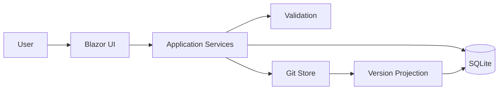
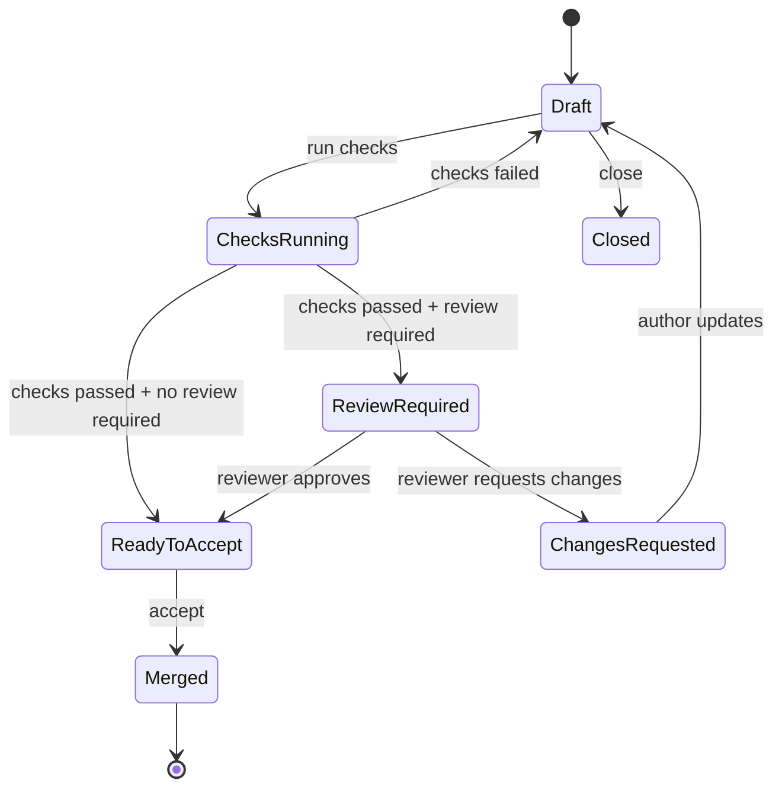
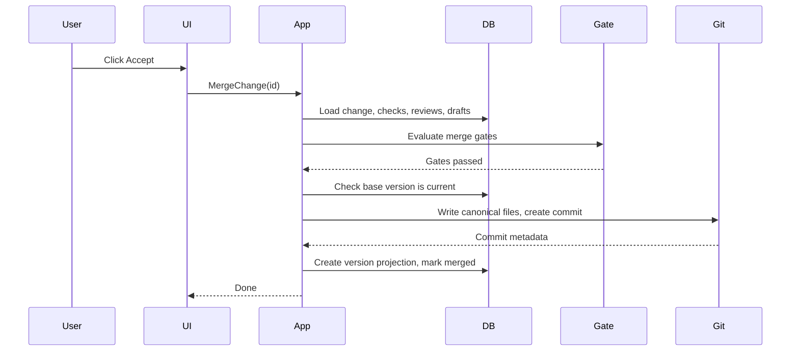

# Architecture

## 1. System identity

Detection Content Workbench is a Git-backed, database-driven content management system for
detection engineering. It manages detection content and the work around that content. It does
not execute detections against live telemetry or generate production alerts.

## 2. Architectural thesis

```text
Database = drafts, changes, checks, reviews, workflow state
Git      = accepted detection content and version history
```

Before merge, detection changes are operational workflow state in the database. At merge/accept
time, the system writes canonical content to Git. Git becomes the durable version ledger. The
UI projects Git commits as user-friendly detection versions.

## 3. Context diagram



## 4. Deployment model

Single ASP.NET Core modular monolith (ADR-0001).

```text
src/
  Workbench.Web              Blazor/MudBlazor host and composition root
  Workbench.Application      Application services, ports, read models
  Workbench.Domain           Aggregates, enums, invariants, value objects
  Workbench.Infrastructure   LibGit2Sharp Git store, infrastructure adapters
  Workbench.Persistence      Dapper + SQLite repositories, schema initializer
  Workbench.Workflow         IWorkflowOrchestrator + Elsa adapter
  Workbench.Validation       Check pipeline and query-validator boundary
```

The domain, application, persistence, infrastructure, workflow, and validation modules do not
depend on `Workbench.Web`.

## 5. User-facing model (ADR-0017)

Three concepts, five navigation items:

| Nav item | Purpose |
|---|---|
| Home | Action queue: what needs attention. |
| Detections | Catalog of accepted detection packages. |
| Changes | Active and recent changes (absorbs issue context, checks, reviews). |
| History | Accepted versions, compare, restore. |
| Settings | Operator-only health and configuration. |

Checks and reviews are shown inline on the Change workspace, not as standalone pages.

## 6. Data ownership

| Object | Store | Notes |
|---|---|---|
| Change (drafts, reason, checks, reviews) | Database | All operational state before merge. |
| Accepted detection package | Git | Canonical content after merge. |
| Detection version projection | Database | User-friendly projection of Git commit. |
| Detection identity | Database | Exists from first change creation. |

## 7. Core lifecycle



## 8. Governance

Governance is derived from workspace configuration (ADR-0017), not selected per-change.

| Mode | Gates | When |
|---|---|---|
| Quick lab | No approval; checks optional. | Experimentation environments (operator opt-in). |
| Controlled review | Required checks + non-author approval + stale-base blocking. | Default for shared content. |

Safety rules (domain-enforced):
- Authors cannot self-approve in controlled workflows.
- Approval resets when content changes after approval.
- Stale base versions block merge.
- Merge preserves unmodified accepted files.

## 9. Change model

A Change is the central workflow object. It carries everything needed for the edit-validate-review-accept loop:

```text
Change
  Title, Key
  Reason (free text)
  Related investigation URL
  Target detection (new or existing)
  Governance level (derived)
  Draft content (metadata, query, tests, fixtures)
  Check results (inline)
  Review decisions (inline)
  Status, base version, staleness flag
```

## 10. Merge operation



Merge is blocked when: required checks missing/failed, approval missing, self-approval
attempted, base version stale, draft cannot be canonicalized, or write lock unavailable.

## 11. Validation checks

Minimum checks:

```text
Package schema check
Query syntax check (interface-backed validator)
Fixture parse/load check
Test definition parse check
```

Check results are stored in the database and shown inline on the Change workspace.

## 12. Accepted content layout

```text
detections/<slug>/
  detection.yaml
  rule.kql
  tests/<test-id>.yaml
  fixtures/<fixture-id>.ndjson
```

Canonical paths are computed by the application layer. The UI never constructs Git paths.

## 13. Version history

Every accepted Git commit is projected into a user-friendly detection version with: version
number, detection, author, timestamp, linked change, checks summary, review summary, and
storage reference (hidden from normal UI).

Version actions: view, compare two versions, restore as new change.

## 14. Security boundaries

- No user-facing Git branch operations.
- Users cannot author arbitrary workflows.
- Detection IDs validated before path construction.
- Repository writes only during merge or controlled restore.
- Restore creates new content; never rewrites history.
- Fixture sizes and row counts limited.
