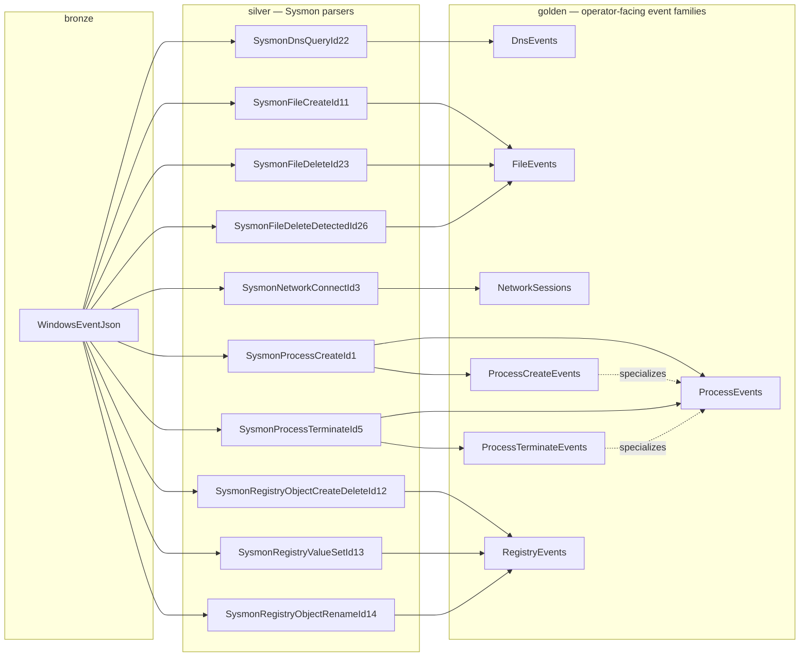

# Architecture

## What This System Is

A schema-first KQL hunting platform over DuckDB. Users write KQL in a Blazor Server web
interface. The backend parses KQL using Microsoft Kusto language tooling, translates a
controlled subset into transient DuckDB SQL through an intermediate relational model, executes
it, and returns bounded results. Users never write SQL, never see internal tables, and never
access raw schemas.

The system provides a Microsoft Sentinel / Defender Advanced Hunting-like experience over local
or embedded security data. Analysts query logical event families (for MVP, ASIM-shaped Golden contracts) — not files, staging tables, or DuckDB internals.


## ADR Alignment Snapshot

Current implementation aligns with accepted ADRs for parser-view SQL boundaries (ADR 0001), golden-only query surface (ADR 0002), two-seam testing (ADR 0003), semantics-preserving planner rewrites (ADR 0004), single-connection DuckDB MVP runtime (ADR 0005), semantic-safety rejection policy (ADR 0006), planner fast-path gateway direction (ADR 0011), MVP rejection of query-condition-cache extension (ADR 0012), and staged pragmatic `search` implementation boundaries (ADR 0014).

Proposed future tracks remain open for Quartz-backed scheduling (ADR 0007), multi-backend routing/contracts (ADR 0009), render sidecar + Vizor.ECharts compilation (ADR 0010), and time-series compilation contracts (ADR 0015). ADR 0013 is deprecated historical context and is not the active `search` direction.

## Structural Pattern

The architecture is structurally CQRS, not by design choice but because the problem shape
requires it. Two pipelines share a single DuckDB store but have entirely separate models,
intermediate representations, and code paths.

**Write side (schema pipeline):** C# schema models → `SchemaEmitter` DDL → `SchemaApplier`
→ DuckDB state mutation. Runs at deployment or bootstrap time. Intermediate representation:
`ExprDef`/`MappingQueryDef` mapping tree.

**Read side (runtime query pipeline):** KQL → `KustoToRelational` → `RelNode` IR →
`DuckDbQueryEmitter` → read-only DuckDB execution → bounded results. Runs at query time.
Intermediate representation: `RelNode`/`ScalarExpr` query tree.

The two pipelines share only the `ColumnDef`/`CanonicalViewDef` type definitions as a
contract surface. The `ApprovedViewCatalog` bridges them by projecting write-side schema
models into read-side Kusto.Language symbols. Everything else is separate.

This separation means the read path can be optimized independently (planner stage implemented), and
adding a new parser family only changes the write side.

## Core Architectural Bets

**Bet 1: Kusto.Language as parsing frontend.** Microsoft's own KQL parser, analyzer, and
symbol resolver handles all syntactic and semantic work. The project does not build a custom
parser, a custom LSP, or a custom language. `Kusto.Toolkit` provides the ergonomic layer for
injecting a synthetic `GlobalState` with `golden.*` views registered as `TableSymbol` instances.
Verified: `FilterOperator` (not `WhereOperator`), `TopOperator.ByExpression`, `JoinOnClause`,
`SummarizeByClause`, and all `SyntaxKind` enum names confirmed against
`microsoft/Kusto-Query-Language` source.

**Bet 2: Two-stage translation through an intermediate representation.** KQL is not translated
directly to SQL. The Kusto AST is first lowered into a `RelNode` intermediate relational model,
then the `RelNode` tree is emitted as DuckDB SQL. This boundary decouples Kusto semantics from
DuckDB dialect, makes each stage independently testable, and provides a clean insertion point
for policy enforcement and future optimization.

**Bet 3: C# schema models as the durable source of truth for contracts.** Parser-view SQL may be embedded in C# definitions when authored as DuckDB SQL. Runtime query SQL remains transient. Generated mapping SQL remains transient.
The maintained artifacts are C# record types defining raw tables, internal tables, parser views,
and canonical public views. Schema provenance (hashes, versions, generator metadata) is
persisted; SQL text is not persisted as standalone artifacts.

**Bet 4: DuckDB as embedded analytical engine.** No external database. No cluster. DuckDB runs
in-process for MVP (single connection through the Blazor Server backend). Post-MVP, the Quack
protocol (targeted DuckDB v2.0, September 2026) provides concurrent access and server-side
query authorization as a second enforcement layer for the policy boundary.

## Spec-Driven Development Model

```
docs/KQL-to-DuckDB-translation-spec.md
  authoritative translation reference (21 sections + 12 appendices)
    ↓
ARCHITECTURE.md
  system contracts and boundaries
    ↓
kql-syntax-coverage-checklist.md
  319 in-scope constructs: [x] MVP / [ ] deferred / [B] blocked
  each [x] item has a DuckDB translation target
    ↓
Red test cases (Hunting.Tests)
  MSTest suites across translator, emitter, schema pipeline, and end-to-end execution
    ↓
Implementation (Hunting.Core, Hunting.Data)
    ↓
Green test cases → Refactor
```

A construct is considered supported only when it appears as `[x]` in the checklist AND its
tests pass. No other definition of done applies.

The test harness operates at two independent seams:

- **Translator seam** (`Hunting.Tests/Translation/`): KQL string → `RelNode` tree. Tests
  assert tree shape, not SQL. Locates failures in `KustoToRelational`.
- **Emitter seam** (`Hunting.Tests/Emitter/`): hand-constructed `RelNode` → DuckDB SQL string.
  Tests assert whitespace-normalized SQL fragments. Locates failures in `DuckDbQueryEmitter`.
- **DuckDB spec tests** (`Hunting.Tests/Spike/`): verify every DuckDB function used as a
  translation target actually executes correctly in DuckDB.NET. Ground truth for the emitter.
- **End-to-end tests** (`Translation/EndToEndPipelineTests.cs`): supplementary KQL → result
  validation against mock data.

## Pipelines

### Schema Pipeline (write side)

```
C# schema and mapping models (RawTableDef, ParserViewDef, CanonicalViewDef)
  → ParserViewDef authoring mode
      ├─ Mapping-backed: ExprDef/MappingQueryDef → generated parser-view SQL
      └─ SQL-backed: embedded DuckDB SQL → emitted/applied as-is
  → SchemaEmitter: generates DDL and view SQL
      ├─ CREATE TABLE with typed columns
      ├─ CREATE VIEW parser definitions from mapping-backed or SQL-backed ParserViewDef
      │   Null literals emitted as CAST(NULL AS type) to prevent DuckDB type inference errors
      └─ CREATE VIEW golden.* as UNION ALL over parser views
  → SchemaApplier: executes DDL through DuckDB.NET
  → DESCRIBE validation: columns and types checked against C# contracts
  → SQL discarded; provenance metadata retained
```

Initial table/view coverage can be bootstrapped from ASIM parser definitions as a one-off accelerator, but the internal source of truth remains the C# model. This is not a permanent ingestion pipeline. ASIM is Azure-centric reference material, and long-term schema growth is expected to follow a provider-agnostic model.

### Runtime Query Pipeline (read side)

```
KQL input (from Monaco editor or API)
  → Kusto.Language ParseAndAnalyze (with ApprovedViewCatalog GlobalState)
  → Policy validation:
      ├─ Unapproved table → Error (Parse/Policy phase)
      ├─ Bare join (no kind=) → Error (Policy phase, semantic safety)
      ├─ Blocked operators (.show, .create, evaluate) → Error (Translate phase)
      └─ Unsupported constructs → Error with KQL-terms message
  → KustoToRelational: Kusto AST → RelNode tree
  → DuckDbQueryEmitter: RelNode → transient CTE-staged DuckDB SQL
  → DuckDB.NET execution (timeout, row cap)
  → Bounded result set returned as QueryResult
  → DuckDB errors pattern-matched to KQL-terms diagnostics
  → SQL discarded
```

## Implemented Components (Phase 1 + Phase 2)

### Hunting.Core

| Component | Status | Notes |
|-----------|--------|-------|
| `Schema/DuckDbType`, `KustoType` | Complete | Type enums with cross-mapping |
| `Schema/SchemaObjectDef` hierarchy | Complete | `RawTableDef`, `InternalTableDef`, `ParserViewDef`, `CanonicalViewDef` |
| `Schema/Definitions/DeviceProcessEventsSchema` | Complete | Current process-family schema (transitional naming), Sysmon EID 1 parser view |
| `Mapping/MappingModel` | Complete | `ExprDef` tree, `MapDsl` builder helpers |
| `Catalog/ApprovedViewCatalog` | Complete | C# schema → Kusto.Language `GlobalState` via `Kusto.Toolkit` |
| `Policy/QueryDiagnostic` | Complete | `DiagnosticBag`, five-phase error contract |
| `QueryModel/RelNode` | Complete | 10 node types + `WindowScalarExpr` + `WindowSpec`/`WindowFrame` |
| `QueryModel/ScalarExpr` | Complete | `ColumnRef`, `LiteralScalar`, `BinaryScalar`, `UnaryScalar`, `FunctionCall`, `CaseScalar`, `WindowScalarExpr` |
| `QueryModel/ScalarBinaryOp` | Complete | 36 operators incl. has/has_cs/hasprefix/hassuffix/matchesregex |
| `DuckDbSql/SchemaEmitter` | Complete | DDL generation with typed NULLs, parser view mappings |
| `DuckDbSql/DuckDbQueryEmitter` | Complete | CTE-staged SQL, 70+ function mappings, window frames |
| `Translation/KustoToRelational` | Complete | All MVP operators; API names source-verified |

### Hunting.Data

| Component | Status | Notes |
|-----------|--------|-------|
| `DuckDbConnectionFactory` | Complete | Single-connection MVP model |
| `SchemaApplier` | Complete | DDL execution, DESCRIBE validation, type alias normalization |
| `QueryRuntime` | Complete | Full pipeline orchestration, DuckDB error normalization |
| `MockDataSeeder` | Complete | 20 realistic Sysmon EID 1 events (recon, lateral movement, beaconing, persistence) |

## Database Schema Layout

| Schema | Visibility | Purpose |
|--------|-----------|---------|
| `bronze` | Internal only | Original or minimally parsed source records (JSON) |
| `silver` | Internal only | Source/event-specific parser views, lookups, enrichment, versioning |
| `golden` | User-facing | Event-family hunting views — the only KQL-queryable surface |
| `accelerator` | Internal only, optional | Future derived/optimized tables behind `golden.*` views |

View composition (current implementation):

```
golden.DeviceProcessEvents
  = UNION ALL over:
      silver.v_process_sysmon_create
      silver.v_process_windows_4688_create  ← future
      silver.v_process_defender_create      ← future
```

MVP event-family composition target (ASIM-style aggregation logic with project-owned medallion naming):



Golden event-family views document explicit Silver contributors. “Contributes to” edges are physical data-flow dependencies; “specializes” edges are semantic subset relationships between Golden views.
Silver contributors in this model are DuckDB SQL parser views (mapping-backed generated SQL or SQL-backed embedded definitions), not KQL parser artifacts.

All parser views feeding the same public view emit identical columns with compatible types.
Null projections are emitted as `CAST(NULL AS type)` — bare `NULL` would cause DuckDB to
infer `INTEGER` and break DESCRIBE validation.

## Assembly Model

```
src/
  Hunting.Core/     Schema contracts/types, Mapping model, Catalog, Policy, QueryModel, Translation, DuckDbSql
  Hunting.Schema/   DeviceProcessEventsSchema, DeviceNetworkEventsSchema (dedicated schema authoring surface)
  Hunting.Data/     DuckDbConnectionFactory, SchemaApplier, QueryRuntime, MockDataSeeder
  Hunting.Web/      Blazor Server UI, Monaco editor integration, schema browser, result grid, and developer SQL preview

tests/
  Hunting.Tests/    Spike/, Translation/, Emitter/

docs/
  KQL-to-DuckDB-translation-spec.md   Authoritative translation reference (796 KB)
```

Dependency graph:

```
Hunting.Web → Hunting.Core, Hunting.Data, Hunting.Schema
Hunting.Data → Hunting.Core
Hunting.Schema → Hunting.Core
Hunting.Tests → Hunting.Core, Hunting.Data, Hunting.Schema
```

`Hunting.Core` has no project dependencies. All DuckDB references live in `Hunting.Data` and
`Hunting.Tests`. All Kusto.Language references live in `Hunting.Core` and `Hunting.Tests`.

## Error Contract

```csharp
record QueryDiagnostic(
    DiagnosticSeverity Severity,   // Error, Warning, Info
    DiagnosticPhase Phase,         // Parse, Policy, Translate, Emit, Execute
    string Message,                // User-facing, in KQL terms
    string? DeveloperDetail,       // Raw SQL, DuckDB exception text, AST node info
    int? TextStart,                // Position in original KQL string
    int? TextLength);
```

Errors short-circuit the pipeline. DuckDB execution errors are never shown unprocessed —
pattern-matched to KQL-terms explanations, with a generic fallback that exposes `DeveloperDetail`
only in developer mode. The five phases map cleanly to the five pipeline stages: any failure
belongs to exactly one phase and is always attributed correctly.

## SQL Artifact Policy

SQL artifact policy is scoped by pipeline role (see ADR 0001: `docs/adr/0001-use-embedded-duckdb-sql-for-parser-views.md`).

| SQL Type | Persisted? | Notes |
|----------|-----------|-------|
| Schema DDL | No | Generated from C# models; applied, not persisted as standalone SQL |
| Mapping-backed parser view SQL | No | Generated from `ExprDef` / `MappingQueryDef`; not persisted as standalone SQL |
| SQL-backed parser view SQL | Yes (embedded in C#) | Developer-authored DuckDB SQL embedded in C# schema definitions |
| Public hunting view SQL | No (default) | Generated from `CanonicalViewDef` unless explicitly overridden later |
| Runtime query SQL | No | Generated from `RelNode`, executed, discarded |
| Debug SQL preview | Optional | Exposed via `QueryResult.GeneratedSql` in developer mode |
| Schema provenance | Yes | Hashes, versions, generator metadata |

## Known Divergences from Kusto

Full register in `kql-syntax-coverage-checklist.md` Section 9. Significant items:

| Construct | Divergence | Resolution |
|-----------|-----------|------------|
| `has` | Kusto: inverted term index, O(1). DuckDB: `regexp_matches` regex scan | Correct word-boundary semantics; scan-based performance acceptable for embedded data volumes |
| `dcount()` | Kusto: HyperLogLog approximate | DuckDB: `COUNT(DISTINCT x)` exact — stricter, acceptable |
| `sort by` default | Kusto default is `desc` | Emitter always emits direction explicitly — never relies on DuckDB default (`asc`) |
| `extract()` | Returns empty string on no match | DuckDB `regexp_extract` returns NULL — emitter wraps with `COALESCE(..., '')` |
| `serialize` | Explicit operator forcing row ordering | No-op in translation; ordering attached to `OVER` clause of window expressions |
| `dayofweek()` | Returns timespan from Sunday | DuckDB `date_part('dow')` returns integer 0–6 — documented type difference |
| `endof*(dt)` | Returns last tick of period | Emitted as `date_trunc + interval - 1 microsecond` |
| Dynamic member access | Dot notation on dynamic columns | Not yet implemented (post-MVP); JSON path emission required |
| `innerunique` join | Deduplicates left side before joining | **Blocked** — no SQL equivalent; bare `join` and `kind=innerunique` produce policy errors |

## Third-Party Libraries

| Library | Version | Role |
|---------|---------|------|
| `Microsoft.Azure.Kusto.Language` | 17.* | KQL parser, AST, diagnostics, semantic analysis |
| `Kusto.Toolkit` | 2.* | `GlobalState` builder ergonomics (`AddOrUpdateDatabaseMembers`) |
| `DuckDB.NET.Data` | 1.* | DuckDB ADO.NET provider |
| `DuckDB.NET.Bindings` | 1.* | DuckDB native bindings |
| Monaco Editor | latest | Browser code editor |
| Monaco KQL editor language service (JS interop) | current | KQL editor support (syntax, completions, schema-aware suggestions, run shortcut) |
| `System.Text.Json` | inbox | JSON handling and one-off bootstrap import tooling |
| MSTest | 3.* | Test framework |

## Medallion Layering Direction (ADR 0008)

POC and forward design use `bronze`/`silver`/`golden` schema layering with Golden as the operator-facing query surface and binder-enforced lower-layer isolation in normal operator use. See `docs/adr/0008-use-medallion-schemas-with-principle-driven-contracts.md`.

## Multi-Dialect Backend Direction (ADR 0009)

Post-stable-v1 direction is a single-KQL-front-door architecture with backend-specific execution adapters. Core translation/planning remain engine-agnostic; backend selection is workload-routed (scheduled/historical vs realtime). See `docs/adr/0009-multi-dialect-backend-architecture.md`.

## Render Visualization Sidecar Direction (ADR 0010)

`render` is treated as terminal presentation metadata, not relational semantics. Translation emits SQL plus a render sidecar, and UI compilation to Vizor.ECharts remains outside translator/planner/emitter layers. See `docs/adr/0010-render-poc-subset-with-vizor-echarts.md`.

## Post-MVP Architecture Evolution

- **Quack protocol** — concurrent access + server-side query authorization (DuckDB v2.0, September 2026). The CQRS shape (separate write/read connections with different permission levels) maps naturally to Quack's per-query authorization callback.
- **One-off schema bootstrap import** — optional starter import from ASIM/Sentinel parser definitions, followed by provider-agnostic schema evolution in C# contracts.
- **Accelerator schema** — materialized/optimized tables behind `golden.*` views.
- **Detection-as-code** — saved queries, scheduled hunts, alerting.
- **Scheduled query runner (ADR 0007)** — Quartz-based scheduler as a separate solution project with DB-backed saved queries, schedule definitions, and run history; includes dashboard-adjacent UI for saved query and schedule management (no near-real-time processing in this stage).
- **Post-translation planner** — logical query shaping once primitive translation and emission are proven (see below).

### Planner Stage (Implemented)

The runtime path includes a logical planner stage between translation and SQL emission:

```
Kusto AST → Primitive RelNode → Planned RelNode → DuckDB SQL
```

`RelationalPlanner` performs semantics-preserving rewrites only (no physical optimization).
DuckDB remains responsible for physical planning/execution. Current passes focus on SQL-shape
quality and dead-expression cleanup (for example: projection pruning, safe filter pushdown,
filter-extend inlining, and common scalar hoisting), with emitter-side stage simplifications
applied after planning.

---

*Last updated: 2026-05-26 — Documentation aligned to current implementation state (Phase 4 complete, including Monaco editor language service).*
