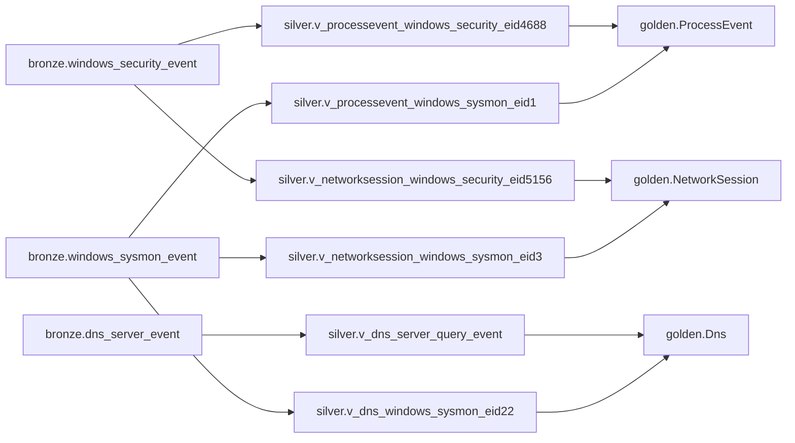

# Architecture

## What This System Is

Hunting is a schema-first KQL-on-DuckDB security hunting workbench built with .NET. Users write KQL in a Blazor Server web interface. The backend parses KQL using Microsoft Kusto language tooling, translates a controlled subset into a relational intermediate model, emits transient DuckDB SQL, executes it, and returns bounded results.

Users query logical Golden event contracts. They do not write SQL, do not query Bronze or Silver objects, and do not depend on DuckDB-internal table names.

## ADR Alignment Snapshot

The current implementation aligns with accepted ADRs for parser-view SQL boundaries, Golden-only query surface, two-seam testing, semantics-preserving planner rewrites, single-connection DuckDB MVP runtime, semantic-safety rejection policy, medallion schema direction, schema provenance, governed seed fixtures, and parser specifications as a validation layer.

Phase 1A is the accepted medallion checkpoint. It is not a broad schema expansion milestone. Its purpose is to prove the Bronze/Silver/Golden shape, remove legacy vertical-slice assumptions, and establish the active contracts before hardening and expansion.

Phases 1B, 1C, and 1D harden that checkpoint. Phase 1B adds schema provenance and conservative migration safety. Phase 1C governs development seed fixtures. Phase 1D makes parser behavior reviewable and guarded without replacing the existing parser-view generation path.

## Structural Pattern

The architecture is structurally CQRS because the write-side schema pipeline and read-side query pipeline have different models and failure modes.

**Write side:** C# schema models → `SchemaEmitter` DDL → `SchemaApplier` → DuckDB state mutation.

**Read side:** KQL → public `KustoToRelational` compatibility adapter → internal `KustoQueryTranslator` → `RelNode` IR → `RelationalPlanner` → `DuckDbQueryEmitter` → read-only DuckDB execution → bounded results.

`ApprovedViewCatalog` bridges the two pipelines by projecting Golden schema models into Kusto.Language symbols.

## Core Architectural Bets

| Bet | Decision |
|---|---|
| KQL frontend | Use Microsoft Kusto language tooling rather than a custom parser |
| Translation seam | Lower KQL into `RelNode`, then emit DuckDB SQL |
| Schema source of truth | Keep C# schema models as durable contract definitions |
| Execution engine | Use embedded DuckDB for MVP/local/dev execution |
| Public query surface | Expose Golden contracts only |

## Medallion Schema Boundary

The database is organized into medallion schemas:

| Schema | Visibility | Purpose |
|---|---|---|
| `bronze` | Internal only | Source-shaped evidence preservation |
| `silver` | Internal only | Source/event-specific parser and interpretation views |
| `golden` | Operator-facing | Stable hunting contracts exposed to KQL |
| `internal` | Internal only | Schema provenance, seed fixture metadata, and other control-plane tables |
| `accelerator` | Internal only, optional | Future derived/optimized tables behind Golden views |

```text
bronze = source-shaped evidence preservation
silver = source/event-specific interpretation
golden = operator-facing semantics
internal = control-plane metadata
```

Bronze stores source-shaped records. Silver interprets those records using source/event filters and parser-specific projections. Golden consolidates Silver outputs into operator-facing contracts. Golden may perform thin harmonization but must not hide source-specific payload parsing.

## Phase 1A Medallion Checkpoint

Phase 1A is the first active medallion checkpoint.

Active Golden contracts:

```text
golden.ProcessEvent
golden.NetworkSession
golden.Dns
```

Active Bronze source-family tables:

```text
bronze.windows_sysmon_event
bronze.windows_security_event
bronze.dns_server_event
```

Active Silver parser views:

```text
silver.v_processevent_windows_sysmon_eid1
silver.v_processevent_windows_security_eid4688
silver.v_networksession_windows_sysmon_eid3
silver.v_networksession_windows_security_eid5156
silver.v_dns_windows_sysmon_eid22
silver.v_dns_server_query_event
```



Removed or rejected legacy names:

```text
golden.ProcessEvents
golden.NetworkSessions
golden.DeviceProcessEvents
golden.DeviceNetworkEvents
bronze.windows_event_json
silver.v_process_sysmon_create
MockDataSeeder.GetProcessSeedSql()
```

These names should not return accidentally. If compatibility aliases are needed later, they must be introduced deliberately with tests and documentation.

## Phase 1B Schema Provenance and Migration Safety

Phase 1B adds an internal provenance layer for schema evolution.

The active internal metadata table is:

```text
internal.schema_provenance
```

It records one row per applied schema object:

| Column | Purpose |
|---|---|
| `object_name` | Fully qualified object name |
| `object_kind` | Object kind such as raw table, parser view, canonical view, or internal table |
| `schema_hash` | Stable SHA-256 fingerprint of the schema object |
| `catalog_version` | Catalog/application schema version label |
| `applied_at` | Timestamp when provenance was recorded |

The provenance pipeline is:

```text
Schema definitions
  -> generated fingerprints
  -> recorded provenance
  -> drift detection
  -> safety classification
  -> guard enforcement component
```

Drift states are:

```text
Unchanged
NewObject
ChangedObject
MissingObject
```

Safety classification is conservative. `Unchanged` and `NewObject` are safe. `ChangedObject` and `MissingObject` are unsafe by default because Phase 1B does not yet include structural table/view diffs.

`SchemaMigrationSafetyGuard` blocks unsafe drift under the default `BlockUnsafe` policy. `AllowUnsafe` exists only for explicit development/reset workflows.

## Phase 1C Governed Seed Fixtures

Phase 1C governs development/test seed data through internal fixture batch metadata.

The active internal seed metadata table is:

```text
internal.seed_batches
```

It records one row per governed seed fixture batch:

| Column | Purpose |
|---|---|
| `batch_id` | Stable seed batch identifier |
| `table_name` | Fully qualified target table |
| `source_name` | Source family or source system |
| `scenario` | Scenario label |
| `row_count` | Expected row count inserted by the batch |
| `content_hash` | Stable SHA-256 hash of the batch metadata and SQL/content |
| `catalog_version` | Optional seed/catalog version |
| `applied_at` | Timestamp when the batch was recorded |

The seed governance pipeline is:

```text
Existing medallion seed SQL
  -> SeedFixtureBatch objects
  -> content hashes
  -> internal.seed_batches recording
  -> idempotent application through SeedFixtureBatchApplier
```

The current medallion baseline exposes one governed batch per active Bronze source table. Reapplying the same governed batches skips execution and avoids duplicate rows. Mismatched recorded metadata is blocked by default, with an explicit allow policy for development/reset workflows.

The governed seed path does not replace production ingestion. It exists to make development/test fixtures explicit, repeatable, and inspectable.

## Phase 1D Parser Specification Model and Source-Shape Correctness

Phase 1D makes the active Silver parser surface reviewable and testable without replacing the existing parser-view generation path.

The parser specification layer introduces:

```text
ParserSpec
ParserProjectionSpec
ParserIntentionalNullSpec
ParserSpecValidator
Phase1DParserSpecCatalog
Phase1DParserSpecCatalogValidator
ParserSpecViewBridge
```

The active parser spec catalog exposes one spec per active Silver parser view:

```text
silver.v_processevent_windows_sysmon_eid1
silver.v_processevent_windows_security_eid4688
silver.v_networksession_windows_sysmon_eid3
silver.v_networksession_windows_security_eid5156
silver.v_dns_windows_sysmon_eid22
silver.v_dns_server_query_event
```

The Phase 1D parser pipeline is:

```text
Active ParserViewDef catalog
  -> derived ParserSpec catalog
  -> catalog validation
  -> source-shape behavior guards
  -> bridge back to existing ParserViewDef
```

`ParserSpec` is currently a review and validation layer. Runtime parser SQL generation still uses `ParserViewDef.Mapping`. The bridge validates that a parser spec describes an existing parser view; it does not regenerate mapping SQL from placeholder parser-spec expressions.

Phase 1D source-shape guards verify that active parser views accept only their intended event/source shapes and reject wrong-source, wrong-event, and missing-selector records.

## Development Seed Boundary

`MockDataSeeder` is development/test bootstrap data only. It supports local execution, end-to-end tests, and UI sample queries. It is not production ingestion and does not define production fixture semantics.

The current governed seed fixture path wraps the active medallion development seed SQL with batch metadata, row counts, content hashes, and idempotent application. The older direct seed SQL path remains for compatibility with existing tests and utilities, but new repeatable medallion bootstrap tests should prefer `SeedFixtureBatchApplier`.

Current seed coverage includes representative rows for encoded PowerShell, credential-access tooling, persistence tooling, suspicious network ports, SMB activity, beaconing without hostname, DNS test domains, and NXDOMAIN responses.

Future seed work should move from table-level batches toward scenario-level fixture batches with clearer source-shape and analytic intent.

## UI Sample Query Boundary

UI sample queries are centralized in `Hunting.Core.Samples.SampleQueryCatalog` and rendered by `SchemaBrowser.razor`.

The sample catalog must use only active Golden names:

```text
ProcessEvent
NetworkSession
Dns
```

The catalog must not use legacy table names or relative time filters such as `ago(...)` against fixed seed data. Numeric fields such as `ProcessId`, `LocalPort`, and `RemotePort` should use numeric predicates, not string-empty checks.

## Runtime Query Pipeline

```text
KQL input
  -> Kusto.Language ParseAndAnalyze with ApprovedViewCatalog GlobalState
  -> Policy validation
  -> KustoToRelational compatibility adapter
  -> internal KustoQueryTranslator
  -> RelationalPlanner RelNode rewrite passes
  -> DuckDbQueryEmitter
  -> DuckDB.NET execution
  -> bounded QueryResult
  -> SQL discarded
```

Bronze and Silver are not part of the user-facing query surface. Only approved Golden contracts are registered in the KQL catalog.

### Translator, planner, and optimizer naming boundary

`KustoQueryTranslator` is the internal KQL/Kusto-syntax-to-`RelNode` translation façade. The public `KustoToRelational` type remains as a compatibility adapter until a deliberate breaking API change is accepted. Translation does not perform relational rewrite decisions. `RelationalPlanner` remains the name for semantics-preserving `RelNode` rewrite passes. Optimizer terminology is reserved for future cost- or rule-based optimization work rather than AST lowering.

Document parsing and diagnostics, management-command blocking, approved table-reference policy, Kusto SDK syntax adaptation, projection naming, function argument validation, and integer-literal reading are isolated internal translation collaborators. Tabular, join, and scalar translation remain in the internal façade for now and may be extracted incrementally without changing the compatibility surface.

## Schema Pipeline

```text
C# schema and mapping models
  -> SchemaEmitter
      -> CREATE SCHEMA
      -> CREATE TABLE
      -> CREATE OR REPLACE VIEW for Silver parser views
      -> CREATE OR REPLACE VIEW for Golden canonical views
  -> SchemaApplier
      -> Executes DDL through DuckDB.NET
      -> Validates with DESCRIBE
```

Golden views must emit explicit canonical projections per Silver branch. `SELECT *` is not acceptable at the Golden boundary.

## Implemented Component Areas

| Project | Responsibility |
|---|---|
| `Hunting.Core` | Query model, translation, planner, policy, catalog, SQL emission, sample-query catalog |
| `Hunting.Schema` | C# schema definitions and active medallion catalog |
| `Hunting.Data` | DuckDB connection factory, schema application, runtime orchestration, mock seeding |
| `Hunting.Web` | Blazor UI, schema browser, query execution surface, render UI |
| `Hunting.Tests` | Translation, emitter, runtime, schema, planner, sample, and E2E tests |

## SQL Artifact Policy

| SQL Type | Persisted? | Notes |
|---|---:|---|
| Schema DDL | No | Generated from C# models and applied |
| Mapping-backed parser-view SQL | No | Generated from schema/mapping definitions |
| SQL-backed parser-view SQL | Yes, embedded in C# | Allowed only when explicitly chosen |
| Golden view SQL | No by default | Generated from `CanonicalViewDef` |
| Runtime query SQL | No | Generated, executed, discarded |
| Debug SQL preview | Optional | Exposed in developer mode |

## Expansion Rule

A new source or Golden family must not be added by changing only the catalog. It must include contract definitions, Silver parser specs or mappings, positive parser tests, negative source-shape tests, Golden projection/type tests, seed fixture coverage, policy/catalog tests, metadata updates, and documentation.

## Known Current Limitations

| Area | Limitation |
|---|---|
| Schema provenance | Implemented in Phase 1B at object-fingerprint level; structural migration planning remains deferred |
| Migration safety | No additive/destructive structural migration planner yet |
| Seed governance | Implemented in Phase 1C for governed development fixture batches; scenario-level fixture files remain deferred |
| Tolerant casting | Numeric extraction still needs a formal tolerant conversion policy |
| Windows Security mapping | Some fields remain intentionally null until conversion semantics are defined |
| DNS semantics | Response/status normalization remains incomplete |
| Golden semantics | `ActionType`, `ReportId`, account fields, and DNS response fields need stronger contracts |
| Source time | Event/source/ingest timestamps are not yet modeled separately |
| Parser model | Implemented in Phase 1D as a validation/review layer over existing `ParserViewDef.Mapping` |
| Parser-spec generation | Parser specs do not yet generate `MappingQueryDef` or parser-view SQL |
| Fixture depth | More sample logs are needed, but should be added under fixture governance |

## Phase 1B–1D Boundary

Phase 1B resolves the absence of a basic schema provenance ledger and object-level drift guard. Phase 1C resolves governed development seed fixture metadata and idempotent application. Phase 1D adds parser specifications as a validation and review layer. Structural migration planning, tolerant casting, and Golden semantic normalization remain deferred.
