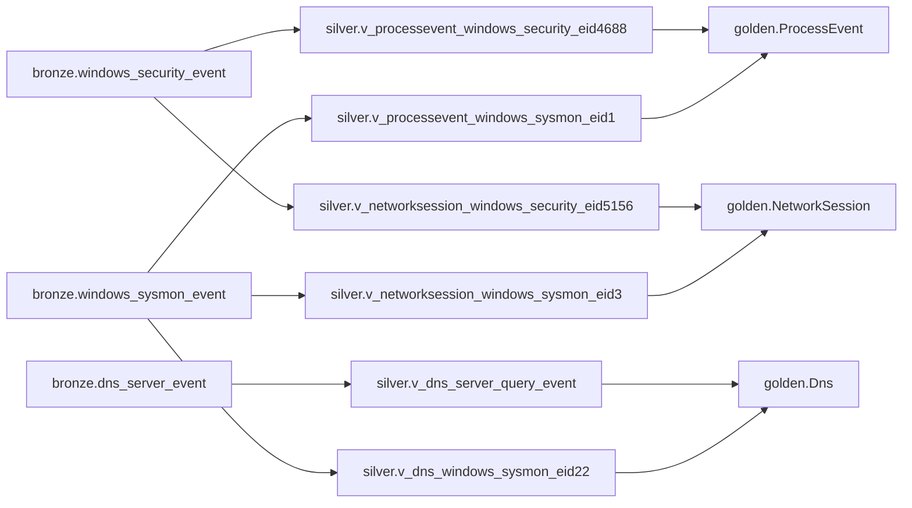

# Architecture

## What This System Is

Hunting is a schema-first KQL-on-DuckDB security hunting workbench built with .NET. Users write KQL in a Blazor Server web interface. The backend parses KQL using Microsoft Kusto language tooling, translates a controlled subset into a relational intermediate model, emits transient DuckDB SQL, executes it, and returns bounded results.

Users query logical Golden event contracts. They do not write SQL, do not query Bronze or Silver objects, and do not depend on DuckDB-internal table names.

## ADR Alignment Snapshot

The current implementation aligns with accepted ADRs for parser-view SQL boundaries, Golden-only query surface, two-seam testing, semantics-preserving planner rewrites, single-connection DuckDB MVP runtime, semantic-safety rejection policy, and medallion schema direction.

Phase 1A is now the accepted medallion checkpoint. It is not a broad schema expansion milestone. Its purpose is to prove the Bronze/Silver/Golden shape, remove legacy vertical-slice assumptions, and establish the active contracts before hardening and expansion.

## Structural Pattern

The architecture is structurally CQRS because the write-side schema pipeline and read-side query pipeline have different models and failure modes.

**Write side:** C# schema models → `SchemaEmitter` DDL → `SchemaApplier` → DuckDB state mutation.

**Read side:** KQL → `KustoToRelational` → `RelNode` IR → planner → `DuckDbQueryEmitter` → read-only DuckDB execution → bounded results.

`ApprovedViewCatalog` bridges the two pipelines by projecting Golden schema models into Kusto.Language symbols.

## Core Architectural Bets

| Bet | Decision |
|---|---|
| KQL frontend | Use Microsoft Kusto language tooling rather than a custom parser |
| Translation seam | Lower KQL into `RelNode`, then emit DuckDB SQL |
| Schema source of truth | Keep C# schema models as durable contract definitions |
| Execution engine | Use embedded DuckDB for MVP/local/dev execution |
| Public query surface | Expose Golden contracts only |

## Medallion Schema Boundary

The database is organized into medallion schemas:

| Schema | Visibility | Purpose |
|---|---|---|
| `bronze` | Internal only | Source-shaped evidence preservation |
| `silver` | Internal only | Source/event-specific parser and interpretation views |
| `golden` | Operator-facing | Stable hunting contracts exposed to KQL |
| `accelerator` | Internal only, optional | Future derived/optimized tables behind Golden views |

```text
bronze = source-shaped evidence preservation
silver = source/event-specific interpretation
golden = operator-facing semantics
```

Bronze stores source-shaped records. Silver interprets those records using source/event filters and parser-specific projections. Golden consolidates Silver outputs into operator-facing contracts. Golden may perform thin harmonization but must not hide source-specific payload parsing.

## Phase 1A Medallion Checkpoint

Phase 1A is the first active medallion checkpoint.

Active Golden contracts:

```text
golden.ProcessEvent
golden.NetworkSession
golden.Dns
```

Active Bronze source-family tables:

```text
bronze.windows_sysmon_event
bronze.windows_security_event
bronze.dns_server_event
```

Active Silver parser views:

```text
silver.v_processevent_windows_sysmon_eid1
silver.v_processevent_windows_security_eid4688
silver.v_networksession_windows_sysmon_eid3
silver.v_networksession_windows_security_eid5156
silver.v_dns_windows_sysmon_eid22
silver.v_dns_server_query_event
```



Removed or rejected legacy names:

```text
golden.ProcessEvents
golden.NetworkSessions
golden.DeviceProcessEvents
golden.DeviceNetworkEvents
bronze.windows_event_json
silver.v_process_sysmon_create
MockDataSeeder.GetProcessSeedSql()
```

These names should not return accidentally. If compatibility aliases are needed later, they must be introduced deliberately with tests and documentation.

## Development Seed Boundary

`MockDataSeeder` is development/test bootstrap data only. It supports local execution, end-to-end tests, and UI sample queries. It is not a governed fixture system.

Current seed coverage includes representative rows for encoded PowerShell, credential-access tooling, persistence tooling, suspicious network ports, SMB activity, beaconing without hostname, DNS test domains, and NXDOMAIN responses.

Future seed work must move toward governed fixture batches with scenario labels, row counts, content hashes, and repeatable idempotent application.

## UI Sample Query Boundary

UI sample queries are centralized in `Hunting.Core.Samples.SampleQueryCatalog` and rendered by `SchemaBrowser.razor`.

The sample catalog must use only active Golden names:

```text
ProcessEvent
NetworkSession
Dns
```

The catalog must not use legacy table names or relative time filters such as `ago(...)` against fixed seed data. Numeric fields such as `ProcessId`, `LocalPort`, and `RemotePort` should use numeric predicates, not string-empty checks.

## Runtime Query Pipeline

```text
KQL input
  -> Kusto.Language ParseAndAnalyze with ApprovedViewCatalog GlobalState
  -> Policy validation
  -> KustoToRelational
  -> RelNode planner
  -> DuckDbQueryEmitter
  -> DuckDB.NET execution
  -> bounded QueryResult
  -> SQL discarded
```

Bronze and Silver are not part of the user-facing query surface. Only approved Golden contracts are registered in the KQL catalog.

## Schema Pipeline

```text
C# schema and mapping models
  -> SchemaEmitter
      -> CREATE SCHEMA
      -> CREATE TABLE
      -> CREATE OR REPLACE VIEW for Silver parser views
      -> CREATE OR REPLACE VIEW for Golden canonical views
  -> SchemaApplier
      -> Executes DDL through DuckDB.NET
      -> Validates with DESCRIBE
```

Golden views must emit explicit canonical projections per Silver branch. `SELECT *` is not acceptable at the Golden boundary.

## Implemented Component Areas

| Project | Responsibility |
|---|---|
| `Hunting.Core` | Query model, translation, planner, policy, catalog, SQL emission, sample-query catalog |
| `Hunting.Schema` | C# schema definitions and active medallion catalog |
| `Hunting.Data` | DuckDB connection factory, schema application, runtime orchestration, mock seeding |
| `Hunting.Web` | Blazor UI, schema browser, query execution surface, render UI |
| `Hunting.Tests` | Translation, emitter, runtime, schema, planner, sample, and E2E tests |

## SQL Artifact Policy

| SQL Type | Persisted? | Notes |
|---|---:|---|
| Schema DDL | No | Generated from C# models and applied |
| Mapping-backed parser-view SQL | No | Generated from schema/mapping definitions |
| SQL-backed parser-view SQL | Yes, embedded in C# | Allowed only when explicitly chosen |
| Golden view SQL | No by default | Generated from `CanonicalViewDef` |
| Runtime query SQL | No | Generated, executed, discarded |
| Debug SQL preview | Optional | Exposed in developer mode |

## Expansion Rule

A new source or Golden family must not be added by changing only the catalog. It must include contract definitions, Silver parser specs or mappings, positive parser tests, negative source-shape tests, Golden projection/type tests, seed fixture coverage, policy/catalog tests, metadata updates, and documentation.

## Known Phase 1A Limitations

| Area | Limitation |
|---|---|
| Schema provenance | No schema ledger or schema hash table yet |
| Migration safety | No additive/destructive migration planner yet |
| Seed governance | No seed batch ledger, fixture hash, or scenario provenance yet |
| Tolerant casting | Numeric extraction still needs a formal tolerant conversion policy |
| Windows Security mapping | Some fields remain intentionally null until conversion semantics are defined |
| DNS semantics | Response/status normalization remains incomplete |
| Golden semantics | `ActionType`, `ReportId`, account fields, and DNS response fields need stronger contracts |
| Source time | Event/source/ingest timestamps are not yet modeled separately |
| Parser model | Silver parser definitions work but are not yet first-class parser specs |
| Fixture depth | More sample logs are needed, but should be added under fixture governance |
