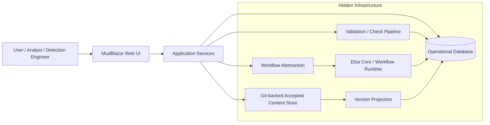
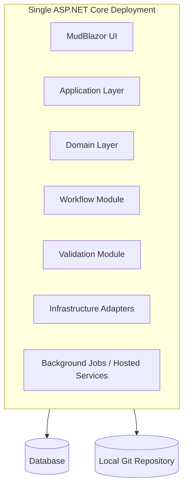
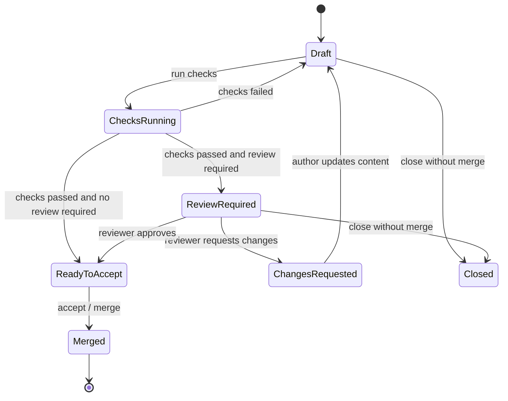
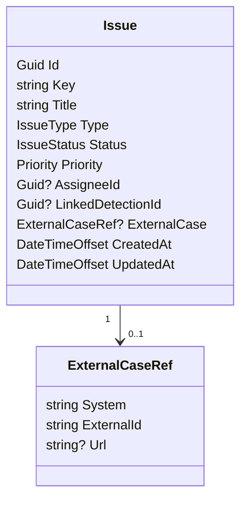
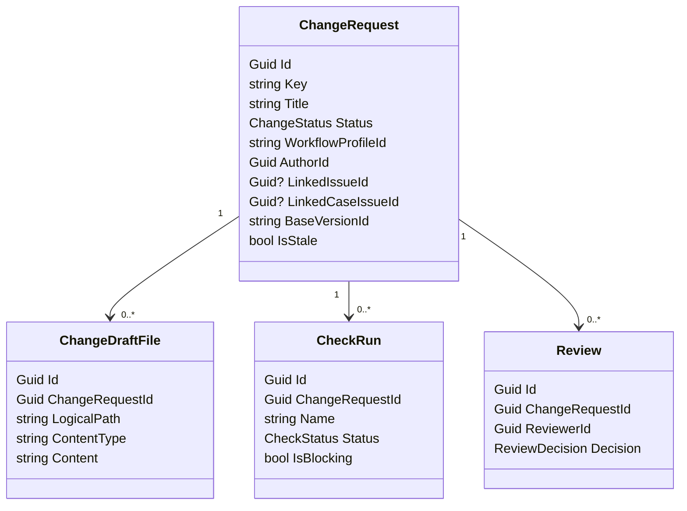
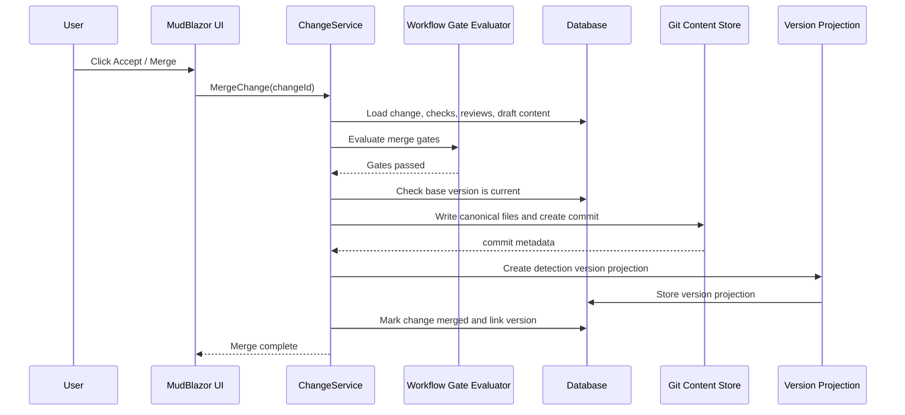
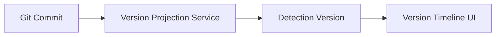
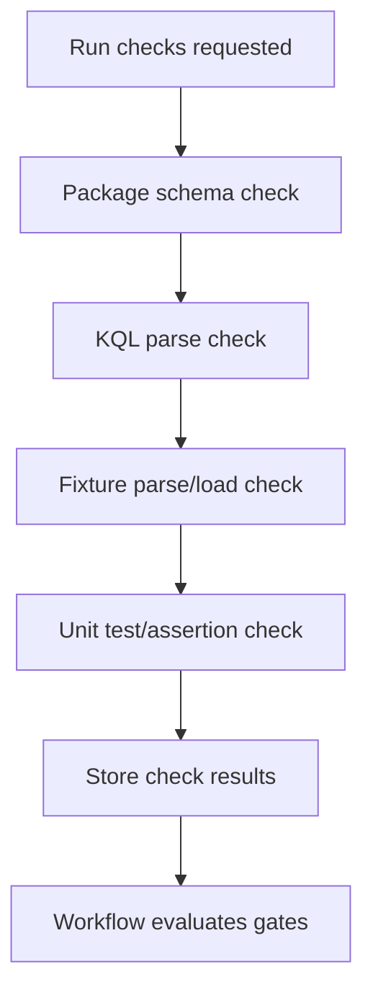

# Architecture

## 1. System identity

Detection Content Workbench is a Git-backed, database-driven content management and collaboration system for detection engineering and external-case-driven SOC work. The product centers on KQL detection content, YAML tests, JSON/NDJSON fixtures, issue workflow, external case references, PR-like changes, checks, reviews, and automatic version history.

The system is deliberately decoupled from any SIEM runtime. The initial product does not execute scheduled detections against live telemetry, generate production alerts, or run response automation. It manages detection content and the work around that content.

## 2. Architectural thesis

The system has two distinct persistence responsibilities:

```text
Database = work in progress, collaboration, workflow, review, checks, read models
Git      = accepted detection content and version history
```

This split is the central design decision.

Before merge, detection changes are operational workflow state. They live in the database with issues, external case references, reviews, validation results, workflow status, comments, and draft content. At merge/accept time, the system canonicalizes the accepted content and writes it to Git. Git then becomes the durable version ledger for accepted detection content. The UI projects Git commits as user-friendly detection versions.

## 3. Context diagram



## 4. Deployment model

Start as a modular monolith.



A separate worker process may be introduced later if validation jobs, repository scanning, workflow timers, or notifications require isolation. The POC should not start with microservices.

## 5. Module boundaries

### 5.1 UI module

The UI presents domain objects and allowed actions. It must not expose implementation mechanics.

User-visible areas:

```text
Home
Detections
Issues / external-case-linked issues
Pull Requests / Changes
Checks
Reviews
Versions
Settings
```

The UI calls application services and application read services. It must not call Git, workflow engine APIs, database repositories, accepted-content store ports, or adapter APIs directly. UI pages also must not compute accepted-content repository prefixes or paths directly; canonical accepted-content path logic belongs in the application layer.

### 5.2 Application module

Application services coordinate user commands, permissions, domain rules, workflow signals, validation requests, persistence, accepted-content reads, and version operations. The application layer defines ports for persistence, accepted content, validation checks, workflow orchestration, and units of work. Application services may use those ports, but must not depend on Dapper, SQLite, LibGit2Sharp, Elsa, MudBlazor, or other adapter implementations. UI-facing reads should return application read models/DTOs rather than storage primitives such as `ContentFile` or ports such as `IAcceptedContentStore`.

Core services:

```text
DetectionContentService
IssueService
ChangeService
ReviewService
CheckRunService
WorkflowProfileService
VersionHistoryService
MergeService
RestoreService
```

### 5.3 Domain module

The domain layer owns business concepts and invariants.

Core aggregates/concepts:

```text
Detection
DetectionDraft
DetectionVersion
Issue
ExternalCaseRef
ChangeRequest
CheckRun
Review
WorkflowProfile
WorkflowGate
ActivityEvent
```

The domain layer should express rules such as:

- A controlled review change cannot be merged without passing required checks.
- A controlled review change cannot be self-approved by its author.
- A change becomes stale when its base version no longer matches the current accepted version.
- Editing content after approval resets approval where the workflow profile requires it.
- Restore creates a new change or new version; it never rewrites history.

### 5.4 Persistence module

The persistence module stores operational state in the database.

Database-owned entities:

```text
users
issues
external_case_refs (owned by issues or issue columns)
change_requests
change_draft_files
comments
reviews
check_runs
workflow_instances
workflow_events
detection_drafts or change_draft_files, depending on ADR-0013 implementation
detection_versions
activity_events
locks
```

The exact schema can evolve, but the storage boundary must remain clear: operational state in DB, accepted canonical content in Git.

### 5.5 Git content store module

The Git content store writes and reads accepted detection content.

Responsibilities:

- Validate IDs and paths.
- Write canonical files on merge.
- Create controlled commits.
- Read accepted content by version.
- Compute diffs for version comparison.
- Restore old content as a new change or new accepted version.
- Expose commit metadata to the version projection service.

It must not expose user-facing branch operations in the POC.

### 5.6 Workflow module

The workflow module abstracts Elsa Core or another .NET workflow engine.

Responsibilities:

- Start lifecycle workflows.
- Evaluate workflow profile gates.
- Signal domain events.
- Report allowed next actions.
- Report blocking gates.
- Maintain workflow timeline projection.

Normal users see statuses, gates, and actions, not workflow definitions.

### 5.7 Validation module

The validation module executes check pipelines against draft content.

Minimum POC checks:

```text
Package schema check
KQL parse check
Fixture parse/load check
Unit test/assertion check
```

Check results are stored in the database and surfaced on PR/change pages.

### 5.8 Library roles and extraction readiness

The modular monolith is organized so that some projects can later become packages, but package extraction is not required for the POC. Current roles are:

| Project | Role | Extraction guidance |
|---|---|---|
| `Workbench.Domain` | Domain model and invariant library. | Best independent-library candidate; keep free of Workbench project references and adapter dependencies. |
| `Workbench.Application` | Workbench use-case, port, canonical-content, and read-model layer. | Candidate after domain; preserve application read services so UI and external consumers do not bind directly to storage ports. |
| `Workbench.Validation` | Workbench-specific check adapter package. | Keep coupled to `ICheck` until a second consumer justifies extracting neutral parsing/checking routines. |
| `Workbench.Infrastructure` | Infrastructure adapters, currently Git-backed accepted content. | Treat as an adapter package behind application ports; do not expose Git mechanics to UI. |
| `Workbench.Persistence` | SQLite/Dapper database adapter. | Treat as `Workbench.Persistence.Sqlite` if packaged; schema and reconstitution remain product-specific. |
| `Workbench.Workflow` | Optional workflow adapter. | Keep Elsa supplementary; domain state remains canonical. |
| `Workbench.Web` | Blazor/MudBlazor host and composition root. | Host-only; compose adapters and call application services/read services. |

The highest-priority decoupling rule is that presentation code does not consume infrastructure-facing ports directly. Accepted-content listing and draft-to-accepted comparison therefore go through an application read service, while `IAcceptedContentStore` remains an application port used by application services.

## 6. Data ownership model

| Object | Primary store | Notes |
|---|---|---|
| Detection draft | Database | Exists before merge. |
| Accepted detection package | Git | Canonical content after merge. |
| Detection version projection | Database | User-friendly projection linked to Git commit. |
| Issue | Database | Operational work item. |
| Case | Database | Issue type with richer fields. |
| PR/change | Database | Proposed content change and workflow state. |
| Review | Database | Approval/change request decisions. |
| Check run | Database | Validation result and logs. |
| Workflow instance | Database / workflow persistence | Internal orchestration state. |
| Comments | Database | Do not pollute Git history. |
| Locks | Database / in-memory | POC may start simple. |
| Accepted content history | Git | Projected into domain versions. |

## 7. Core lifecycle



The lifecycle is driven by a workflow template plus a selected workflow profile. The same skeleton can enforce different gates for lab and SOC modes.

## 8. Workflow profiles

Workflow profiles are selectable governance modes. Users choose them from a curated list, or the workspace policy selects a default.

Initial profiles:

| Profile | Description | Merge gates |
|---|---|---|
| `quick_lab` | Fast experimentation. | No approval; checks optional or warning-only. |
| `solo_validated` | Single maintainer mode. | Required checks; no external approval. |
| `standard_review` | Small team mode. | Required checks; one approval. |
| `controlled_review` | SOC controlled mode. | Required checks; non-author approval; stale-change blocking. |
| `emergency_fix` | Urgent fix with audit. | Minimum checks; justification; follow-up review. |

The POC implements `quick_lab` and `controlled_review`.

## 9. Issue and external case reference model

Issues are database-owned work items. ADR-0014 delegates full case management to external systems, so the POC does not model internal case tasks, observables, outcomes, or a dedicated case lifecycle. A case-triggered detection work item is represented as `IssueType.Case` with an optional `ExternalCaseRef`.



Issue types:

```text
new_detection
tuning
bug
test_gap
research
documentation
maintenance
case
```

`IssueType.Case` signals that detection-content work was triggered by an external investigation. The issue can link to FlowIntel, TheHive, or another external system by reference metadata, but the workbench remains focused on detection content changes, checks, reviews, and accepted versions.

## 10. PR/change model

A PR/change is a database-owned proposed modification to detection content.



The draft file model is logical. It does not need to mirror Git paths exactly in the database. The canonical writer decides final repository layout at merge time.

## 11. Merge / accept operation

Merge is the transition from database-owned draft state to Git-owned accepted content.



Merge must be blocked if:

- Required checks are missing or failed.
- Required approval is missing.
- The author attempts self-approval where prohibited.
- The base version is stale.
- The draft package cannot be canonicalized.
- The repository write lock cannot be acquired.

## 12. Version history model

Users care about versions, not Git commits. Every accepted Git commit is projected into a user-friendly detection version.



Version entry fields:

```text
version id / display number
detection id
title
summary
author
accepted timestamp
linked issue
linked case
linked PR/change
workflow profile
checks summary
review summary
changed sections
git commit sha as hidden/advanced metadata
```

Version actions:

```text
View changes
Compare versions
Restore as new change
Show linked issue/case
Show checks
Show review
```

Restoration must create a new change or new version. It must not reset or rewrite Git history.

## 13. Validation/check architecture

Checks are first-class PR/change objects.



Check result model:

```text
name
status
started_at
completed_at
is_blocking
summary
details_json
logs_excerpt
```

For POC, the KQL parser and unit test runner may be simplified, but they must be behind interfaces so they can be replaced by the real KQL-to-DuckDB validation path later.

## 14. Security and safety boundaries

### 14.1 Git safety

- No user-facing branch operations.
- No force operations.
- No reset/checkout workflow for users.
- Canonical writer validates paths.
- Repository writes happen only during merge/accept or controlled restore.
- Restore creates new content; it does not rewrite history.

### 14.2 Workflow safety

- Users cannot author arbitrary workflows.
- Users cannot run arbitrary shell commands.
- Workflow templates are vendor-defined.
- Admins can enable/disable templates and configure safe parameters.

### 14.3 Collaboration safety

- Base version is tracked for every change.
- Stale changes are blocked from merge.
- Approvals reset after content changes when required by profile.
- Self-approval is blocked in controlled workflows.

### 14.4 Input safety

- Detection IDs must be validated before path construction.
- Fixture sizes and row counts must be limited.
- YAML parsing must use typed schemas and reject unknown fields where appropriate.
- JSON/NDJSON parsing must report precise errors.

## 15. Vendor-neutral domain language

Core model and UI must not use vendor product names. Use neutral terms:

```text
normalized event view
hunting query
scheduled detection
content pack
external detection platform
local runtime
workflow automation
reference list
source connector
```

Vendor-specific adapters may be introduced later but must remain below the domain layer.

## 16. Future extension points

The architecture leaves room for:

- A separate worker process.
- Hangfire for durable background job processing.
- Quartz for calendar-grade scheduling.
- External runtime/publisher adapters.
- SOAR-like predefined workflow actions.
- Semantic KQL validation and KQL-to-DuckDB execution.
- Content packs and releases.
- External repository synchronization.

None of these are required for the POC.

## 17. POC architectural acceptance

The architecture is proven when:

1. Users can create issues, external-case-linked issues, and PR-like changes in the database.
2. Draft detection content remains in the database until merge.
3. Checks run against draft content and store results in the database.
4. Controlled workflow blocks merge without passing checks and another engineer approval.
5. Merge writes canonical detection content to Git.
6. Git commit is projected as a user-friendly detection version.
7. Users can compare and restore versions without seeing Git primitives.
8. The UI never requires understanding Git, Elsa, or SIEM runtime concepts.
