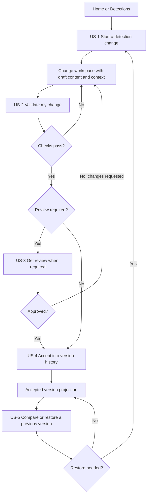
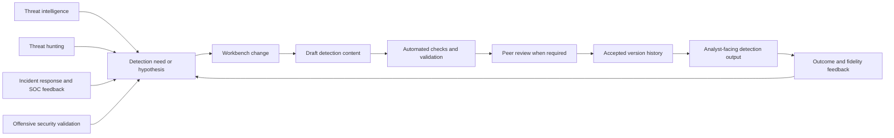
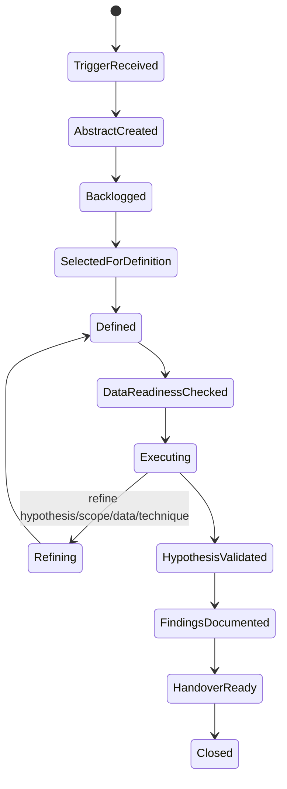
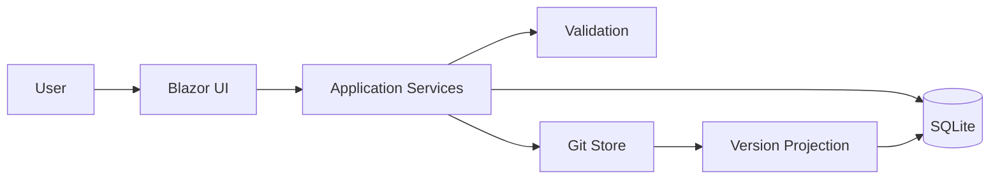
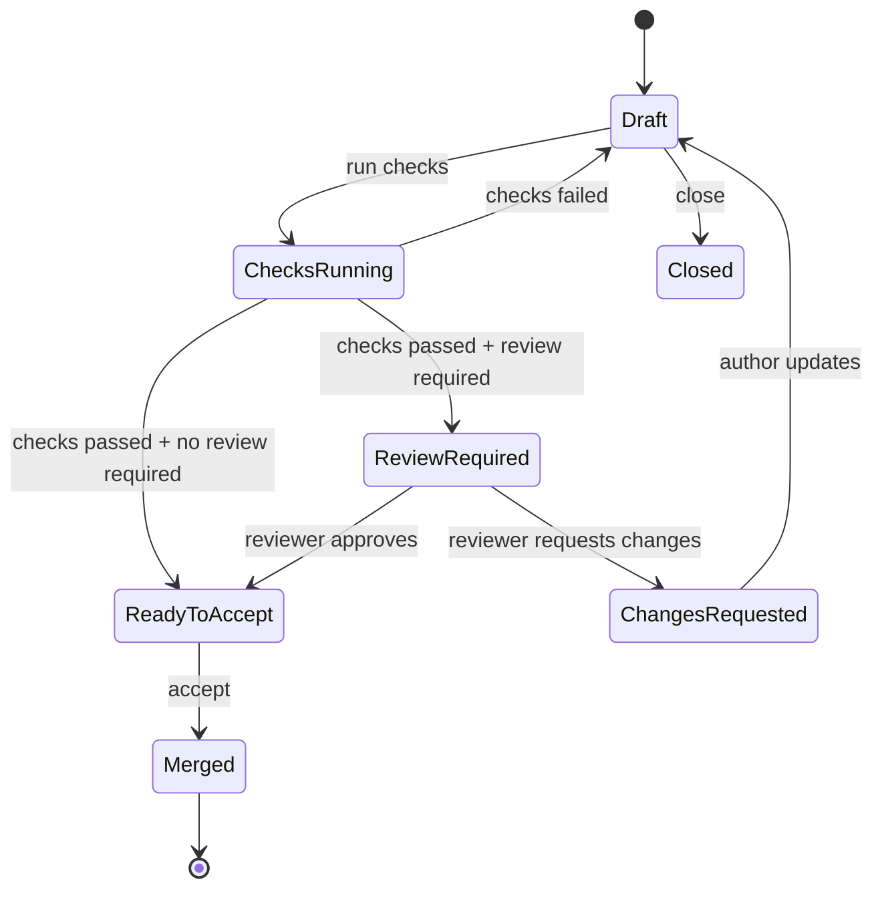
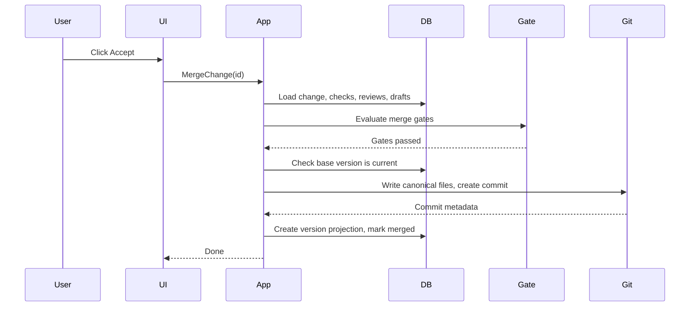

# Architecture and Product Definition

## 1. System identity

Detection Content Workbench is a Git-backed, database-driven content management system for
detection engineering. It lets SOC teams edit detection content, prove it is safe, and accept
it into version history.

Core promise:

> "Edit a detection, prove it's safe, accept it into history."

Every visible capability must directly support that sentence. Anything else is
operator-only infrastructure, integration context, or future scope.

Workbench manages detection content and the work around that content. It does not execute
detections against live telemetry, generate production alerts, replace threat hunting, or
own incident response/case management.

## 2. User-facing product surface

Users see exactly three primary objects:

| Concept | What it answers | Maps to |
|---|---|---|
| **Detections** | "What do we have?" | Catalog of accepted detection packages and their version history. |
| **Changes** | "What are we working on?" | A proposed edit with context, draft content, checks, review, and acceptance in one place. |
| **History** | "What happened before?" | Accepted versions, comparisons, and safe restore. |

Everything else — checks, reviews, issues, workflow profiles, Git storage, reconciliation — is
state within a Change or hidden infrastructure, not a standalone user destination.

Navigation:

```text
Home           "What needs my attention?"
Detections     "What do we have?"
Changes        "What are we working on?"
History        "What happened before?"
Settings       Operator-only health and configuration
```

Five items. No "Work," "Issues," "Checks," or "Reviews" as separate top-level destinations.

## 3. User-story journey

The five core user stories form one repeatable detection-content loop: start a change,
validate the draft, review when required, accept into history, and compare or restore accepted
versions when feedback shows a better version is needed.



## 4. Core user stories

These are the product. Everything else supports them.

### US-1: Start a detection change

As a detection engineer, I want to create or edit a detection so I can develop content.

A detection engineer begins from Home when responding to queued work, or from Detections when
they already know what they want to create or edit. The point is momentum: users should reach
useful content without first assembling issues, branches, workflow profiles, or setup records.

**Acceptance:**

- From Home or Detections, one click reaches the editor.
- New detection: user provides a name, lands in the draft editor.
- Existing detection: user picks the detection, lands in the draft editor with current content.
- No separate detection-intake or issue-creation step is required.
- Context for the change (reason, related investigation URL) is captured as fields on the Change, not as a separate Issue object.

### US-2: Validate my change

As a detection engineer, I want to check my work before it is accepted.

Validation is evidence about this specific draft, so it lives inside the Change workspace. The
engineer should see what failed, fix the draft, and rerun checks without losing the reason and
content context for the change.

**Acceptance:**

- "Run checks" is a button inside the Change workspace.
- Results appear inline: pass/fail per check, with human-readable failure explanations.
- Failed checks explain what is wrong and what to fix.
- The user does not navigate to a separate Checks page.

### US-3: Get review when required

As a reviewer, I want to see what changed and why so I can approve safely.

Review is the human control point for governed changes. Reviewers need the diff, reason,
related investigation link, validation results, and decision controls together so approval
reflects the current draft rather than stale or scattered evidence.

**Acceptance:**

- The Change workspace shows: diff, check results, context (reason, related investigation), and approve/reject controls — all on one page.
- Self-approval is blocked in controlled workflows (domain rule, simple UI message).
- Approval resets when content changes after approval.
- The reviewer does not visit separate check, issue, or version pages to make a decision.

### US-4: Accept into version history

As a user, I want accepted content to become a permanent version.

Acceptance is the boundary where proposed content becomes the current accepted detection
version. The user action is domain language: accept a ready Change. Git writes and version
projection happen behind that boundary.

**Acceptance:**

- One click "Accept" when all gates pass.
- If blocked, a gate checklist explains every blocker with a direct fix action.
- Git is invisible. The system writes canonical files and creates a version projection.
- Stale base versions block acceptance with a clear explanation.

### US-5: Compare or restore a previous version

As a maintainer, I want to recover from bad changes without rewriting history.

History supports continuous improvement. Maintainers compare accepted versions to understand
tuning decisions and restore older content as a new Change so recovery still follows
validation and review.

**Acceptance:**

- History page shows accepted versions per detection.
- User can compare two versions with readable differences.
- "Restore as new change" creates a new Change pre-populated from old content — normal workflow applies.
- No Git branch, reset, revert, or rebase language appears.

## 5. Detection engineering ecosystem boundary

FIRST detection-engineering guidance frames the discipline as an ecosystem feedback loop: CTI,
threat hunting, incident response, SOC analysis, offensive validation, and platform teams can
all create detection needs or tuning feedback. Workbench captures that context as links,
reasons, checks, reviews, and version history; it does not replace those source systems.
Threat hunting is a distinct discipline in this ecosystem: it can trigger detection-content
work or consume detection feedback, but its future TaHiTI workflow is modeled as a separate
`HuntInvestigation` aggregate per ADR-0020.



Outcome and tiering data should be treated as metadata around detection quality and feedback,
not as a separate workflow engine or navigation model. This keeps the core architecture focused
on the edit-validate-review-accept loop while leaving room for future reporting on coverage,
precision, fidelity, and tuning reasons.

## 6. TaHiTI threat hunting workflow boundary

DeltaZulu Hunting and Workbench will later merge into `DeltaZulu.Platform`, but the merge
should not force threat hunting into the current detection-content, alert, incident, case, or
generic issue workflows. Threat hunting is a hypothesis-driven investigation discipline. It can
produce downstream work for detection engineering, incident response, threat intelligence,
visibility remediation, vulnerability/configuration management, monitoring improvements, or
follow-up hunts, but none of those outputs is the hunt itself.

TaHiTI maps to a dedicated `HuntInvestigation` lifecycle:

| TaHiTI phase | TaHiTI activity | Target state or action |
|---|---|---|
| Initiate | Trigger hunt | `TriggerReceived` records `HuntTrigger`. |
| Initiate | Create investigation abstract | `AbstractCreated` captures initial hypothesis, rationale, scope hint, and priority. |
| Initiate | Backlog | `Backlogged` makes the abstract selectable without requiring immediate execution. |
| Hunt | Define / refine | `SelectedForDefinition`, `Defined`, `Refining`; updates hypothesis, scope, data sources, and techniques. |
| Hunt | Execute | `DataReadinessChecked`, `Executing`; links query runs, result snapshots, and evidence. |
| Hunt | Validate hypothesis | `HypothesisValidated`; records proven, disproven, inconclusive, missing-data, or conversion outcome. |
| Finalize | Document findings | `FindingsDocumented`; records findings, decisions, metrics, and lessons. |
| Finalize | Handover | `HandoverReady`, then `Closed` after typed handover is completed or intentionally skipped. |

The Hunt phase supports iteration. Execution can reveal missing telemetry, a weak hypothesis,
noisy scope, or a better technique. The model therefore allows
`Executing -> Refining -> Defined -> DataReadinessChecked -> Executing` without treating
refinement as failure.



### Workbench vs Hunting responsibility split

| Concern | Future owner | Boundary rule |
|---|---|---|
| Hunt lifecycle and backlog | Workbench | Owns `HuntInvestigation` state, assignment, priority, documentation status, findings, decisions, metrics, and handover. |
| Hypothesis, scope, data requirements, techniques | Workbench | Owns workflow intent and refinements; does not execute queries. |
| KQL execution and query runs | Hunting | Owns execution, query-run records, parameters, diagnostics, timing, and engine-specific details. |
| Evidence capture and result snapshots | Hunting | Owns immutable query outputs, sampled rows, visualizations, and lineage. Workbench links to them. |
| Entity pivots and analytical lineage | Hunting | Owns analytical graph and pivots. Workbench can reference lineage IDs as evidence context. |
| Documentation and findings | Workbench | Owns summary, decision, conclusion, and handover readiness. |
| Detection-content promotion | Workbench | A typed handover creates or links to a future detection-content Change. It is not the default hunt outcome. |
| Incident-response promotion | Workbench + future security contracts | A typed handover creates or links an incident candidate only when sufficient suspicious or malicious activity exists. |

Pre-merge, this split is documentation-only. Do not add project references between Hunting and
Workbench.

### Target hunt domain model

`HuntInvestigation` is the central aggregate. It should not be modeled as `Alert`, `Incident`,
`Case`, `Issue`, or `ChangeRequest`.

| Concept | Shape | Notes |
|---|---|---|
| `HuntInvestigation` | Aggregate | Owns lifecycle, title, owner, priority, current hypothesis version, scope, findings, decisions, metrics, and handover status. |
| `HuntTrigger` | Entity/value object | Source of hunt: CTI, ATT&CK coverage, previous hunt, incident response, monitoring gap, red team, crown-jewel analysis, domain expertise. |
| `HuntHypothesis` | Versioned child entity | Hypotheses must be versioned or designed for versioning because refinement changes the claim being tested. |
| `HuntScope` | Versioned value object | Time range, populations, platforms, environments, exclusions, and target entities. |
| `HuntDataSourceRequirement` | Child entity | Required telemetry and readiness status; missing telemetry becomes a visibility-gap finding. |
| `HuntTechnique` | Child entity | Analysis approach, ATT&CK mapping, statistical technique, pivot plan, or enrichment approach. |
| `HuntQueryRun` | Reference | Workbench-side link to Hunting-owned execution record; not a copied result set. |
| `HuntEvidenceItem` | Reference + annotation | Links query runs, result snapshots, visualizations, entity pivots, or external references to findings. |
| `HuntFinding` | Child entity | Supports malicious/suspicious activity, visibility gaps, benign explanations, threat-intel notes, vulnerabilities, monitoring improvements, and lessons learned. |
| `HuntDecision` | Child entity | Records hypothesis validation and closure decisions with analyst, timestamp, rationale, and confidence. |
| `HuntHandover` | Child entity | Explicit typed output to downstream workflow; zero or more handovers are allowed. |
| `HuntMetric` | Child entity/value object | Measures value and process maturity, not only count volume. |

### Hunt lifecycle states and transition rules

Target states: `TriggerReceived`, `AbstractCreated`, `Backlogged`,
`SelectedForDefinition`, `Defined`, `DataReadinessChecked`, `Executing`, `Refining`,
`HypothesisValidated`, `FindingsDocumented`, `HandoverReady`, and `Closed`.

Transition rules:

- A hunt cannot move to `Defined` without an active hypothesis, scope, data-source requirements, and at least one analysis technique.
- A hunt cannot move from `DataReadinessChecked` to `Executing` if required telemetry is missing unless the execution plan explicitly permits partial execution.
- A hunt can move from `Executing` to `Refining` multiple times.
- Refinement must preserve history of previous hypotheses, scopes, data-source requirements, and techniques.
- A hunt can close with no malicious activity found, inconclusive evidence, or missing data.
- Handover is explicit and typed; closing without handover requires a decision rationale.

### Hunt outcome taxonomy

| Outcome | Meaning |
|---|---|
| `ProvenMaliciousActivityFound` | Evidence supports malicious or suspicious activity and may justify incident-response handover. |
| `DisprovenNoEvidenceFound` | The hypothesis was tested sufficiently and no supporting evidence was found. This is a valid result. |
| `Inconclusive` | Available evidence does not prove or disprove the hypothesis. |
| `FailedMissingData` | Required telemetry is absent or unusable; model as a visibility gap. |
| `ConvertedToMonitoringUseCase` | Hunt logic or insight should become ongoing monitoring or detection content. |
| `ConvertedToThreatIntel` | Findings should update intelligence notes, assumptions, or collection requirements. |
| `ClosedAsLearning` | Hunt produced process, telemetry, or analytical learning without a downstream operational output. |

### Hunt handover model

A hunt may produce zero or more handovers. Detection engineering promotion is one possible
handover, not the default purpose.

| Handover type | Target |
|---|---|
| `IncidentCandidate` | Create or link a candidate only when evidence supports suspicious or malicious activity. |
| `DetectionContentDraft` | Create or link a Workbench Change for detection content. |
| `VisibilityGap` | Remediate telemetry collection, parsing, retention, or access gaps. |
| `ThreatIntelligenceNote` | Update intelligence context, assumptions, or collection needs. |
| `VulnerabilityOrConfigurationFinding` | Send to vulnerability/configuration management. |
| `MonitoringUseCaseImprovement` | Improve alerting, dashboards, or monitoring logic. |
| `PreventiveControlRecommendation` | Recommend hardening or preventive control changes. |
| `FollowUpHunt` | Create a new hunt trigger or backlog item. |

### Hunt evidence and query-run relationship

Hunting owns query execution artifacts. Workbench links to them.

```text
HuntInvestigation
  HuntEvidenceItem
    QueryRunReference -> Hunting query-run ID
    ResultSnapshotReference -> Hunting immutable result snapshot ID
    VisualizationReference -> Hunting visualization ID
    EntityPivotReference -> Hunting lineage/pivot ID
    AnalystAnnotation -> Workbench-owned note about why this evidence matters
```

Do not copy large query results into Workbench workflow notes. Evidence should remain
reproducible through immutable Hunting-owned references plus small analyst annotations.

### Existing Workbench concept gap analysis

| Existing concept | Reuse / extend / separate | Rationale |
|---|---|---|
| `Issue` | Separate; optionally link later | Detection-content backlog issues have their own issue types and lifecycle. A hunt backlog item is an investigation abstract with hypothesis/scope/data requirements, not a generic issue. |
| `IssueStatus` | Separate | Current issue states include content-workflow states such as `Merged` and `Published`; hunts need TaHiTI states and refinement loops. |
| `ChangeRequest` | Separate; use only through handover | A hunt may hand over to a detection-content draft, but the hunt itself is not an edit/review/accept content change. |
| `Review` | Pattern only | Review-style attribution is useful, but hunt decisions need validation outcomes, confidence, and handover rationale. |
| `WorkflowProfile` / `IWorkflowOrchestrator` | Reuse pattern, not profiles | Workbench can orchestrate lifecycle actions later, but hunt states should not reuse detection-content governance profiles. |
| Task/comment artifacts | Separate future design | Workbench does not currently expose a hunt-suitable task/comment aggregate; hunt notes, assignments, and documentation should be designed around `HuntInvestigation`. |
| `ExternalCaseRef` | Reuse value-object pattern | Useful for typed links to external incident/case systems when handover happens. |
| `CandidateDecision` / `Incident` stubs | Separate from hunts | Useful downstream for incident promotion, but a hunt should not begin as a candidate or incident. |
| `ContentLibraryArtifact` and `HuntingSavedQueryImporter` | Reuse as migration bridge only | Existing saved-query import can seed draft content or future query references, but saved queries are not hunt executions or evidence snapshots. |
| `DraftContentType.HuntingQuery` | Reuse cautiously | Useful for query text in detection-content changes; hunt query runs require execution metadata owned by Hunting. |

### Existing Hunting concept mapping

The separate Hunting repository is not referenced at runtime from this project. Based on the
consolidation plan and existing Workbench import adapter, the expected mapping is:

| Hunting-side concept | Future hunt mapping | Boundary |
|---|---|---|
| Saved query | Query template or starting point for a hunt technique | Can seed a `HuntTechnique` or query plan; not evidence until executed. |
| Query history / query run | `HuntQueryRun` reference | Hunting owns execution metadata, diagnostics, parameters, timestamps, and actor. |
| Result model | `HuntEvidenceItem` via immutable result snapshot reference | Hunting owns rows, aggregates, samples, and snapshot storage. |
| Visualization | Evidence context or finding support | Hunting owns visualization definitions and rendered analytical artifacts. |
| Entity pivot | Evidence lineage | Hunting owns pivots, entity graph traversal, and analytical lineage. |
| Detection run / alert | Possible trigger or downstream correlation input | Hunts can reference alerts as context, but should not be modeled as alerts. |

Post-merge implementation should verify this mapping against the actual Hunting domain before
creating shared contracts.

### Target post-merge hunt module boundaries

| Target module | Responsibility |
|---|---|
| `DeltaZulu.Workbench.Hunts` | `HuntInvestigation` aggregate, lifecycle, backlog, assignment, findings, decisions, handover, metrics. |
| `DeltaZulu.Hunting.Querying` | KQL execution, query runs, query diagnostics, query history. |
| `DeltaZulu.Hunting.Evidence` | Result snapshots, visualizations, entity pivots, analytical lineage. |
| `DeltaZulu.Workbench.DetectionContent` | Detection-content Changes and accepted version workflow. |
| `DeltaZulu.Security.Correlation` | Incident candidates and alert correlation, when Hunting produces candidate contracts. |
| `DeltaZulu.Security.Cases` | Incident/case workflow contracts and external case links. |
| `DeltaZulu.Platform.Contracts` | Interface-only shared contracts after merge boundaries are stable. |

### Post-merge hunt implementation sequence

1. Confirm shared vocabulary and contract names in `DeltaZulu.Platform`.
2. Create interface-only contracts for query-run and result-snapshot references.
3. Add `HuntInvestigation` domain model and tests without UI.
4. Add repository and migrations for hunt workflow state.
5. Add application services for lifecycle transitions and handover creation.
6. Integrate Hunting query-run references through contracts, not direct module calls.
7. Add minimal Workbench hunt backlog/detail UI after domain behavior is stable.
8. Add metrics and reporting after real hunt records exist.

### Pre-merge hunt non-goals

- No full TaHiTI workflow implementation.
- No hunt database tables or migrations.
- No hunt UI pages.
- No project references between Hunting and Workbench.
- No web-host consolidation.
- No attempt to model hunts as alerts, incidents, cases, generic issues, or detection-content changes.
- No copied query result storage in Workbench notes.
- No rigid process that prevents small hunts from moving quickly.

## 7. Architectural thesis

```text
Database = drafts, changes, checks, reviews, workflow state
Git      = accepted detection content and version history
```

Before merge, detection changes are operational workflow state in the database. At
merge/accept time, the system writes canonical content to Git. Git becomes the durable version
ledger. The UI projects Git commits as user-friendly detection versions.

## 8. Context diagram



## 9. Deployment model

Single ASP.NET Core modular monolith (ADR-0001).

```text
src/
  DeltaZulu.Blazor.Components Reusable DeltaZulu design-system primitives and static assets
  DeltaZulu.DetectionContent Shared detection-content identity/path/reference contracts
  Workbench.Web              Blazor/MudBlazor host and composition root
  Workbench.Application      Application services, ports, read models
  Workbench.Domain           Aggregates, enums, invariants, value objects
  Workbench.Infrastructure   LibGit2Sharp Git store, infrastructure adapters
  Workbench.Persistence      Dapper + SQLite repositories, schema initializer
  Workbench.Workflow         IWorkflowOrchestrator + Elsa adapter
  Workbench.Validation       Check pipeline and query-validator boundary
```

The domain, application, persistence, infrastructure, workflow, and validation modules do not
depend on `Workbench.Web`.

## 10. Data ownership

| Object | Store | Notes |
|---|---|---|
| Change (drafts, reason, checks, reviews) | Database | All operational state before merge. |
| Accepted detection package | Git | Canonical content after merge. |
| Detection version projection | Database | User-friendly projection of Git commit. |
| Detection identity | Database | Exists from first change creation. |

## 11. Change model and related concepts

A Change is the central workflow object. It carries everything needed for the
edit-validate-review-accept loop:

```text
Change
  Title, Key
  Reason (free text)
  Related investigation URL
  Target detection (new or existing)
  Governance level (derived)
  Draft content (metadata, query, tests, fixtures)
  Check results (inline)
  Review decisions (inline)
  Status, base version, staleness flag
```

### Issues

Issues are optional. They are not removed from the domain model, but they are no longer:

- A required step before opening a Change.
- A top-level navigation item.
- A prerequisite for explaining why work exists.

Instead, the reason for change and related investigation URL live on the Change. If a team
needs a backlog of detection work items separate from active Changes, Issues remain available
as a secondary feature under Settings or as a future extension — not as part of the core
workflow.

### Workflow profiles

Workflow profiles remain in the domain model as governance configuration, but users do not
select them per-change. The system derives the appropriate profile from workspace
configuration. The UI shows the effect ("this change requires approval from another team
member") rather than the mechanism ("controlled_review profile selected").

### Checks and reviews

Checks are shown inline in the Change workspace. Reviews are shown in the Change workspace and
queued from Home when they require a user's action. There are no standalone Checks or Reviews
pages in navigation.

## 12. Core lifecycle



## 13. Governance and safety

Governance is derived from workspace configuration (ADR-0017), not selected per-change.

| Mode | Gates | When |
|---|---|---|
| Quick lab | No approval; checks optional. | Experimentation environments (operator opt-in). |
| Controlled review | Required checks + non-author approval + stale-base blocking. | Default for shared content. |

Safety rules are domain-enforced:

- Authors cannot self-approve in controlled workflows.
- Approval resets when content changes after approval.
- Stale base versions block merge.
- Merge preserves unmodified accepted files.

When acceptance is blocked, show a checklist instead of only disabling the Accept button:

```text
Accept blocked
[x] Draft content present
[x] Required checks passed
[ ] Approval from another reviewer required  -> Request review
[ ] Base version is current                  -> Rebase by opening a fresh change or refresh draft
```

The checklist should name the blocker in domain language and route to the next useful action.

## 14. Merge operation



Merge is blocked when: required checks missing/failed, approval missing, self-approval
attempted, base version stale, draft cannot be canonicalized, or write lock unavailable.

## 15. Validation checks

Minimum checks:

```text
Package schema check
Query syntax check (interface-backed validator)
Fixture parse/load check
Test definition parse check
```

Check results are stored in the database and shown inline on the Change workspace.

## 16. Accepted content layout

```text
detections/<slug>/
  detection.yaml
  rule.kql
  tests/<test-id>.yaml
  fixtures/<fixture-id>.ndjson
```

Canonical paths are computed by the application layer. The UI never constructs Git paths.

## 17. Version history

Every accepted Git commit is projected into a user-friendly detection version with: version
number, detection, author, timestamp, linked change, checks summary, review summary, and
storage reference hidden from normal UI.

Version actions: view, compare two versions, restore as new change.

## 18. Out of scope and security boundaries

These are explicitly not part of the product:

- SIEM runtime, live detection execution, scheduled execution, alert generation.
- User-authored workflow YAML or arbitrary automation.
- Git branch/rebase/checkout/staging UI.
- Internal incident/case management (response tasks, observables, timelines, closure outcomes).
- ITSM features (SLA, CAB, CMDB, service catalog).
- SOAR response automation.
- Vendor-specific SIEM terminology in core UI.
- Remote Git synchronization as a user workflow.

Security boundaries:

- No user-facing Git branch operations.
- Users cannot author arbitrary workflows.
- Detection IDs are validated before path construction.
- Repository writes happen only during merge or controlled restore.
- Restore creates new content; never rewrites history.
- Fixture sizes and row counts are limited.

## Platform merge-preparation boundaries

Workbench is being prepared for eventual composition inside `DeltaZulu.Platform.Web`, but this repository does not build that central host. Reusable design-system primitives live in `DeltaZulu.Blazor.Components`; Workbench-specific adapters stay in `Workbench.Web` when they depend on Workbench domain/application enums or workflow state. Stable detection-content identity, slug/path, file, and accepted-reference contracts live in `DeltaZulu.DetectionContent`; drafts, change requests, checks, reviews, approvals, merge readiness, and workflow orchestration remain Workbench-owned operational/governance concepts. See [`PLATFORM_MERGE_PREP.md`](PLATFORM_MERGE_PREP.md) for the current inventory and remaining blockers.
