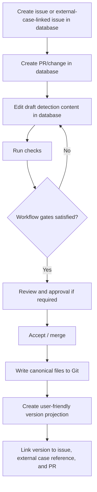

# Detection Content Workbench

## Purpose

Detection Content Workbench is a domain-focused content management system for detection engineering and case-driven security work. It is intentionally not a SIEM engine, not a Git client, not an ITSM tool, and not a generic workflow designer. The product provides a Bruno-like local/static-content experience for detection content while keeping operational collaboration state in a database.

Users work with detections, issues, external-case-linked issues, pull requests, checks, reviews, and versions. They do not interact with Git branches, staging areas, rebases, merge conflicts, workflow-engine internals, case-management internals, or vendor-specific SIEM terminology. Accepted detection content is stored as canonical files in a Git repository. Drafts, issues, external case references, PR/change state, comments, reviews, workflow instances, validation runs, and UI projections are stored in the database.

The initial executable artifact is a KQL-focused detection authoring workspace. KQL queries, YAML tests, and JSON/NDJSON fixtures form the detection package. The system can later integrate with runtimes, publishers, and SOAR-like automation, but the proof-of-concept must first validate content authoring, database-backed collaboration, workflow gates, automatic Git-backed version history, and safe merge/accept behavior.

## Product principles

1. **Domain-first UI.** The UI presents detection engineering concepts: detections, issues, external case references, PRs, checks, reviews, and versions. It must not become a repository browser or workflow-designer UI.
2. **Git is hidden infrastructure.** Git stores accepted content and version history. Users see versions, comparisons, restore actions, and audit context.
3. **Database owns work in progress.** Issues, external case references, PR/change drafts, comments, reviews, workflow state, validation runs, locks, and read models live in the database.
4. **Merge is the boundary.** Before merge, content is draft/workflow state. After merge, content is canonical static content in Git.
5. **Workflow templates are vendor-defined.** Users select predefined workflows such as quick lab change or controlled SOC review. Users do not author arbitrary YAML workflows.
6. **Workflow engine is abstracted.** Elsa Core is the preferred pragmatic workflow runtime, but the application uses an internal workflow abstraction.
7. **No vendor product names in core terminology.** The system uses neutral concepts such as scheduled detection, hunting query, normalized event view, content pack, local runtime, and external detection platform.
8. **External-case-driven SOC workflow.** Case-triggered detection work and detection-as-code share the same issue/PR/check/review model; full case management remains delegated to external systems per ADR-0014.

## Initial scope

The proof-of-concept must demonstrate a full loop:



The initial content package contains:

```text
Detection
├── metadata
├── KQL query
├── YAML test definitions
└── JSON or NDJSON fixtures
```

The initial UI contains:

```text
Home / work queue
Detections
Issues / external-case-linked issues
Pull Requests / Changes
Checks
Reviews
Versions
Settings
```

## Repository documentation map

This repository uses the following documentation files as development constraints:

| File | Purpose |
|---|---|
| [AGENTS.md](AGENTS.md) | Instructions for AI coding agents and contributors. Read before writing code. |
| [ARCHITECTURE.md](ARCHITECTURE.md) | High-level architecture, module boundaries, data ownership, workflow model, and runtime shape. |
| [ROADMAP.md](ROADMAP.md) | Revised POC acceptance criteria, implementation phases, and out-of-scope boundaries. |
| [GAP_ANALYSIS.md](GAP_ANALYSIS.md) | Current implementation gaps and priority ordering against the docs and ADRs. |
| [USER_STORIES.md](USER_STORIES.md) | User-centered capability stories for destructuring the tool and supporting gap analysis. |
| [UI_ACTIVITY_DIAGRAM.md](UI_ACTIVITY_DIAGRAM.md) | UI activity diagram and navigation implications derived from the user stories. |
| [UX_REDESIGN_ANALYSIS.md](UX_REDESIGN_ANALYSIS.md) | UX bottleneck analysis and interaction redesign guidance for smoother user flows. |
| [adr/](adr/) | Architecture Decision Records. Each ADR captures a design decision that should not be silently reversed. |

## Architecture decisions

The current ADR set is:

| ADR | Decision |
|---|---|
| [ADR-0001](adr/0001-modular-monolith.md) | Start as a modular monolith. |
| [ADR-0002](adr/0002-database-for-operational-state-git-for-accepted-content.md) | Store operational state in DB and accepted content in Git. |
| [ADR-0003](adr/0003-domain-focused-ui-not-git-ui.md) | Expose domain versions, not Git primitives. |
| [ADR-0004](adr/0004-vendor-defined-workflows.md) | Use vendor-defined workflow templates, not user-authored workflow YAML. |
| [ADR-0005](adr/0005-elsa-as-workflow-engine.md) | Prefer Elsa Core/Workflows as the initial workflow runtime. |
| [ADR-0006](adr/0006-pr-like-changes-over-git-branches.md) | Model PR-like changes in the DB, not as user-facing Git branches. |
| [ADR-0007](adr/0007-case-as-issue-type.md) | Earlier case-as-issue model; superseded for POC details by ADR-0014. |
| [ADR-0008](adr/0008-workflow-profiles-for-governance.md) | Use workflow profiles for lab, solo, team, and controlled SOC modes. |
| [ADR-0009](adr/0009-vendor-neutral-domain-language.md) | Avoid vendor product names in core concepts. |
| [ADR-0010](adr/0010-validation-as-pr-checks.md) | Represent validation as PR/check-style gate results. |
| [ADR-0011](adr/0011-automatic-version-history.md) | Project Git history into automatic domain version history. |
| [ADR-0012](adr/0012-no-siem-runtime-in-poc.md) | Exclude SIEM runtime and SOAR from the POC. |
| [ADR-0013](adr/0013-collapse-detection-draft-and-conceive-detection.md) | Collapse standalone detection drafts into change requests and detection identity. |
| [ADR-0014](adr/0014-delegate-case-management-to-external-systems.md) | Delegate case management to external systems and keep external case references on issues. |
| [ADR-0015](adr/0015-investigation-notes-markdown-in-git.md) | Store investigation notes as accepted Markdown content in Git. |
| [ADR-0016](adr/0016-workflow-orchestrator-abstraction.md) | Use `IWorkflowOrchestrator` with an Elsa toggle. |

## Recommended first implementation slice

The first code slice should not try to implement the entire product. It should implement the minimum vertical path:

1. Create a detection draft in the database.
2. Create an issue and a PR/change linked to that detection draft.
3. Select either `quick_lab` or `controlled_review` workflow profile.
4. Run a minimal check pipeline: package schema, interface-backed query syntax validation, fixture parse, and unit test placeholder.
5. In `controlled_review`, require approval from a second user before merge.
6. Merge the change into Git as canonical detection files.
7. Create a database projection of the version.
8. Show user-friendly version history and changed sections.

## Terms

| Term | Meaning |
|---|---|
| Detection | Domain object containing metadata, query, tests, fixtures, versions, and links to work items. |
| Issue | Database-owned work item used for new detection, tuning, bug, test gap, research, documentation, maintenance, or case-triggered work. |
| External case reference | Optional issue-owned reference to an external case system, external id, and URL. |
| Case issue | `IssueType.Case` work item for detection work triggered by an external investigation, optionally linked by `ExternalCaseRef`. |
| PR / Change | Database-owned proposed change to detection content, similar to a pull request but without user-facing Git branches. |
| Check | Validation result shown on a PR/change. |
| Review | Human approval or change request decision. |
| Version | User-friendly projection of an accepted Git commit. |
| Workflow profile | Selectable governance mode, such as quick lab or controlled SOC review. |
| Canonical content | Accepted detection package files written to Git at merge/accept time. |

## Non-goals

The following are deliberately out of scope for the POC:

- SIEM runtime, live ingestion, scheduled execution, alert generation, or production detection scheduling.
- User-authored workflow YAML or arbitrary automation scripts.
- Vendor-specific product terminology in the core UI or schemas.
- Git branch UI, tree viewer, rebase, checkout, staging, or manual conflict resolution.
- ITIL/ITSM features such as SLA clocks, CAB workflow, CMDB, service catalog, or formal change records.
- Full SOAR response automation.
- Remote Git synchronization as a normal user workflow.

## Development posture

Treat this repository as a product architecture seed. Keep code consistent with the ADRs. When implementation pressure suggests a deviation, write or revise an ADR before changing direction.
