# Target full-cycle security analytics user stories

This document defines the target product-level user stories for DeltaZulu.Platform. The platform is not only a threat-hunting workbench. It is a local, schema-governed, full-cycle security analytics platform that connects interactive analytics, detection engineering, scheduled detection execution, alerting, enrichment, incident-candidate correlation, triage, and feedback into detection improvement.

Threat hunting remains an important workflow, but it is no longer the parent product category. The parent category is Analytics. Hunting is one analytics workflow. Scheduled detection execution, dashboards, validation, alert investigation, and candidate triage all consume the same analytics substrate under different policies.

The platform connects six slices:

1. Analytics execution: run KQL over approved Golden schema views backed by DuckDB, with shared execution semantics for interactive queries, dashboards, validation, and scheduled detections.
2. Knowledge reuse: preserve query history, curated analytics, visualizations, dashboards, evidence selections, and reusable analytical patterns.
3. Detection content governance: create, validate, review, accept, restore, and version detection content through governed proposal workflows.
4. Scheduled operations: project accepted detection content into executable detection definitions, run them on schedule or on demand, and record traceable detection runs.
5. Alerting and correlation: materialize matching results as alerts, extract entities, enrich evidence, apply suppression, correlate alerts into incident candidates, and support triage decisions.
6. Workflow orchestration: use Elsa workflows to coordinate long-running processes such as validation, review, acceptance, scheduled execution, alert processing, incident-candidate correlation, triage, and recovery.

Domain rules remain in the SIEM domain and application services. Elsa workflows orchestrate order, timing, branching, retries, timers, and human-in-the-loop steps, but they do not own detection logic, alert semantics, evidence integrity, entity meaning, suppression rules, or incident-candidate validity.

## Product narrative

DeltaZulu.Platform gives a security practitioner a local, schema-governed security analytics loop: inspect data readiness, explore normalized event contracts, investigate evidence, preserve useful analytical logic, promote reusable analytics into governed detection proposals, accept validated detection versions, execute accepted detections on a schedule, preserve produced alerts, enrich and correlate alert evidence, triage incident candidates, and feed operational outcomes back into detection tuning and visibility improvement.

The platform starts at a module picker and exposes three major user-facing modules:

- **Analytics** for KQL-based querying, schema exploration, query history, curated analytics, visualizations, dashboards, evidence capture, and threat-hunting workflows.
- **Detection Content Governance** for detection packages, governed proposals, semantic detection content, validation checks, review, acceptance, restore, and version history.
- **Operations** for executable detections, scheduled detection runs, alerts, alert entities, enrichment, suppression, incident candidates, triage state, and recovery.

The modules remain separate by responsibility. Analytics asks questions and preserves analytical artifacts. Governance controls detection-content proposals and acceptance. Operations executes accepted detections and manages produced operational state. The modules integrate through explicit handoff boundaries: curated analytics can be promoted into detection drafts; accepted detection versions can project executable definitions; detection runs create alerts; alerts can correlate into incident candidates; triage outcomes can create detection-tuning work.

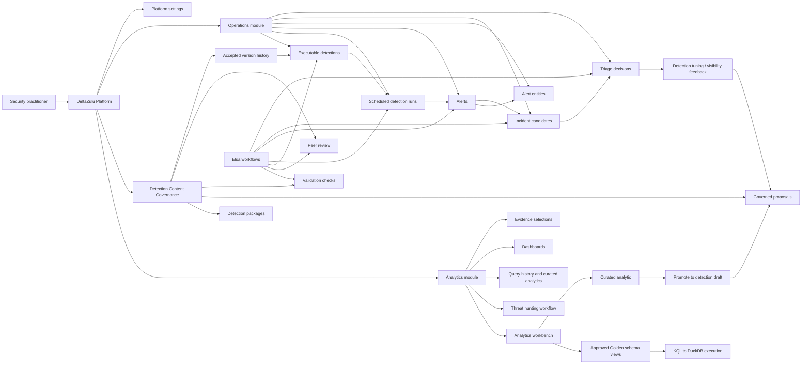

## Core terminology

| Term | Target meaning |
|---|---|
| Analytics | Parent domain for KQL execution, schema exploration, query history, curated analytics, visualizations, dashboards, evidence capture, and threat-hunting workflows. |
| Threat hunting | A specific analytics workflow for hypothesis-driven investigation. It is not the parent module. |
| Curated analytic | A reusable analytical object with query text, purpose, expected result shape, required schemas, entity mappings, known false positives, severity/confidence/risk hints, and notes. |
| Detection content | Governed content that describes executable detection logic and metadata, but is not executable until accepted and projected. |
| Executable detection | Operations projection from accepted detection content. It can run on schedule or on demand. |
| Detection run | Traceable execution record for one executable detection over one execution/lookback window. |
| Alert | Immutable or append-oriented operational record created from a detection match or aggregate result. |
| Alert entity | Normalized entity extracted from alert evidence according to detection entity mappings and schema contracts. |
| Incident candidate | Explainable correlation proposal built from alerts, entities, windows, evidence, scoring factors, and rationale. It is not a confirmed incident. |
| Triage decision | Analyst or system decision about an alert or candidate, preserved as operational and audit state. |

## Personas

| Persona | Primary goal | Target surfaces |
|---|---|---|
| SOC analyst | Query approved security data, inspect evidence, review alerts, pivot by entity, and preserve useful investigation steps. | Analytics workbench, schema browser, query history, curated analytics, alert queue, alert detail, incident candidates. |
| Threat hunter | Run hypothesis-driven investigations without forcing every hunt into detection engineering or incident response. | Threat hunting workflow, analytics workbench, evidence selections, findings, handover actions. |
| Detection engineer | Convert useful analytical logic into governed, testable, executable detection content. | Detection catalog, detection proposals, validation workflow, test cases, entity mapping, suppression settings, accepted versions. |
| Reviewer / maintainer | Review detection-content proposals, approve safe versions, recover prior versions, and preserve auditability. | Proposal review tab, gate checklist, workflow state, accepted history, compare/restore. |
| Dashboard author | Package repeated views of analytics, alerts, runs, and candidates without redefining detection logic. | Dashboard list/detail, widget editor, saved visualization support, alert/candidate widgets. |
| Detection operations user | Monitor scheduled detection execution, failed runs, produced alerts, suppression behavior, and execution diagnostics. | Executable detections, detection runs, run detail, alert batches, operations health. |
| Triage analyst | Review alerts and incident candidates, preserve evidence, promote or dismiss candidates, and record disposition. | Alert queue, alert detail, candidate queue, candidate detail, triage workflow. |
| Platform operator | Configure local defaults, workspace paths, workflow modes, data-health visibility, and repair incomplete projections. | Settings, workflow settings, data health, merge reconciliation, recovery workflows. |
| Developer / demo operator | Use debug-only controls and persona switching in a non-production context. | Development settings, debug SQL, POC actor switcher. |

## Capability map

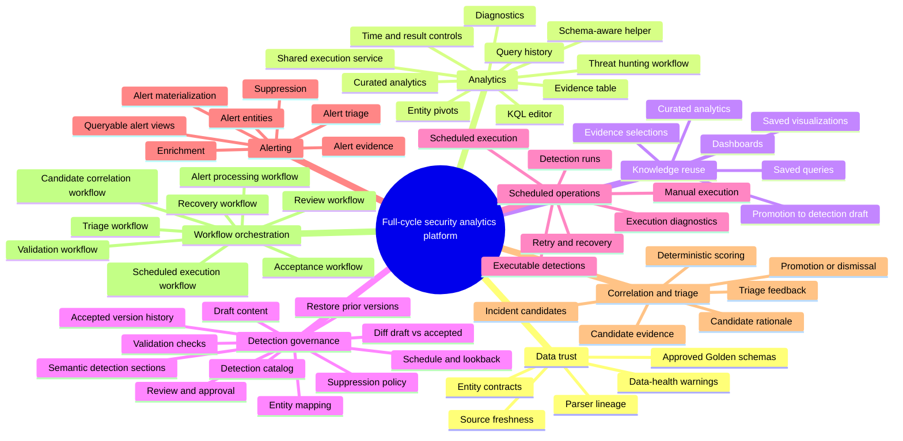

## User-story index

| ID | Story | Target status |
|---|---|---|
| US-01 | Enter the platform and choose a security analytics workspace. | Target UI |
| US-02 | Discover approved schemas, data health, and entity contracts. | Target UI |
| US-03 | Run a KQL analytics query safely. | Target UI |
| US-04 | Inspect, sort, page, deep-read, and preserve evidence. | Target UI |
| US-05 | Save and reuse useful queries and curated analytics. | Target UI |
| US-06 | Render and save visualizations from query output. | Target UI |
| US-07 | Run a threat-hunting workflow as a specialized analytics workflow. | Target UI + workflow-backed |
| US-08 | Promote a query, evidence selection, or curated analytic into a detection draft. | Target UI + workflow-backed |
| US-09 | Build and refresh dashboards. | Target UI |
| US-10 | Import, export, search, and manage dashboards. | Target UI |
| US-11 | Create and browse detection content packages. | Target UI |
| US-12 | Open a governed detection-content proposal. | Target UI + workflow-backed |
| US-13 | Edit semantic detection content and compare with accepted content. | Target UI |
| US-14 | Validate a detection-content proposal. | Workflow-backed |
| US-15 | Review and approve a governed proposal. | Workflow-backed |
| US-16 | Accept a ready proposal into version history and project executable detection metadata. | Workflow-backed |
| US-17 | Compare and restore prior accepted versions. | Target UI + workflow-backed |
| US-18 | Configure local user, workspace, workflow, operations, and query defaults. | Target UI |
| US-19 | Recover incomplete accepted-content projections and failed workflows. | Workflow-backed |
| US-20 | Persist executable detection definitions. | Domain-backed primitive + workflow-backed |
| US-21 | Execute detection versions on schedule or on demand and record detection runs. | Workflow-backed |
| US-22 | Materialize matching results as alerts. | Workflow-backed |
| US-23 | Enrich, suppress, query, and triage alerts. | Target UI + workflow-backed |
| US-24 | Correlate alerts into incident candidates. | Target UI + workflow-backed |
| US-25 | Promote, dismiss, merge, or expire incident candidates. | Target UI + workflow-backed |
| US-26 | Query alerts, alert entities, detection runs, and candidates through approved analytical views. | Target UI |
| US-27 | Inspect data availability, freshness, and lineage. | Target UI |
| US-28 | Preserve audit trail for governance, execution, alert, and triage actions. | Domain-backed primitive + workflow-backed |

## Target interactive and workflow-backed stories

### US-01: Enter the platform and choose a security analytics workspace

**As a** security practitioner, **I want** to choose the workspace that matches my task, **so that** I can query data, hunt, manage dashboards, govern detection content, or work operational alerts without knowing project internals.

**Narrative**

The user lands on the platform home page, sees registered modules, and opens Analytics, Detection Content Governance, or Operations. Shared settings are available from all modules. Workflow-backed operations are visible through meaningful security state, not raw workflow-engine internals.

**Acceptance criteria**

- Product identity is explicit before broad UI expansion: visible naming, hero copy, CTA labels, and dark featured treatment consistently follow the chosen DZNS, DeltaZulu Platform, or internal DeltaZulu platform brand model.
- Product UI follows the shared design system: IBM Plex Sans for product headings, Newsreader only on marketing/company surfaces, orange only for action semantics, sharp structural surfaces, pill action controls, and no permanent Hunting-era token alias layer.
- Home lists platform modules in configured order.
- Each module card routes to that module's route prefix.
- Analytics exposes Overview, Analytics Workbench, Threat Hunting, Library, Dashboards, and Settings navigation.
- Detection Content Governance exposes Home, Detections, Proposals, History, and Settings navigation.
- Operations exposes Executable Detections, Detection Runs, Alerts, Incident Candidates, Operations Health, and Settings navigation, even as placeholders before deep alerting implementation, so operational queues, monitoring, triage, and investigation-drawer patterns can be validated.
- Settings distinguish user preferences, workspace settings, workflow settings, operations/recovery, and development/demo-only settings.
- Workflow state is surfaced as meaningful security operations state, not as raw Elsa implementation detail.

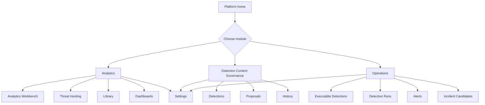

### US-02: Discover approved schemas, data health, and entity contracts

**As a** SOC analyst or hunter, **I want** to browse approved schemas, fields, samples, data-health signals, and entity contracts, **so that** I can write valid KQL and understand which pivots, detections, and alert mappings are possible.

**Narrative**

The Analytics Workbench places a schema browser next to the editor. The catalog registers only approved Golden views. The same catalog builds editor metadata, Kusto semantic state, entity contract metadata, validation policy, and alert entity-mapping hints. Each approved view declares event-time semantics, source lineage, parser metadata, and entity mappings where available.

**Acceptance criteria**

- The analytics page includes a schema browser beside the query editor.
- Approved view metadata is generated from canonical Golden view definitions.
- The KQL compiler resolves only registered approved views.
- Samples and helper snippets can be inserted into the editor.
- Each approved view exposes fields, field types, and descriptions where known.
- Each approved view declares event-time semantics and source lineage where available.
- Each approved view declares entity mappings for supported entities such as host, user, process, IP address, domain, URL, file, registry key, service, and cloud account.
- The schema browser warns when a view is empty, stale, unsupported, or not currently populated.
- The schema-aware helper suggests only fields valid for the selected view.
- The same schema metadata can be reused by detection validation and alert entity extraction.

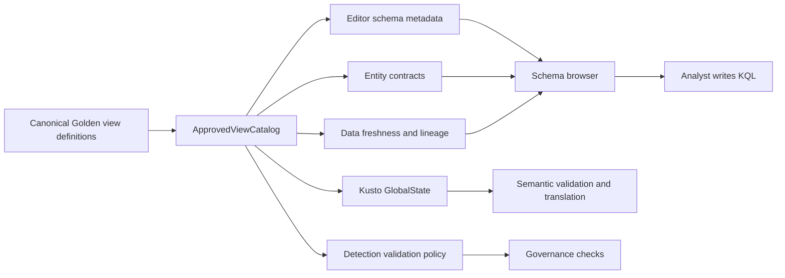

### US-03: Run a KQL analytics query safely

**As a** SOC analyst, hunter, dashboard author, validator, or detection runner, **I want** KQL execution to use one shared analytics execution substrate, **so that** interactive queries, dashboards, validation, and scheduled detections do not diverge into separate engines.

**Narrative**

The user writes KQL, chooses a time filter and result limit, and runs the query. The same application-layer execution contract is used by interactive analytics, dashboard widgets, validation checks, and scheduled detection execution. Execution purpose controls policy: interactive use may return bounded tables; validation may run semantic-only or dry-run checks; scheduled detections run accepted executable definitions with execution windows and alert materialization rules.

**Acceptance criteria**

- The user can run editor contents with a button or keyboard shortcut.
- Empty queries do not execute.
- Time filters apply against the selected view's event-time field when known.
- Result limits are applied before UI materialization.
- Concurrent query execution respects runtime constraints where required.
- Diagnostics are shown when policy, translation, semantic validation, or execution fails.
- Query history records query text, time range, limit, runtime status, elapsed time, row count, and diagnostics summary.
- Failed queries show diagnostics instead of stale data.
- Developer/debug builds can expose generated SQL, but normal users write KQL and do not depend on SQL visibility.
- The shared execution contract supports execution purpose values such as Interactive, Dashboard, ValidationDryRun, ScheduledDetection, and Recovery.
- Scheduled detection execution uses the same approved query surface but enforces accepted detection metadata, execution window, and alert materialization policy.

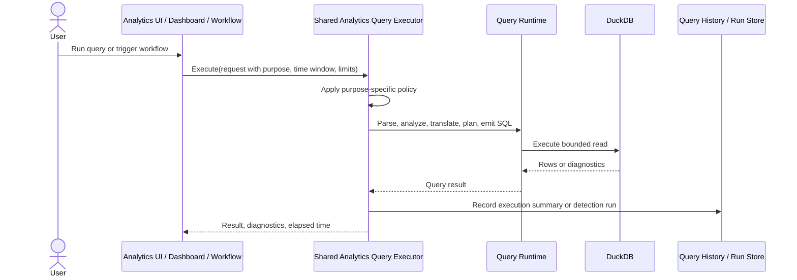

### US-04: Inspect, sort, page, deep-read, and preserve evidence

**As a** SOC analyst or hunter, **I want** table controls, structured-value drawers, and evidence actions, **so that** I can inspect returned events and preserve useful findings without leaving the analytics page.

**Narrative**

When a query returns rows, the UI shows row count and elapsed time, lets the user switch between table and render output, sorts columns, pages through rows, truncates long cell display, and opens long or JSON-like values in a details drawer. The user can pin result rows as evidence, copy normalized JSON, inspect source lineage, and pivot on recognized entities.

**Acceptance criteria**

- Successful non-empty results show a table tab.
- Rows can be sorted by column and paged.
- Long or structured values can be opened in a details drawer.
- JSON-like values are beautified for reading and copying.
- Empty successful results show a clear empty state.
- Failed queries show diagnostics instead of stale data.
- The user can pin a result row as evidence for later use.
- The user can copy a row as normalized JSON.
- The user can inspect source view, parser version, source event identity, and lineage where available.
- Recognized entities are shown as pivots where entity contracts support them.
- The user can start a follow-up query from a selected entity.
- Selected evidence can be used when promoting a query into a curated analytic, detection draft, hunt finding, or candidate handover.

### US-05: Save and reuse useful queries and curated analytics

**As a** SOC analyst, **I want** to preserve both lightweight query history and curated analytics, **so that** repeated investigation steps become reusable operational knowledge.

**Narrative**

Query history captures prior executions. A curated analytic is stronger than a saved query: it contains query text, purpose, expected result shape, required schemas, entity mappings, time semantics, known false positives, severity/confidence/risk hints, operational notes, and promotion readiness. Curated analytics can be reopened in the editor, used in dashboards, used in hunts, or promoted into governed detection drafts.

**Acceptance criteria**

- Query history is available without leaving the analytics page.
- Query history can be loaded back into the editor.
- The current editor contents can be saved as a lightweight query when non-empty.
- The user can convert a query into a curated analytic.
- Curated analytics can include name, description, purpose, query text, required views, required fields, expected result shape, entity mappings, known false positives, severity hint, confidence hint, risk hint, and notes.
- Saved names are generated from query text when the user does not supply a custom name.
- Saved queries and curated analytics can be listed, fetched, saved, marked as run, and deleted by repository contract.
- Curated analytics can be used as dashboard widgets.
- Curated analytics can be promoted into detection drafts.

### US-06: Render and save visualizations from query output

**As a** dashboard author, **I want** to render chart output from KQL and save it as a visualization, **so that** chart-ready analytics can be reused in dashboards and operational views.

**Narrative**

The analytics runner parses render directives, executes data-only KQL, builds chart models, and the page converts chart models to ECharts options. If render output is available, the user can save it as a visualization tied to a saved query or curated analytic. Visualizations are reusable analytical artifacts, but they do not become executable detections unless promoted through governance.

**Acceptance criteria**

- Render directives are parsed separately from data execution.
- Chart models are built from query results and render bindings.
- The UI enables the Render tab only when chart output can render.
- The user can save render output as a visualization when the editor text is non-empty.
- Saved visualizations preserve enough directive information to rerun from saved query text or a curated analytic.
- Visualizations can be used in dashboards.
- Visualization records do not become executable detections unless promoted through the governed detection flow.

### US-07: Run a threat-hunting workflow as a specialized analytics workflow

**As a** threat hunter, **I want** to run hypothesis-driven investigations within Analytics, **so that** hunting work has structure without being forced into detection engineering, alert triage, or incident response.

**Narrative**

Threat hunting is a workflow under Analytics. It can use curated analytics, ad hoc queries, result snapshots, evidence selections, entity pivots, dashboards, and findings. A hunt may hand over to detection engineering, incident candidate review, visibility remediation, threat intelligence, or follow-up hunts, but it does not automatically become any of those objects.

**Acceptance criteria**

- Threat hunting is exposed as an Analytics workflow, not as the parent module.
- A hunt can capture trigger, hypothesis, scope, required data sources, techniques, query runs, evidence, findings, decisions, and handovers.
- A hunt can iterate between refinement and execution.
- Negative, inconclusive, and missing-data outcomes are valid outcomes.
- Hunt evidence references analytics artifacts rather than copying opaque notes.
- Hunt handover is explicit and typed.
- A hunt can produce zero, one, or multiple downstream outputs.

### US-08: Promote a query, evidence selection, or curated analytic into a detection draft

**As a** SOC analyst or detection engineer, **I want** to promote useful analytical logic into a detection draft, **so that** successful analytical work can become governed, testable, executable detection content.

**Narrative**

The user can promote an active query, query history item, saved query, curated analytic, hunt finding, or evidence selection into a detection-content proposal. The promotion flow preserves query text, selected time range, result sample, pinned evidence, schema dependencies, entity mappings, severity/confidence/risk hints, known false positives, and analyst notes. The result is a governed detection proposal, not an accepted detection.

**Acceptance criteria**

- The user can start promotion from the analytics page, query history, saved query, curated analytic, visualization context, or hunt finding.
- Promotion can create a new detection package or attach to an existing detection.
- Promotion preserves query text, required views, required fields, observed result shape, selected time range, and pinned evidence.
- Promotion captures intended entity mappings before the detection can become executable.
- Promotion captures severity, confidence, risk, ATT&CK metadata where available, known false positives, and operational notes.
- Promotion creates a governed detection-content proposal rather than directly creating an accepted detection.
- Promotion can start an Elsa-backed detection-draft workflow.
- The resulting proposal can proceed through validation, review, and acceptance gates.

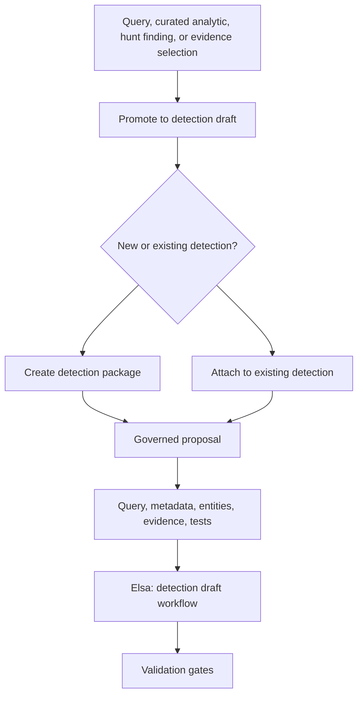

### US-09: Build and refresh dashboards

**As a** dashboard author, **I want** to compose query, visualization, alert, detection-run, and incident-candidate widgets, **so that** important security analytics and operations views can be refreshed together.

**Narrative**

A dashboard has settings, widgets, layout, and refresh policy. Query widgets execute through the shared analytics executor. Visualization widgets resolve saved visualizations and their source queries or analytics. Alert, run, and candidate widgets summarize operational state from persisted SIEM records. Dashboard layout polish is secondary to correctness, refresh behavior, and operational meaning.

**Acceptance criteria**

- Opening a dashboard loads the persisted definition and runs runnable widgets.
- The user can manually refresh all runnable widgets.
- The user can enter edit mode, change settings, add/edit/delete widgets, and save.
- Widget layout changes are tracked while editing.
- Widget model validation blocks invalid dashboards before persistence.
- Widget runs can succeed, fail, or be cancelled with diagnostics.
- Auto-refresh can periodically rerun runnable widgets when policy allows it.
- Dashboard widgets can use saved queries, curated analytics, saved visualizations, alert summaries, detection-run summaries, and incident-candidate summaries.
- Dashboard refresh policy protects the local runtime from excessive query execution.
- Dashboard failures do not hide stale data without clear status.

### US-10: Import, export, search, and manage dashboards

**As a** dashboard author, **I want** dashboard lifecycle controls, **so that** local dashboard definitions can be organized and moved between environments.

**Narrative**

The dashboard list supports search, pagination, creation, JSON import, opening, and deletion. Dashboard detail can build a JSON export with a safe filename. Imported dashboards are validated against current widget contracts and schema availability before they are treated as runnable.

**Acceptance criteria**

- The dashboard list loads summaries ordered by recent update.
- The user can create a new local dashboard.
- The user can import a dashboard JSON file as a copy.
- Imported dashboards are validated before persistence.
- The user can search dashboards and clear search.
- The user can page through summaries when needed.
- The user can delete a dashboard.
- A dashboard can be exported as JSON from its definition.
- Exported dashboards identify required saved queries, curated analytics, visualizations, alert widgets, candidate widgets, run widgets, and schema dependencies.

### US-11: Create and browse detection content packages

**As a** detection engineer, **I want** to create and browse detection packages, **so that** detection content has a stable identity before proposals are opened.

**Narrative**

The Detections page lists detection content packages, supports search by slug or title, filters by lifecycle, and opens detection details. Detection packages represent governed content identity. They are not executable until accepted content produces an executable detection definition.

**Acceptance criteria**

- The user can create a new detection package.
- The user can search detections by slug or title.
- The user can filter by Draft, Accepted, Deprecated, or Disabled lifecycle where applicable.
- The user can open a detection detail page from the table.
- Detection detail shows accepted version, open proposals, execution state, entity mappings, and latest run summary where available.
- Detection package identity remains stable across content versions.

### US-12: Open a governed detection-content proposal

**As a** detection engineer, **I want** to open a proposed update against a detection, **so that** content edits can carry checks, review, workflow state, and acceptance state.

**Narrative**

Proposals are PR-like domain objects against detections. They carry draft content, workflow profile, checks, reviews, stale state, optional linked issue, merge result, close reason, and workflow instance references where applicable. The Proposals page lists work by all, mine, awaiting review, stale, failed workflow, and ready to accept.

**Acceptance criteria**

- The user can create a new proposal from the Proposals page.
- The user can create a new proposal from a promoted analytical artifact.
- Open proposals show key, title, status, file count or semantic section count, check count, stale state, workflow state, and update time.
- The list can filter to the current user's open proposals.
- The list can filter to proposals awaiting review by someone else.
- The list can filter to stale proposals.
- The list can filter to failed or paused workflow states.
- Opening a row navigates to the proposal workspace.
- Workflow state is shown in user-facing language such as Draft, Validating, Awaiting Review, Ready to Accept, Accepting, Merged, Failed, or Blocked.

### US-13: Edit semantic detection content and compare with accepted content

**As a** detection engineer, **I want** to edit semantic detection sections and compare them with accepted content, **so that** reviewers can understand what operational behavior will change.

**Narrative**

The proposal workspace lets mutable proposals edit semantic detection sections. These sections may be backed by files, but the user-facing model is detection-oriented rather than file-oriented. The main sections are query logic, metadata, entity mapping, schedule/lookback, alert materialization, suppression, test cases, evidence examples, notes, and static supporting assets. Advanced users can still inspect and edit raw files where appropriate.

**Acceptance criteria**

- Mutable proposals can edit detection query logic.
- Mutable proposals can edit title, description, severity, confidence, risk, ATT&CK metadata, and operational notes.
- Mutable proposals can edit entity mappings required for alert generation and candidate correlation.
- Mutable proposals can edit schedule, lookback, and suppression settings.
- Mutable proposals can edit alert materialization mode: PerResultRow, SingleAlertPerRun, GroupByEntity, or GroupByCustomKey.
- Mutable proposals can add positive and negative test cases.
- Mutable proposals can attach evidence examples from analytics result rows.
- Editing content resets approvals when the workflow profile requires it.
- Editing content returns review-ready statuses back to Draft when required.
- Draft content can be compared against accepted content.
- Stale check warnings appear when content changes after the last completed check.
- Advanced file view remains available without forcing normal users to work at the file level.

### US-14: Validate a detection-content proposal

**As a** detection engineer, **I want** to run validation checks in the proposal workspace, **so that** only syntactically valid, schema-compatible, testable, and operationally usable content can advance.

**Narrative**

An Elsa-backed validation workflow collects draft content, determines applicable checks, queues blocking or non-blocking runs, records pass/fail outcomes, and updates proposal status according to workflow gates. KQL syntax validation uses the same catalog policy and translator path as runtime query execution but stops before DuckDB execution unless a test fixture or explicit dry-run check requires execution.

**Acceptance criteria**

- The user can run checks from the proposal header, gate checklist, content warning, or validation tab.
- The validation workflow can be started, resumed, cancelled, and retried where allowed.
- Checks apply only when the proposal contains matching content types or semantic sections.
- Each check records name, blocking flag, status, summary, details JSON, optional logs excerpt, and workflow step identity.
- A pipeline summary reports passed, failed, skipped, blocked, and errored counts.
- Required check gates block acceptance when checks have not run or have not passed.
- KQL validation validates detection query content against the approved catalog.
- Schema checks verify that only approved views and fields are referenced.
- Result-shape checks verify that required alert fields or entity mappings can be produced.
- Entity checks verify that configured entity mappings are resolvable.
- Time-window checks verify that event time, lookback, execution window, and suppression requirements are coherent.
- Alert materialization checks verify that the query result shape matches the selected materialization mode.
- Performance checks warn about unbounded or risky queries.
- Test-case checks run positive and negative tests where fixtures exist.
- Regression checks preserve previous expected behavior where applicable.

### US-15: Review and approve a governed proposal

**As a** reviewer, **I want** to record an approval or request changes with context visible, **so that** acceptance reflects a current, reviewed draft.

**Narrative**

The Review tab explains the workflow profile, optionally blocks author self-approval, records review decisions, supersedes approvals after content edits when required, and shows prior reviews in a timeline. Elsa can pause the workflow for human review and resume after a valid decision. The domain still enforces review rules.

**Acceptance criteria**

- Review workflow requirements are visible in the proposal workspace.
- Controlled workflows require approval from someone other than the author.
- Self-approval is blocked by domain rules for non-author approval workflows.
- Reviewers can record Approved or Changes Requested decisions with comments.
- Changes Requested moves the proposal to a changes-requested state.
- Approval can move the proposal to Ready to Accept if all gates pass.
- Prior reviews remain visible, including superseded approvals.
- Workflow state clearly shows whether the proposal is awaiting review, blocked by stale checks, ready to accept, or failed.
- Review records include actor, timestamp, decision, comment, and supersession state.

### US-16: Accept a ready proposal into version history and project executable detection metadata

**As a** maintainer, **I want** to accept a ready proposal, **so that** proposed detection content becomes an immutable accepted version and can produce executable detection definitions.

**Narrative**

The gate checklist calls acceptance only when merge readiness is satisfied. An Elsa-backed acceptance workflow coordinates accepted-content write, merge intent marking, version projection, executable detection projection, proposal merge state, detection lifecycle update, and sibling-proposal staleness. Domain and persistence services enforce atomicity and recovery markers.

**Acceptance criteria**

- Terminal, stale, missing-check, failed-check, missing-approval, and missing-non-author-approval gates can block acceptance.
- A ready proposal can be accepted with one action.
- Acceptance workflow records its progress in meaningful steps.
- Accepted content is committed before version projection is completed.
- The resulting version records changed sections, commit SHA, checks summary, review summary, and content hash.
- The accepted detection points to the resulting version.
- Accepted content can project or update an executable detection definition when required metadata exists.
- Other open proposals for the same detection are marked stale.
- Failed acceptance leaves a recoverable merge intent or workflow state.
- Recovery can reconcile committed content and incomplete projection.

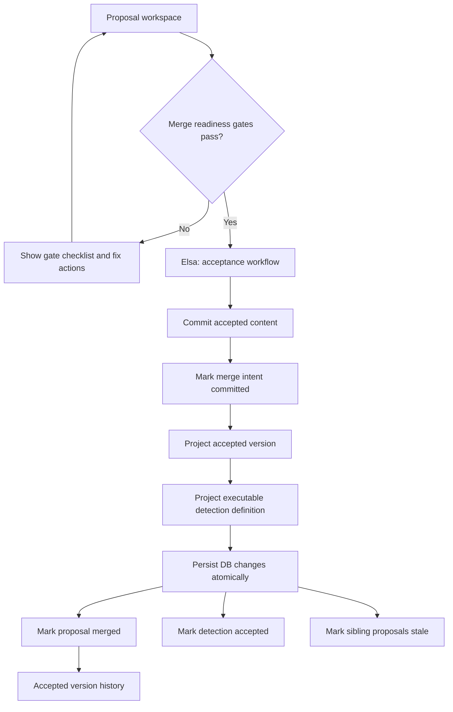

### US-17: Compare and restore prior accepted versions

**As a** maintainer, **I want** to compare accepted versions and restore older content through a new proposal, **so that** recovery remains governed and auditable.

**Narrative**

History pages expose accepted versions. Version detail shows accepted metadata and content. Restore creates a new governed proposal rather than rewriting accepted history. The restore workflow can prefill draft content from a prior version and route the proposal through validation, review, and acceptance gates.

**Acceptance criteria**

- The user can open accepted version history.
- Version detail can show accepted version metadata and content.
- The user can compare versions to understand what changed.
- Restoring prior content creates a new proposal instead of rewriting history.
- Restored content follows the same validation, review, and acceptance gates.
- Restore records which prior version was used as the source.
- Restore can trigger an Elsa-backed restore workflow that creates the new proposal and routes it to validation.

### US-18: Configure local user, workspace, workflow, operations, and query defaults

**As a** platform operator or demo user, **I want** to configure preferences and operating context, **so that** query defaults, workflow behavior, scheduled operations, and governance actions reflect the current workspace.

**Narrative**

Settings are split into user preferences, workspace settings, workflow settings, operations/recovery, and development/demo-only tools. Query defaults belong to user preferences. Data paths and accepted content paths belong to workspace settings. Workflow orchestration mode and workflow definitions belong to workflow settings. Scheduled execution, suppression defaults, alert retention, and recovery belong to operations settings. POC actor switching is explicitly development/demo-only.

**Acceptance criteria**

- The user can set a default time filter for analytics.
- The user can set a default item limit for analytics.
- The page displays the active workflow orchestration mode.
- The page displays the canonical accepted content store path.
- Workspace settings show data path, accepted content path, and schema catalog configuration where applicable.
- Workflow settings show available governance, execution, alert processing, candidate correlation, triage, and recovery workflows.
- Operations settings expose scheduling mode, suppression defaults, alert retention, and recovery state where applicable.
- Operations/recovery settings expose unresolved merge intents and failed recoverable workflow states.
- POC actor switching is clearly marked as demo/development-only.
- Real audit records do not rely on demo-only identity switching in production-like modes.

### US-19: Recover incomplete accepted-content projections and failed workflows

**As a** platform operator, **I want** to inspect and repair unresolved merge intents and failed workflow states, **so that** committed accepted-content writes, version projections, scheduled runs, alert processing, and background workflows can be reconciled safely.

**Narrative**

Settings exposes merge reconciliation and workflow recovery. Unresolved merge intents represent recovery markers for accepted-content writes that have not completed version or executable detection projection. Failed workflow states represent interrupted validation, acceptance, scheduled execution, alert processing, candidate correlation, or triage workflows.

**Acceptance criteria**

- The user can refresh unresolved merge intents.
- The page clearly states when there are no unresolved merge intents.
- Each unresolved intent can be inspected with enough metadata to repair.
- Repair actions surface success or failure messages.
- Failed recoverable workflow instances can be listed by workflow type, detection, change, run, alert, or candidate where applicable.
- Recoverable workflows can be retried or marked closed where domain rules allow.
- Recovery actions preserve audit records.
- Recovery actions do not bypass domain invariants.

## Domain-backed and workflow-backed operations stories

### US-20: Persist executable detection definitions

**As a** detection operations user, **I want** accepted detection content to become executable detection records, **so that** the platform can run versioned analytics on a schedule.

**Narrative**

Executable detection records are Operations projections from accepted detection content. They include detection ID, accepted version, rule hash, query text, severity, confidence, risk score, MITRE metadata, entity mapping, schedule cron, lookback policy, alert materialization mode, suppression policy, enabled flag, test metadata, and timestamps. They should not be edited directly outside governed content flow unless explicitly marked as operational override.

**Acceptance criteria**

- Detection definitions can be listed, fetched, saved, enabled/disabled, deleted, and versioned by repository contract.
- The latest executable version of a detection can be resolved by detection identity.
- Detection metadata includes severity, confidence, risk score, schedule, lookback, suppression hints, alert materialization mode, and entity mapping.
- Query text remains attached to a specific detection version and rule hash.
- Enabled executable detections can be picked up by scheduled execution workflows.
- Disabled detections are not scheduled for normal execution.
- Executable definitions retain a link to accepted content version and governance history.

### US-21: Execute detection versions on schedule or on demand and record detection runs

**As a** detection operations user, **I want** accepted detection versions to run on schedule or on demand, **so that** detection logic produces traceable results against defined execution windows.

**Narrative**

Alerting is scheduled or manually triggered, not real-time streaming. An Elsa-backed scheduled execution workflow finds enabled executable detections, computes execution and lookback windows, runs detection KQL through the shared analytics executor, records run status, persists matching rows as alerts according to materialization mode, and captures execution diagnostics. Detection run records capture execution window, lookback window, status, result count, alert count, duration, error message, query hash, and start/completion timestamps.

**Acceptance criteria**

- Detection runs can be started on schedule or manually where allowed.
- Each run records detection identity, accepted version, rule hash, execution window, lookback window, status, result count, alert count, duration, query hash, and error message where applicable.
- Detection execution uses approved query surfaces.
- Detection execution applies defined event-time and lookback semantics.
- Failed runs preserve diagnostics without producing partial misleading state.
- Successful zero-result runs distinguish no matches from missing or stale data where possible.
- Successful non-zero-result runs create alert records according to materialization mode.
- Detection runs can be listed by detection.
- Detection runs can be opened from detection detail, operations views, alert detail, and recovery views.
- Scheduled execution workflows can retry or fail according to configured policy.

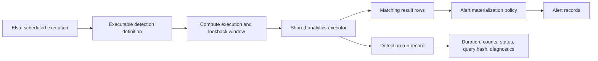

### US-22: Materialize matching results as alerts

**As a** SOC analyst, **I want** detection matches to become traceable alert records, **so that** I can understand which detection version matched which evidence in which execution window.

**Narrative**

If a scheduled or manual detection run returns at least one match, the platform creates alerts according to the detection's alert materialization mode. The default mode is PerResultRow. Aggregate detections can choose SingleAlertPerRun, GroupByEntity, or GroupByCustomKey. Alert evidence is immutable or append-oriented. Alert state changes do not rewrite evidence.

**Acceptance criteria**

- A detection run with zero matches records a successful run without creating alerts.
- A detection run with one or more matches creates alerts according to materialization mode.
- PerResultRow creates one alert per result row.
- SingleAlertPerRun creates one alert summarizing the run result.
- GroupByEntity creates grouped alerts based on configured entity mappings.
- GroupByCustomKey creates grouped alerts based on configured result fields.
- Alert records include detection ID, accepted version, detection run ID, alert time, source view, source event ID where available, severity, confidence, risk score, evidence JSON, status, evidence hash, query hash, rule hash, and timestamps.
- Alert evidence preserves source-specific fields without forcing premature normalization.
- Alert creation is idempotent across retry where detection run identity and materialization keys are stable.
- Alert creation diagnostics are preserved when materialization partially or fully fails.

### US-23: Enrich, suppress, query, and triage alerts

**As a** SOC analyst, **I want** alerts to carry entity, evidence, enrichment, suppression, and triage state, **so that** I can decide what to do next without losing traceability.

**Narrative**

Alert records capture detection version, run, alert time, source view/event, severity, confidence, risk score, evidence JSON, entity links, status, suppression context, enrichment context, disposition, and timestamps. An Elsa-backed alert processing workflow can enrich alerts, extract entities, apply suppression, update status, and route alerts into correlation. Alert status changes preserve evidence rather than rewriting it.

**Acceptance criteria**

- Alerts can be saved individually or in batches.
- Alerts can be listed by run, detection, status, entity, severity, risk, or time range.
- Alert evidence remains JSON so source-specific details can be preserved.
- Alert evidence is immutable except for explicit correction workflows.
- Alert status can be updated without rewriting evidence.
- Alert statuses include New, Triaged, Suppressed, Dismissed, LinkedToCandidate, Promoted, and Closed.
- Alert disposition reason and analyst notes can be recorded.
- Alert entities are extracted according to detection entity mappings and schema contracts.
- Suppression policy can mark alerts as suppressed without deleting them.
- Alert processing workflow can enrich, suppress, correlate, or fail with diagnostics.
- Alert detail shows detection version, run, evidence, entities, suppression context, enrichment, correlation state, and audit trail.

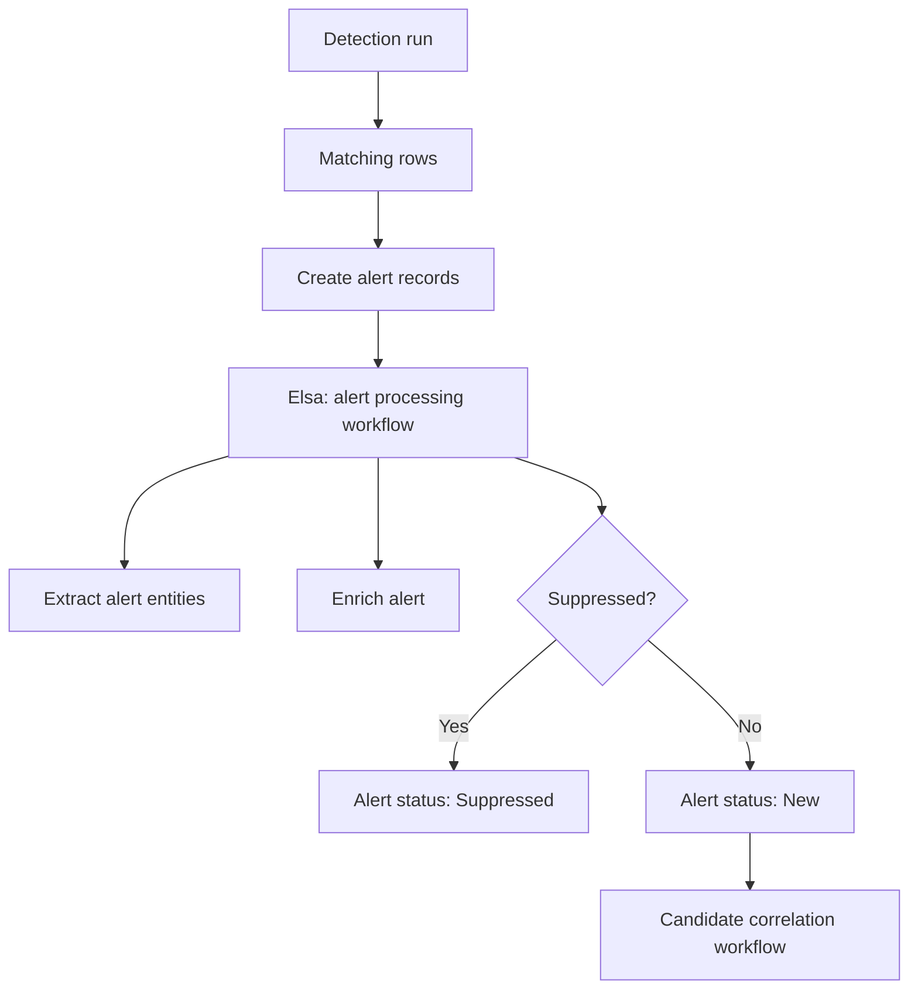

### US-24: Correlate alerts into incident candidates

**As a** triage analyst, **I want** related alerts correlated into incident candidates, **so that** multiple weak signals can become a prioritized investigation queue.

**Narrative**

Incident candidates model a primary entity, time window, alert count, source diversity, tactic and technique breadth, aggregate risk score, scoring factors, rationale, status, and timestamps. Candidates link contributing alerts and persist additional candidate evidence. An Elsa-backed candidate correlation workflow can group alerts by deterministic, explainable correlation rules. The workflow orchestrates correlation, but the correlation algorithm and candidate validity rules remain in domain/application services.

**Acceptance criteria**

- Incident candidates can be listed, fetched, saved, and filtered by status or entity.
- Candidate status can be updated.
- Alert-to-candidate links record the contribution reason.
- Candidate evidence can be saved and listed by candidate.
- Candidate scoring includes aggregate risk, source diversity, tactic breadth, and technique breadth where available.
- Candidate rationale explains why alerts were grouped.
- Candidate confidence is derived from explicit scoring factors, not opaque reasoning.
- Candidate correlation can run after alert creation or on a schedule.
- Candidate correlation can avoid duplicate candidate creation using entity, window, suppression, and deduplication context.
- Candidate detail shows evidence timeline, contributing alerts, entities, rationale, score, and triage actions.

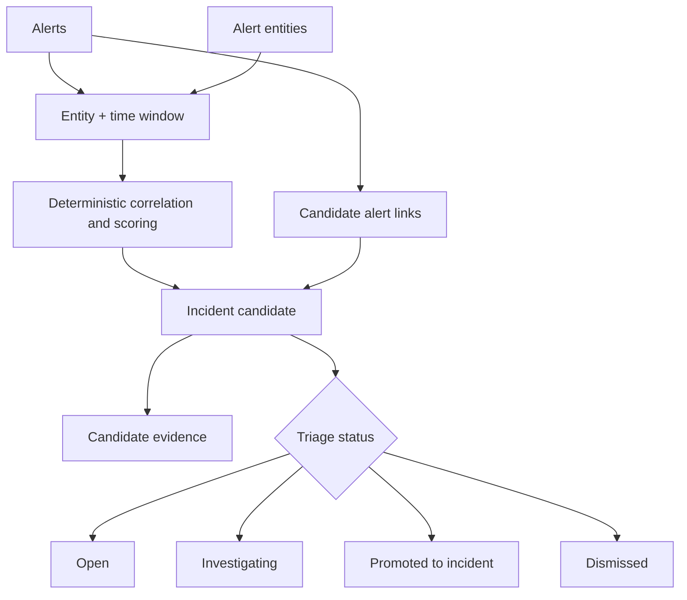

### US-25: Promote, dismiss, merge, or expire incident candidates

**As a** triage analyst, **I want** to decide what happens to an incident candidate, **so that** candidate state remains distinct from confirmed incidents and triage outcomes feed detection improvement.

**Narrative**

Incident candidates are not confirmed incidents. They are explainable investigation proposals. A triage workflow can pause for human decision and resume when the analyst promotes, dismisses, merges, or expires the candidate. Promotion can create an incident or case when that capability exists. Dismissal records reason and notes. Merge combines related candidates while preserving source evidence. Expiry closes stale candidates according to policy.

**Acceptance criteria**

- Candidate lifecycle includes Open, Investigating, PromotedToIncident, Dismissed, Merged, and Expired.
- The analyst can assign or start investigating a candidate.
- The analyst can promote a candidate to an incident or case where the target workflow exists.
- The analyst can dismiss a candidate with reason and notes.
- The analyst can merge related candidates while preserving contributing alerts and evidence.
- Candidates can expire according to policy when no longer operationally relevant.
- Candidate decisions are auditable.
- Candidate triage outcomes can be used as feedback for detection tuning, suppression changes, correlation-rule adjustment, visibility-gap creation, or follow-up hunting.
- Candidate promotion does not rewrite alert evidence.
- Candidate dismissal does not delete contributing alerts.

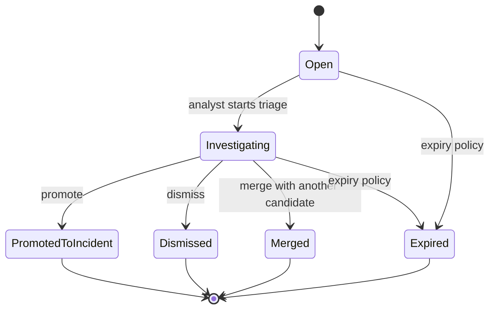

### US-26: Query alerts, alert entities, detection runs, and candidates through approved analytical views

**As a** SOC analyst, **I want** alerts and operations state to be queryable through approved KQL views, **so that** I can join detections, alerts, enrichment, entities, and related logs in the same analytical workflow.

**Narrative**

Operations state should not be trapped behind UI repositories. The platform should expose analyst-facing views for detection runs, alerts, alert entities, enrichment facts, and incident candidates. These views must be governed like other approved query surfaces. The authoritative operational store may remain separate, but the analytics layer needs stable read models so users can join alerts with related Golden telemetry.

**Acceptance criteria**

- The platform exposes approved queryable views such as DetectionRun, AlertEvent, AlertEntity, AlertEnrichment, and IncidentCandidate where implemented.
- Operations views are read-only from KQL.
- Alert and candidate views can be joined with Golden telemetry views when join keys and source lineage exist.
- Alert views expose detection ID, version, rule hash, run ID, alert time, source view, source event ID, severity, confidence, risk score, status, suppression state, and timestamps.
- Alert entity views expose alert ID, entity type, normalized value, display value, source field, role, confidence, and scope.
- Detection run views expose execution window, lookback window, status, result count, alert count, duration, query hash, rule hash, and diagnostics summary.
- Candidate views expose candidate ID, primary entity, window, alert count, score, status, rationale, and timestamps.
- Views do not expose mutable workflow internals as the primary analytical contract.

### US-27: Inspect data availability, freshness, and lineage

**As a** SOC analyst or platform operator, **I want** to see whether expected data is present, fresh, and mapped correctly, **so that** empty query results or zero-alert runs do not create false confidence.

**Narrative**

The platform exposes data-health visibility for approved Golden views and their underlying source lineage. This does not need to become a full ingestion-management system in the MVP, but the user must know whether a view is populated, stale, unsupported, or not mapped to entities. Scheduled detection execution should use these signals to distinguish no matches from missing or stale data where possible.

**Acceptance criteria**

- The user can see approved Golden views and whether they contain recent data.
- The user can see latest event time per view where available.
- The user can see latest ingest time per source where available.
- The user can see event counts per source/view where available.
- The user can see parser or schema version metadata where available.
- The schema browser warns when a view is empty or stale.
- Query empty states distinguish "valid query returned no rows" from "data source appears empty or stale" where possible.
- Detection runs distinguish no matches from skipped/failed/stale-data conditions where possible.
- Result detail can show source lineage from Golden to Silver/Bronze where available.

### US-28: Preserve audit trail for governance, execution, alert, and triage actions

**As a** maintainer or platform operator, **I want** important actions to be auditable, **so that** detection governance and security operations decisions remain accountable.

**Narrative**

The platform records who performed governance, workflow, execution, alert, and triage actions. The audit model does not need full enterprise RBAC in the MVP, but it must distinguish user preference state from actor identity used in governance and operations records. Workflow transitions and domain events should be correlated without making Elsa the source of security truth.

**Acceptance criteria**

- Validation check runs record actor, time, workflow instance, and outcome where applicable.
- Review decisions record actor, time, decision, comment, and supersession state.
- Acceptance actions record actor, time, accepted version, and workflow state.
- Detection run records identify triggering mode such as scheduled, manual, retry, or recovery.
- Alert creation records detection run, materialization mode, evidence hash, and source context.
- Alert status changes record actor or system process, time, previous status, new status, and reason.
- Candidate status changes record actor or system process, time, previous status, new status, and reason.
- Workflow transitions can be correlated with domain state changes.
- Demo-only actor switching is clearly separated from production-like audit identity.
- Audit records do not expose raw implementation details as the primary user-facing explanation.

## End-to-end full-cycle analytics loop

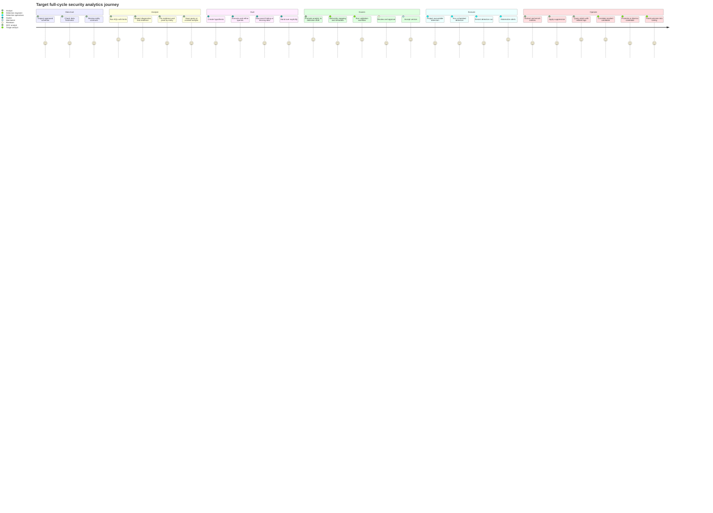

## Key boundaries and constraints

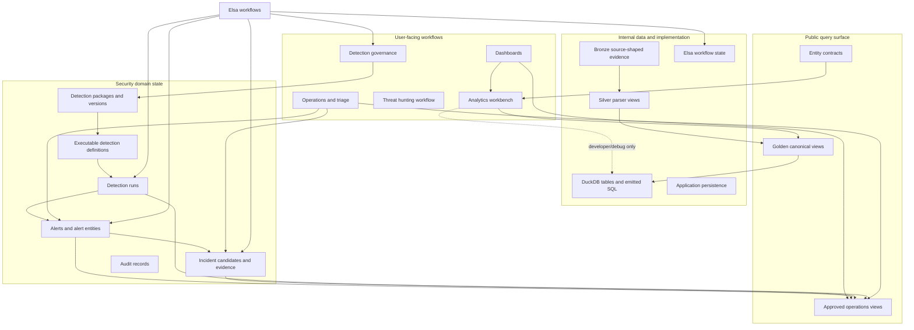

- Users write KQL, not SQL, for normal analytical workflows.
- The approved catalog is the boundary for user-queryable telemetry views.
- Operations state can be exposed through approved read-only analytical views.
- Entity contracts are shared by query assistance, detection validation, alert creation, enrichment, and candidate correlation.
- DuckDB is the embedded MVP execution engine and should be hidden from normal users.
- Dashboard widgets reuse approved analytics, visualizations, alerts, detection runs, and candidates.
- Threat hunting is a workflow under Analytics, not the parent product boundary.
- Detection governance is intentionally PR-like in the domain, but user-facing language remains detection/change/check/review/history.
- Elsa workflows orchestrate validation, review, acceptance, scheduled execution, alert processing, candidate correlation, triage, and recovery.
- Elsa workflows do not own detection logic, alert semantics, evidence integrity, entity meaning, suppression rules, or incident-candidate validity.
- Detection logic remains versioned content plus metadata, tests, entity mapping, schedule, lookback, alert materialization, and suppression configuration.
- Alerting is scheduled or manually triggered in the target design, not real-time streaming.
- A detection run with at least one match creates alerts according to materialization mode.
- Alert and incident-candidate workflows are first-class security operations, not merely future persistence primitives.
- Demo/development identity controls must not be confused with production-like audit identity.

## Workflow orchestration principles

Elsa is used as the long-running orchestration substrate for security analytics workflows. It coordinates steps, waits, timers, retries, branching, and human decisions. It does not own security semantics.

| Workflow | Elsa responsibility | Domain/application responsibility |
|---|---|---|
| Validation | Run ordered checks, pause/retry/cancel, record workflow step identity. | Decide check meaning, blocking status, schema validity, entity validity, and merge readiness. |
| Review | Pause for human review, resume on decision. | Enforce approval rules, self-approval constraints, stale approval rules, and review record validity. |
| Acceptance | Coordinate accepted-content write, projection, stale sibling changes, and recovery markers. | Enforce immutable versioning, accepted content integrity, executable projection rules, and merge invariants. |
| Scheduled execution | Trigger due executable detections, compute workflow retries, record recoverable failures. | Compute execution windows, execute approved KQL, preserve run semantics, and enforce result policy. |
| Alert processing | Coordinate enrichment, suppression, entity extraction, and correlation handoff. | Define alert evidence integrity, entity mapping, suppression semantics, and status transitions. |
| Candidate correlation | Trigger deterministic grouping and scoring. | Own correlation algorithm, scoring factors, deduplication, rationale, and candidate lifecycle validity. |
| Triage | Pause for analyst decisions and resume after action. | Enforce candidate state transitions, alert status transitions, disposition rules, and audit records. |
| Recovery | List and retry recoverable failed states. | Prevent invariant bypass, preserve auditability, and reconcile committed state safely. |

## Implementation implications

The target architecture requires integration without collapsing module boundaries. The most important implementation implication is a shared analytics execution contract. Hunting queries, dashboard widgets, validation checks, and scheduled detection runs must not grow separate KQL execution paths. They should call the same application-layer execution service with purpose-specific policies.

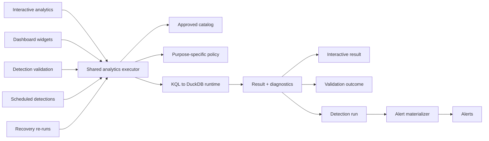

Minimum implementation sequence:

| Phase | Goal | Main deliverable |
|---|---|---|
| 1 | Rename the product boundary | User-facing language changes from Hunting-first to Analytics-first while preserving compatibility routes where needed. |
| 2 | Deduplicate execution | Shared analytics execution service used by interactive queries, dashboards, validation, and scheduled detections. |
| 3 | Define curated analytics | Separate lightweight query history from reusable analytics with purpose, expected shape, entities, and notes. |
| 4 | Define executable detection projection | Accepted detection content projects into executable detection definitions. |
| 5 | Harden operations schema | Detection runs, alerts, alert entities, suppression state, evidence hash, materialization key, and audit fields. |
| 6 | Build scheduled detection runner | Manual execution first, then timer/Elsa scheduled workflow. |
| 7 | Materialize alerts | PerResultRow default, with aggregate modes introduced deliberately. |
| 8 | Expose operations views | DetectionRun, AlertEvent, AlertEntity, AlertEnrichment, and IncidentCandidate approved read models. |
| 9 | Add alert UI | Operations module includes run list, alert queue, alert detail, and diagnostics. |
| 10 | Add enrichment and suppression | Deterministic processing over alert evidence and entities. |
| 11 | Add candidate correlation | Explainable grouping over alert entities, windows, scoring factors, and evidence. |
| 12 | Add triage feedback | Alert/candidate outcomes feed detection tuning, suppression adjustment, visibility gaps, and follow-up hunts. |

## Final positioning

DeltaZulu.Platform is a full-cycle security analytics platform. It starts with schema-governed analytics, but it does not stop at ad hoc query or threat hunting. It carries analytical logic through governance, scheduled execution, alert materialization, enrichment, candidate correlation, triage, and feedback. The platform remains intentionally local and explainable in the MVP. The differentiator is not that it runs queries; it is that it keeps the full analytical lifecycle connected without hiding security semantics inside workflow plumbing or dashboard state.
