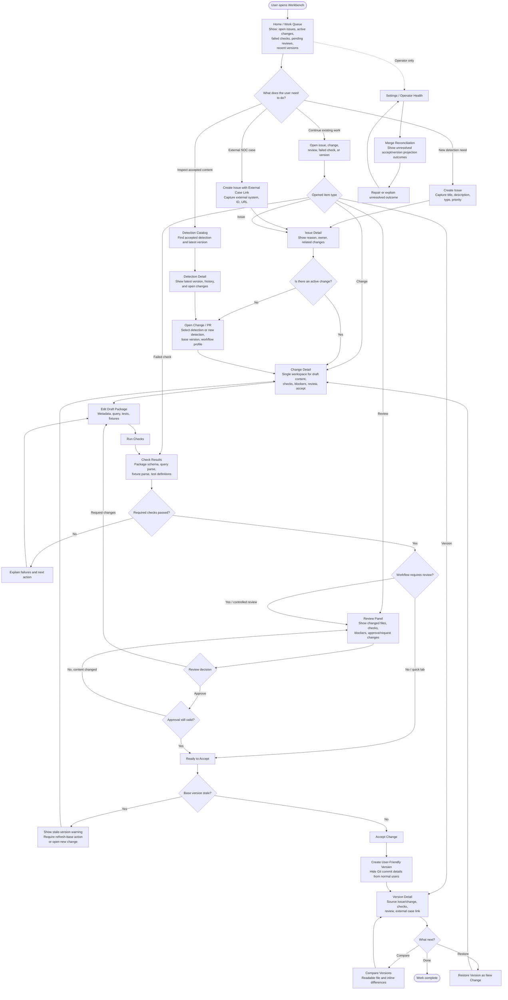

# UI Activity Diagram

## 1. Purpose

This activity diagram translates the user stories into a simpler UI journey. It is meant to expose why the current UX feels hard to understand: users should not have to choose between many equal-looking modules before they know the work they are trying to finish.

The UI should be organized around one primary activity loop:

> Find the work item, edit the change, validate it, review it when required, accept it, then inspect or restore versions.

Pages are still useful, but they should support this loop instead of becoming separate destinations that the user must assemble mentally.

## 2. Primary UI activity diagram

## 3. UX implications from the diagram

| UX problem | Activity-diagram response | Related stories |
|---|---|---|
| Users see many modules before they understand the job. | Start at Home / Work Queue and route each item to the next useful action. | US-01, US-02, US-03 |
| Issue, change, check, review, and version pages feel disconnected. | Make Change Detail the main workspace and show issue, checks, review, blockers, and accept action together. | US-06, US-07, US-13, US-16, US-20 |
| External-case support can look like full case management. | Keep external cases as lightweight links on issues; do not add case tasks, observables, timelines, or outcomes. | US-05 |
| Checks can feel like technical CI output. | Present checks as confidence signals with failure explanations and next actions. | US-13, US-14, US-15 |
| Workflow can look like a workflow-engine product. | Show predefined profile, blockers, and allowed actions; hide engine definitions and instance details. | US-15, US-17, US-18, US-19 |
| Version history can leak Git concepts. | Show domain versions, comparisons, restore-as-new-change, and audit context; hide Git unless an operator needs diagnostics. | US-21, US-23, US-24, US-25, US-26 |
| Operational repair can confuse normal users. | Move merge reconciliation to Settings as operator-only health and repair. | US-27, US-28, US-29 |

## 4. Proposed UI navigation model

The left navigation should be simpler than the domain model. It should guide users by activity, not by implementation object.

| Navigation item | Primary activity | Notes |
|---|---|---|
| Home | Decide what needs attention next. | Default landing page and primary router for US-01. |
| Detections | Find accepted content and start changes from it. | Catalog plus latest version and open changes. |
| Work | Combine issues and changes into a work-centered area. | Reduces split between “why” and “what is changing.” |
| Reviews | Show only reviews needing the current user's action. | Not a second change detail page. |
| Versions | Browse, compare, and restore accepted content. | Domain history, not Git history. |
| Settings | Operator-only health, configuration, and reconciliation. | Hide infrastructure from normal users. |

Checks should usually be visible inside Change Detail and Home queues rather than as a standalone first-level destination. A standalone Checks page is useful only if it behaves like a failure queue.

## 5. Screen responsibility boundaries

| Screen | Must answer | Should not expose |
|---|---|---|
| Home | “What should I do next?” | A full sitemap or implementation inventory. |
| Issue Detail | “Why does this work exist?” | Internal case-management workflows. |
| Change Detail | “What is changing, is it safe, and can it be accepted?” | Git branches, workflow instance IDs, raw validation plumbing. |
| Review Panel | “Can I approve this change?” | Workflow designer concepts. |
| Version Detail | “What was accepted and why?” | Commit-first history. |
| Settings | “Is the workbench healthy?” | Normal authoring actions. |

## 6. Bottleneck and interaction redesign companion

See [UX_REDESIGN_ANALYSIS.md](UX_REDESIGN_ANALYSIS.md) for the bottleneck analysis, redesigned information architecture, interaction patterns, prioritized UX backlog, and acceptance criteria that explain how to turn this activity diagram into a smoother UI.
