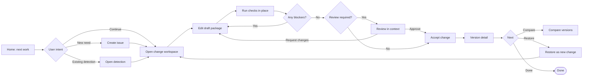

# UX Bottleneck Analysis and Interaction Redesign

## 1. Purpose

This document analyzes the likely UX bottlenecks created by the current workbench structure and proposes interaction redesigns that make the user stories feel like one smooth work flow. The goal is not to add more screens. The goal is to reduce the number of decisions a user must make before they can complete detection-content work.

The redesign assumes the core user promise is:

> “Start from a detection need, make a proposed change, prove it is safe, get review when needed, accept it into version history, and recover previous versions safely.”

Any UI element that does not help with that promise should be removed, deferred, or moved to operator-only settings.

## 2. Main design failures

| Failure | Symptom in the UI | Why it hurts users | Redesign direction |
|---|---|---|---|
| Object-first navigation | Detections, Issues, Changes, Checks, Reviews, Versions, and Settings appear as equal destinations. | Users must already understand the domain model before they can act. | Make Home a work router and combine issues/changes into a Work area. |
| Disconnected work context | Issue reason, draft files, checks, review state, and version outcome live on separate pages. | Users lose the thread of “why am I changing this and what blocks me?” | Make Change Detail the main workspace with context, content, checks, review, and acceptance in one place. |
| Too many visible internals | Git durability, workflow profiles, check types, reconciliation, and version projection can look like user tasks. | The tool appears larger and more technical than the user story requires. | Hide infrastructure by default; expose only domain status and operator-only repair. |
| Weak next-step guidance | Pages show data but do not clearly say what the user should do next. | Users inspect rather than progress. | Add a persistent “Next action” panel on issue/change/version detail pages. |
| Checks are framed as a separate module | A standalone Checks destination competes with the change workflow. | Users must leave the editing context to understand validation. | Show checks inside Change Detail; use a Checks page only as a failure queue. |
| Review is separated from changed content | Review pages can become abstract approval queues. | Reviewers cannot decide without jumping to content and check results. | Review in context: changed files, check summary, blockers, and decision controls together. |
| Version history competes with Git mental models | Versions may expose storage identifiers or commit-like thinking. | Users may think recovery means manipulating Git history. | Keep version actions domain-based: compare and restore as new change. |
| External case support can expand too far | Case-linked issues can invite case-management features. | The product drifts into an external system replacement. | Capture only external case reference and related detection work. |
| Operator repair leaks into authoring | Merge reconciliation can appear in normal work flow. | Normal users are forced to understand failure modes they cannot fix. | Keep reconciliation in Settings with clear operator language. |

## 3. Bottleneck map by journey step

| Journey step | Bottleneck | Design fix | Success signal |
|---|---|---|---|
| Land on Home | Home is a menu instead of a queue. | Show “Needs my action,” “Failed checks,” “Pending review,” and “Recently accepted.” | User can start the next task within one click. |
| Create issue | User must know whether to start from Issue, Detection, or Change. | Offer guided entry points: “Report detection need,” “Start from existing detection,” and “Link external case.” | User creates the right work object without knowing the data model. |
| Open change | Workflow profile and base version can feel technical. | Default profile based on context; explain profile as governance level; hide base version unless changing existing content. | User understands why a profile is selected. |
| Edit draft | Metadata, query, tests, fixtures can become separate mini-products. | Use a package editor with four tabs and one shared unsaved/changed state. | User sees one draft package, not four unrelated forms. |
| Run checks | Validation can interrupt editing. | Run checks from the same workspace and keep failures anchored to files/fields. | User can fix failures without navigating away. |
| Submit/review | Reviewer lacks confidence because evidence is scattered. | Show review summary: changed files, failed/passed checks, issue reason, author notes, blockers. | Reviewer can approve/request changes from one screen. |
| Accept | User may not know why the button is disabled. | Replace disabled-only actions with gate explanations and direct fix links. | User always knows the blocker and how to resolve it. |
| View version | Version is disconnected from the accepted change. | Version detail links to issue, change, checks, review, and external case reference. | User can audit accepted content without storage knowledge. |
| Restore | Restore may sound destructive. | Label as “Restore as new change” and preview what will be copied. | User understands history will not be rewritten. |
| Operate | Reconciliation is too technical for normal users. | Place in Settings / Health with operator copy and repair outcomes. | Authors never encounter reconciliation during normal work. |

## 4. Redesigned information architecture

The navigation should support user intent rather than mirror implementation objects.

```text
Home
├── Needs my action
├── Failed checks
├── Pending reviews
└── Recently accepted

Detections
├── Catalog
├── Detection detail
└── Version history entry points

Work
├── Issues
├── Changes
└── External case links as issue context

Reviews
└── Review queue scoped to current user's decisions

Versions
├── Version history
├── Compare
└── Restore as new change

Settings
├── Operator health
├── Accepted-content configuration
└── Merge reconciliation
```

### Navigation changes

| Current pattern | Redesign |
|---|---|
| Separate top-level Issues and Changes pages. | Use a single Work area with tabs or filters for Issues and Changes. |
| Checks as a default top-level page. | Show checks inside Change Detail; keep a top-level Checks page only if it is a failure queue. |
| Reviews as another way to browse all changes. | Reviews should show only decisions needed from the current user. |
| Settings mixed with normal work. | Settings is operator-only and does not contain normal authoring actions. |

## 5. Interaction redesigns

### 5.1 Home as the work router

Home should answer one question: **“What should I do next?”**

Recommended sections:

1. **Needs my action** — active changes I own, requested changes, stale changes.
2. **Pending review** — controlled-review changes where I can decide.
3. **Failed checks** — failures grouped by change, with a “Fix in change” action.
4. **Recently accepted** — latest versions, with compare and audit entry points.

Avoid using Home as a static product overview after the first-use empty state.

### 5.2 Change Detail as the primary workspace

Change Detail should combine the pieces currently spread across pages:

```text
Change header
├── Title, linked issue, author, workflow profile, status
├── Next action / blockers
└── Primary action button

Draft package editor
├── Metadata
├── Query
├── Tests
└── Fixtures

Validation
├── Required checks summary
├── Failed check details linked to draft files
└── Run checks action

Review
├── Review requirement
├── Reviewer decisions
└── Approve / request changes controls

Acceptance
├── Gate checklist
├── Stale base warning if relevant
└── Accept change action
```

The user should not have to leave Change Detail to answer whether the change is ready.

### 5.3 Gate checklist instead of disabled buttons

When acceptance is blocked, show a checklist instead of only disabling the Accept button.

| Gate | Good UI copy | Direct action |
|---|---|---|
| Checks missing | “Run required checks before accepting.” | Run checks |
| Checks failed | “Fix failed checks before accepting.” | View failures |
| Review missing | “Controlled review requires approval from someone other than the author.” | Request review |
| Self-approval blocked | “Authors cannot approve their own controlled-review changes.” | Switch reviewer / request review |
| Approval stale | “Content changed after approval; request approval again.” | Request review |
| Base version stale | “A newer version was accepted. Refresh this change before accepting.” | Refresh base / open new change |

### 5.4 Contextual checks

Checks should feel like part of the edit loop:

- Show a compact check summary in the Change Detail header.
- Show detailed failures beside the related metadata, query, test, or fixture file.
- Use human-readable result labels: “Schema issue,” “Query issue,” “Fixture parse issue,” “Test definition issue.”
- Keep raw logs collapsed behind “technical details.”

### 5.5 Review in context

Reviewers need an evidence bundle, not a separate approval form.

The review panel should include:

- What changed.
- Why it changed, from the issue or external case link.
- Required checks and their status.
- Known blockers.
- Author notes.
- Approve/request changes actions.

### 5.6 Version actions as safe recovery

Version screens should avoid destructive language.

| User goal | Interaction |
|---|---|
| Understand history | Show accepted versions with source issue/change and accepted-by details. |
| Understand differences | Compare selected versions with readable file and inline differences. |
| Recover old content | “Restore as new change,” with preview and workflow profile selection. |
| Audit accepted content | Link version to issue, external case reference, checks, and review summary. |

## 6. Proposed smoother end-to-end flow



## 7. Prioritized redesign backlog

| Priority | Redesign item | Why first |
|---|---|---|
| P0 | Make Home a real action queue. | It fixes first-look confusion and gives users an obvious starting point. |
| P0 | Make Change Detail the unified workspace. | It removes the biggest navigation bottleneck across edit/check/review/accept. |
| P0 | Add next-action and blocker panels. | It turns hidden workflow rules into actionable guidance. |
| P1 | Merge Issues and Changes into a Work area. | It aligns “why work exists” and “what is changing.” |
| P1 | Move checks into the change workspace and keep only a failure queue. | It reduces module overload and keeps validation contextual. |
| P1 | Redesign review as an evidence panel. | It prevents approval decisions from being separated from changed content. |
| P1 | Simplify version actions around compare and restore as new change. | It supports recovery without exposing Git concepts. |
| P2 | Move reconciliation and storage health to operator Settings only. | It keeps normal users out of infrastructure concerns. |

## 8. UX acceptance criteria

The redesigned UI is good enough for the POC when these statements are true:

1. A new user can identify the next useful action from Home without reading documentation.
2. A detection engineer can create an issue, open a change, edit content, run checks, and understand blockers from one change workspace.
3. A reviewer can approve or request changes without visiting separate check, issue, and version pages.
4. A blocked Accept action always explains the blocker and offers the closest next action.
5. A user can compare or restore versions without seeing Git branch, rebase, reset, or commit-first terminology.
6. Normal users do not see merge reconciliation unless they are in operator Settings.
